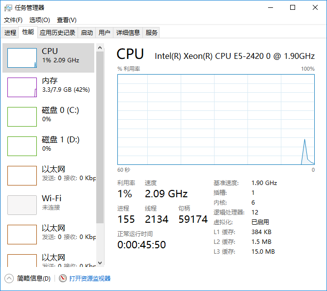

# 一、系统安装


**开机引导分区 /boot ，建议分配大小 200MB**


**交换分区 swap  8GB**


## （一）网络知识补充

- 桥接网络： 使用物理网络地址，容易造成ip地址冲突
- NAT： 虚拟机的网络就是一个局域网，当虚拟机需要访问外部网络时，可以把地址替换成外部网络的地址

## （二）处理器配置补充

处理器的数量配置可参考本机任务管理器, 比如我这台物理机是6核12进程,  所以可配置6个处理器.



## （三）图形桌面补充

centos 安装图形化桌面

​	root 用户执行

1. 装X窗⼝系统
	yum groupinstall -y "X Window System" //注意有引号

 2. 安装图形界⾯软件GNOME

    ​	yum groupinstall -y "GNOME Desktop"

 3. 更新系统的默认运⾏级别

    ln -sf /lib/systemd/system/runlevel5.target /etc/systemd/system/default.target

 4. 重启即可进⼊图形界⾯

    reboot

## （四）新增一块硬盘

https://www.cnblogs.com/iXiAo9/p/13644829.html

#### lsblk

使用虚拟机新增一块硬盘, 大小为100G， 使用  lsblk 命令查看硬盘情况

```shell
[hadoop@hadoop101 ~]$ lsblk
NAME            MAJ:MIN RM  SIZE RO TYPE MOUNTPOINT
sda               8:0    0   50G  0 disk 
├─sda1            8:1    0  200M  0 part /boot
└─sda2            8:2    0 49.8G  0 part 
  ├─centos-root 253:0    0 45.8G  0 lvm  /
  └─centos-swap 253:1    0    4G  0 lvm  [SWAP]
sdb               8:16   0  100G  0 disk 
sr0              11:0    1 1024M  0 rom  
[hadoop@hadoop101 ~]$ 
```

lsblk命令的英文是“list block”，即用于列出所有可用块设备的信息

- NAME：这是块设备名。
- MAJ:MIN：本栏显示主要和次要设备号。
- RM：本栏显示设备是否可移动设备。注意，在本例中设备sdb和sr0的RM值等于1，这说明他们是可移动设备。
- SIZE：本栏列出设备的容量大小信息。例如298.1G表明该设备大小为298.1GB，而1K表明该设备大小为1KB。
- RO：该项表明设备是否为只读。在本案例中，所有设备的RO值为0，表明他们不是只读的。
- TYPE：本栏显示块设备是否是磁盘或磁盘上的一个分区。在本例中，sda和sdb是磁盘，而sr0是只读存储（rom）。
- MOUNTPOINT：本栏指出设备挂载的挂载点。

#### fdisk

使用 fdisk 命令给磁盘分区

```shell
[root@localhost ~]# fdisk -l
#列出系统分区
[root@localhost ~]# fdisk 设备文件名
#给硬盘分区
```


