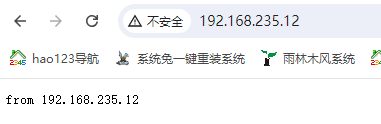
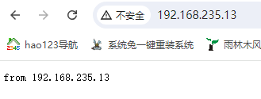
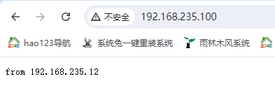
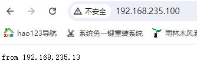

# LVS

## 一、 简介

### 1、概念

LVS（Linux Virtual Server）是一个基于Linux操作系统的虚拟服务器技术，用于实现负载均衡和高可用性。LVS通过将客户端的请求分发到多台后端服务器上，从而提高整体服务的处理能力和可靠性。LVS主要有两个组件：IPVS（IP Virtual Server）和LVS-NAT、LVS-DR、LVS-TUN三种工作模式。

### 2、优势

高性能：LVS工作在内核层，性能高效，能够处理大量并发请求。
高可用性：通过配置Keepalived等工具，LVS可以实现高可用性，确保服务的持续运行。
灵活性强：支持多种负载均衡算法和工作模式，适应不同的应用场景。

### 3、缺点

容易出现单点故障

## 二、架构

### 1、LVS整体架构

LVS的整体架构主要包括负载均衡器（Load Balancer）、后端服务器（Real Server）和客户端三部分。客户端的请求首先到达负载均衡器，然后由负载均衡器根据一定的调度算法将请求转发到后端服务器进行处理，处理结果再返回给客户端。

### 2、LVS的工作模式

LVS支持三种主要的工作模式：  

- LVS-NAT（Network Address Translation）：在该模式下，负载均衡器不仅需要修改请求报文的目标地址，还需要修改响应报文的源地址，适用于小规模集群。
- LVS-DR（Direct Routing）：在该模式下，负载均衡器只修改请求报文的目标MAC地址，而不修改IP地址，后端服务器直接将响应报文发回客户端，适用于大规模集群。
- LVS-TUN（IP Tunneling）：该模式通过IP隧道将请求转发到后端服务器，后端服务器直接将响应报文发回客户端，适用于地理位置分散的集群。

### 3、LVS的调度算法

LVS提供了多种调度算法，以适应不同的应用需求：

- 轮询调度（Round Robin）：将请求依次分配给每个后端服务器。
- 加权轮询调度（Weighted Round Robin）：根据服务器的权重将请求分配给后端服务器。
- 最少连接调度（Least Connections）：将请求分配给当前连接数最少的后端服务器。
- 加权最少连接调度（Weighted Least Connections）：根据服务器的权重和当前连接数分配请求。**这个是默认调度算法**
- 基于局部性的最少连接调度（Locality-Based Least Connections）：优先将请求分配给最近使用的服务器。

## 三、工作原理

### 1、LVS-NAT工作原理

在LVS-NAT模式下，负载均衡器通过NAT（网络地址转换）技术将客户端的请求报文目标地址修改为后端服务器的IP地址，同时记录会话信息。当后端服务器处理完请求后，负载均衡器将响应报文的源地址修改为负载均衡器的IP地址，再返回给客户端。

### 2、LVS-DR工作原理

在LVS-DR模式下，负载均衡器仅修改请求报文的目标MAC地址，而不修改IP地址。负载均衡器将请求发送到后端服务器后，后端服务器直接将响应报文发回客户端。由于不修改IP地址，该模式具有较高的处理效率。

### 3、LVS-TUN工作原理

在LVS-TUN模式下，负载均衡器通过IP隧道将请求报文发送到后端服务器。后端服务器解封装后处理请求，并直接将响应报文发回客户端。该模式适用于地理位置分散的集群。

## 四、搭建过程(DR模型)

### 1、准备工作

在开始搭建LVS之前，需要准备以下环境：两台或多台服务器：一台作为负载均衡器，其余作为后端服务器。

- 操作系统：推荐使用CentOS或其他基于Linux的操作系统。
- 网络环境：确保服务器之间能够互相通信。

这里准备三台虚拟机，节点规划如下：

浏览器作为客户端，node01作为LVS， node02和node03作为RS

| 主机名 | 服务规划 | 安装服务 | ens33 | 配置VIP | 说明                                 |
| ------ | -------- | -------- | ----- | ------- | ------------------------------------ |
| node01 | LVS      | ipvsadm  | DIP   | ens33:2 | 配置ipvsadm                          |
| node02 | RS01     | httpd 80 | RIP   | lo:8    | 调整内核ARP通告和响应级别，启动httpd |
| node03 | RS02     | httpd 80 | RIP   | lo:8    | 调整内核ARP通告和响应级别，启动httpd |

### 2、配置LVS

在LVS上安装IPVSADM工具

```shell
[root@node01 ~]# yum install ipvsadm -y 
```

配置LVS的VIP

```shell
# 临时配置虚拟IP
[root@node01 ~]# ifconfig ens33:2 192.168.235.100/24
[root@node01 ~]# ifconfig
ens33:2: flags=4163<UP,BROADCAST,RUNNING,MULTICAST>  mtu 1500
        inet 192.168.235.100  netmask 255.255.255.0  broadcast 192.168.235.255
        ether 00:0c:29:fd:d4:e0  txqueuelen 1000  (Ethernet)
[root@node01 ~]# echo 1 > /proc/sys/net/ipv4/ip_forward # 配置地址转发功能        
```

### 3、配置RS(Real Server)

1. 先调整RS的响应和通告级别（每一台RS都配）

   ```shell
   echo 1 > /proc/sys/net/ipv4/conf/ens33/arp_ignore
   echo 2 > /proc/sys/net/ipv4/conf/ens33/arp_announce
   echo 1 > /proc/sys/net/ipv4/conf/all/arp_ignore
   echo 2 > /proc/sys/net/ipv4/conf/all/arp_announce
   ```

2. 再配置RS的VIP（每一台RS都配）

   这里记录了node02上的操作，在node03上做同样的操作即可

   ```shell
   # 注意这里子网掩码配置了4个255， 如果配置了3个255会导致数据从ens33走，虚拟IP是配置在lo上的
   [root@node02 all]# ifconfig lo:8 192.168.235.100 netmask 255.255.255.255 
   [root@node02 all]# ifconfig
   lo:8: flags=73<UP,LOOPBACK,RUNNING>  mtu 65536
           inet 192.168.235.100  netmask 255.255.255.255
           loop  txqueuelen 1  (Local Loopback)
   ```

3. 启动两台RS上的httpd

   ```shell
   # httpd 静态的webserver 服务
   [root@node02 ~]# yum install httpd -y  # 安装httpd
   [root@node02 ~]# echo "from 192.168.235.12" /var/www/html/index.html
   [root@node02 ~]# service httpd start
   # 启动成功后在浏览器里访问 192.168.235.12 默认端口80
   ```

    

  ### 4、实验现象

   ```shell
[root@node01 ~]# ipvsadm -A -t 192.168.235.100:80 -s rr # 增加一台虚拟服务器192.168.235.100:80，走tcp协议，调度算法采用轮询
[root@node01 ~]# ipvsadm -ln #  显示内核虚拟服务器表，输出IP 地址和端口的数字形式
IP Virtual Server version 1.2.1 (size=4096)
Prot LocalAddress:Port Scheduler Flags
  -> RemoteAddress:Port           Forward Weight ActiveConn InActConn
TCP  192.168.235.100:80 rr
# 在内核虚拟服务器表的一条记录里添加一条新的真实服务器192.168.235.12:80, 指定LVS 的工作模式为直接路由模式（也是LVS的默认模式）, 默认权重是1
[root@node01 ~]# ipvsadm -a -t 192.168.235.100:80 -r 192.168.235.12:80 -g -w 1 
[root@node01 ~]# ipvsadm -a -t 192.168.235.100:80 -r 192.168.235.13:80 -g -w 2
[root@node01 ~]# ipvsadm -ln
IP Virtual Server version 1.2.1 (size=4096)
Prot LocalAddress:Port Scheduler Flags
  -> RemoteAddress:Port           Forward Weight ActiveConn InActConn
TCP  192.168.235.100:80 rr
  -> 192.168.235.12:80            Route   1      0          0         
  -> 192.168.235.13:80            Route   2      0          0      
   ```

   配置完成后即时生效， 在浏览器里访问 192.168.235.100. 不断刷新可看到 node02和node03返回的页面

   

```shell
[root@node01 ~]# ipvsadm -lnc # 显示LVS 目前的连接
IPVS connection entries
pro expire state       source             virtual            destination
TCP 01:36  FIN_WAIT    192.168.235.1:6859 192.168.235.100:80 192.168.235.13:80
TCP 14:48  ESTABLISHED 192.168.235.1:6868 192.168.235.100:80 192.168.235.13:80
TCP 14:58  ESTABLISHED 192.168.235.1:6867 192.168.235.100:80 192.168.235.12:80
TCP 00:36  FIN_WAIT    192.168.235.1:6858 192.168.235.100:80 192.168.235.12:80
```

## 附录：ipvsadm的参数

https://www.cnblogs.com/feihongwuhen/archive/2010/04/27/7170924.html