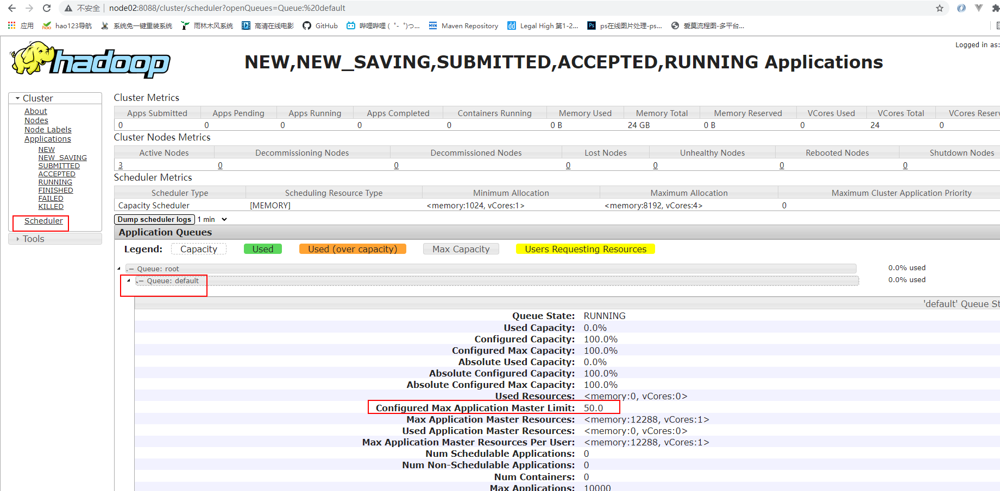

# Yarn配置

**增加ApplicationMaster资源比例**

容量调度器对每个资源队列中同时运行的Application Master占用的资源进行了限制，该限制通过yarn.scheduler.capacity.maximum-am-resource-percent参数实现，其默认值是0.1，表示每个资源队列上Application Master最多可使用的资源为该队列总资源的10%，目的是防止大部分资源都被Application Master占用，而导致Map/Reduce Task无法执行。

**生产环境该参数可使用默认值**。但学习环境，集群资源总数很少，如果只分配10%的资源给Application Master，则可能出现，同一时刻只能运行一个Job的情况，因为一个Application Master使用的资源就可能已经达到10%的上限了。故此处可将该值适当调大。

```shell
[root@node01 hadoop]# pwd
/opt/stanlong/hadoop-ha/hadoop-2.9.2/etc/hadoop

[root@node01 hadoop]# vi capacity-scheduler.xml

<!-- 修改这里，默认0.1， 我改成了0.5 -->
<property>
    <name>yarn.scheduler.capacity.maximum-am-resource-percent</name>
    <value>0.5</value> 
</property>

# 分发
[root@node01 hadoop]# ~/myshell/rsyncd.sh capacity-scheduler.xml 
```

重启Yarn集群， 查看结果

http://node02:8088/cluster




# 一、yarn资源配置

|            |                                          |                                                              |
| ---------- | ---------------------------------------- | ------------------------------------------------------------ |
| 节点层     | yarn.nodemanager.resource.memory-mb      | 设定单节点可使用的物理内存上限                               |
| 节点层     | yarn.nodemanager.resource.cpu-vcores     | 设定单节点可使用的CPU核数资源上限                            |
| 节点层     | yarn.nodemanager.pmem-check-enabled      | yarn对单节点物理内存的检查， 默认true，不改                  |
| 节点层     | yarn.nodemanager.vmem-check-enabled      | yarn对单节点虚拟内存的检查，默认true， 需要改成false。参考 https://blog.csdn.net/m0_52735414/article/details/127178545 |
| 调度器     | yarn.scheduler.minimum-allocation-mb     | 定义单容器最小内存分配值（需≤节点总内存）                    |
| 调度器     | yarn.scheduler.maximum-allocation-mb     | 限制单个容器最大可分配内存（需≤节点内存上限）                |
| 调度器     | yarn.scheduler.minimum-allocation-vcores | 定义单容器最小CPU核心数分配值（需≤节点总CPU核心数）          |
| 调度器     | yarn.scheduler.maximum-allocation-vcores | 限制单个容器最大CPU核心数（需≤节点CPU核心数）                |
| 节点管控   | yarn.nodemanager.vmem-pmem-ratio         | 虚拟内存与物理内存比值（避免内存超分导致任务失败）, 2.1（默认） |
| 节点管控   | yarn.nodemanager.resource.cpu-vcores     | 设定节点可分配的虚拟CPU核数（建议与物理核数匹配）,物理核数的70%-80% |
| ‌任务级控制 | mapreduce.map.java.opts                  | Map任务JVM堆内存（需≤`mapreduce.map.memory.mb`）, `-Xmx2048m`（堆内存2GB） |

