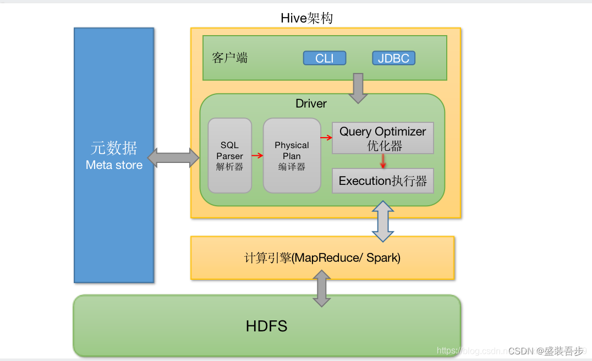
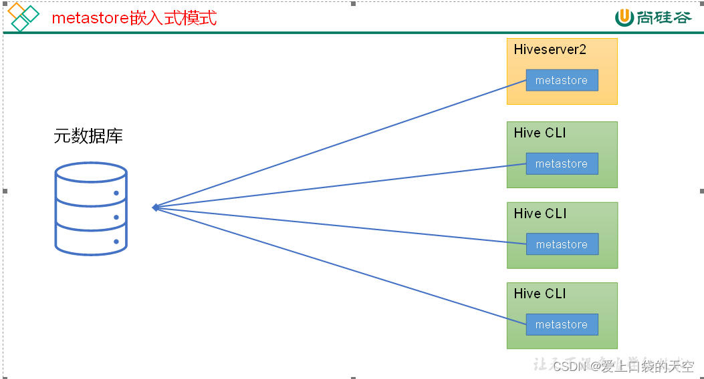
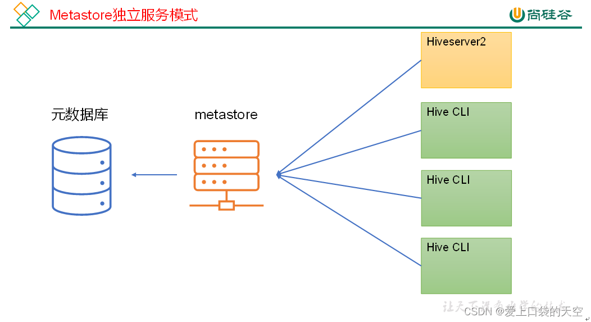

# Hive

## 一、简介

Hive下载地址： https://archive.apache.org/dist/hive/

Hive 是基于Hadoop的一个数据仓库工具，可以将结构化的数据文件映射成一张表，并提供类SQL的查询功能。

本质是：将HQL转化成MapReduce程序

- Hive处理的数据存储在HDFS
- Hive分析数据的底层实现是MapReduce
- 执行程序运行在Yarn上



Hive的安装部署分为三种方式内嵌模式 、本地模式、 远程模式三种方式归根到底就是元数据的存储位置不一样

## 二、节点规划

| 服务器端 | 客户端 |
| -------- | ------ |
| node01   | node02 |

## 三、环境配置

### 1、解压

```shell
[root@node01 ~]# tar -zxf apache-hive-1.2.1-bin.tar.gz -C /opt/stanlong/hive
```

### 2、配置hive环境变量

```shell
[root@node01 bin]# pwd
/opt/stanlong/hive/apache-hive-1.2.1-bin
[root@node01 bin]# vi /etc/profile # 在文件最后添加
export HIVE_HOME=/opt/stanlong/hive/apache-hive-1.2.1-bin  # HIVE环境变量
export PATH=$PATH:$JAVA_HOME/bin:$HADOOP_HOME/bin:$HADOOP_HOME/sbin:$HIVE_HOME/bin
[root@node01 bin]# source /etc/profile # 使配置文件生效
[root@node01 bin]# hi # 命令提示
history         hive            hive-config.sh  hiveserver2   
```

## 四、安装Hive

### 1、内嵌模式

Hive 默认自带一个嵌入式 derby 数据库，这个数据库是用java编写的。内嵌安装的话hive元数据会保存在derby数据库里。最小化安装只允许一个实例使用，开第二个窗口hive就打不开了，不适合生产环境，了解即可。

### 2、本地模式

这种安装方式是把hive的元数据放到mysql数据库里，可以启多个实例，但是不能对外提供服务。安装mysql 参考 DBA/mysql/01mysql安装.md，mysql安装好之后执行后续操作

1. 创建hive元数据库并上传mysql的jdbc驱动包

   ```mysql
   -- 创建 metastore 
   mysql> CREATE DATABASE IF NOT EXISTS hivedb default charset utf8 COLLATE utf8_general_ci;
   
   -- 上传mysql驱动包到 /opt/stanlong/hive/apache-hive-1.2.2-bin/lib 
   ```

2. 配置hive-env.sh

   ```shell
   [root@node01 conf]# cd /opt/stanlong/hive/apache-hive-1.2.2-bin/conf
   [root@node01 conf]# cp hive-env.sh.template hive-env.sh
   [root@node01 conf]# vi hive-env.sh
   ```

   ```shell
   ... 省略掉文件中的注释
   
   # 提前调一下堆内存，避免Hive执行聚合函数的时候报OOM
   export HADOOP_HEAPSIZE=2048
   
   # 配置hive需要的第三方jar包路径，不然启动hive可能会报错
   export HIVE_AUX_JARS_PATH=/opt/stanlong/hadoop-ha/hadoop-2.10.2/share/hadoop/common
   
   # 配置Hadoop环境变量，在/etc/profile里配置过的话，这里也可以不用再配置
   export HADOOP_HOME=/opt/stanlong/hadoop/hadoop-2.10.2
   
   # 配置Hive配置文件的路径
   export HIVE_CONF_DIR=/opt/stanlong/hive/apache-hive-1.2.2-bin/conf
   ```

3. 配置 hive-site.xml

   官方文档配置路径 

   https://cwiki.apache.org/confluence/display/Hive/AdminManual+Metastore+Administration

   ```shell
   [root@node01 ~]# touch /opt/stanlong/hive/apache-hive-1.2.1-bin/conf/hive-site.xml
   ```

   ```xml
   <?xml version="1.0" encoding="UTF-8" standalone="no"?>
   <?xml-stylesheet type="text/xsl" href="configuration.xsl"?>
   <configuration>
       <!-- 配置hive文件在hdfs上的保存路径 -->
       <property>
           <name>hive.metastore.warehouse.dir</name>
           <value>/user/hivedb/warehouse</value>
       </property>
       <!-- 元数据库的链接地址 mysql -->
       <property>
           <name>javax.jdo.option.ConnectionURL</name>
           <value>jdbc:mysql://192.168.235.11:3306/hivedb?createDatabaseIfNotExist=true&amp;useSSL=false&amp;characterEncoding=UTF-8</value>
       </property>
       <!-- 指定mysql连接信息 -->
       <property>
           <name>javax.jdo.option.ConnectionDriverName</name>
           <value>com.mysql.jdbc.Driver</value>
       </property>
       <property>
           <name>javax.jdo.option.ConnectionUserName</name>
           <value>root</value>
       </property>
       <property>
           <name>javax.jdo.option.ConnectionPassword</name>
           <value>root</value>
       </property>
       <!-- 表头信息配置 -->
       <property>
           <name>hive.cli.print.header</name>
           <value>true</value>
       </property>
       <!-- 显示当前数据库 -->
       <property>
           <name>hive.cli.print.current.db</name>
           <value>true</value>
       </property>
   </configuration>
   ```

4. 运行

   - 先启动Hadoop-HA

   - 启动hive

     - 执行初始化命令生成元数据库

     ```shell
     [root@node01 bin]# schematool -dbType mysql -initSchema
     Metastore connection URL:	 jdbc:mysql://192.168.235.11:3306/hivedb?createDatabaseIfNotExist=true&useSSL=false
     Metastore Connection Driver :	 com.mysql.jdbc.Driver
     Metastore connection User:	 root
     Starting metastore schema initialization to 1.2.0
     Initialization script hive-schema-1.2.0.mysql.sql
     Initialization script completed
     schemaTool completed
     
     # 初始化完成之后会在mysql的 hivedb 库里看到相关的hive元数据表,表TBLS和DBS保存了hive表和相关的数据库信息
     ```

     - 启动hive

     ```shell
     [root@node01 ~]# hive
     21/01/23 18:36:46 WARN conf.HiveConf: HiveConf of name hive.metastore.local does not exist
     
     Logging initialized using configuration in jar:file:/opt/stanlong/hive/apache-hive-1.2.1-bin/lib/hive-common-1.2.1.jar!/hive-log4j.properties
     hive (default)> 
     ```

     - 测试

     ```mysql
     hive (default)> create table stu(id int, name string);
     hive (default)> insert into stu values(1, "ss");
     hive (default)> select * from stu;
     ```

### 3、远程模式

#### 3.1、hiveserver2 服务

Hive 的 hiveserver2 服务提供了 jdbc/odbc接口，为用户提供了远程访问Hive数据的功能。由于不同的访问用户涉及到不同的权限，这里补充一个用户说明

**用户说明**

在远程访问Hive数据时，客户端并未直接访问Hadoop集群，而是由Hiveserver2代理访问。由于Hadoop集群中的数据具备访问权限控制，所以此时需要考虑一个问题，访问Hadoop集群的用户身份是谁，是启动的hiveserver2用户还是客户端登录的用户。

答案是都有可能。具体是谁是由`hiveserver2`的`hive.server2.enable.doAs`参数决定。该参数的含义是是否启用Hiveserver2的用户模拟功能。若启用，则Hiveserver2会模拟成客户端的登录用户去访问hadoop集群的数据，不启用则会直接使用启动hiveserver2用户访问Hadoop集群的数据。模拟用户默认是开启的。

具体逻辑如图：未开启用户模拟功能


开启用户模拟功能


生产环境中推荐开启用户模拟功能，因为开启后才能保证用户之间的权限隔离。

hivesever2的模拟用户功能，依赖于Hadoop提供的proxy user（代理用户功能），只有Hadoop中的代理用户才能模拟其他用户的身份访问Hadoop集群。因此，需要将hiveserver2的启动用户设置成hadoop的代理用户，配置方式如下， 在 $HADOOP_HOME/etc/hadoop/core-site.xml 文件中追加如下配置并分发到集群中的其他节点

```xml
    <!--配置root(超级用户)允许通过代理访问的主机节点-->
    <property>
        <name>hadoop.proxyuser.root.hosts</name>
        <value>*</value>
    </property>    
    
    <!--配置root(超级用户)允许通过代理用户所属组-->
    <property>
        <name>hadoop.proxyuser.root.groups</name>
        <value>*</value>
    </property>    
            
    <!--配置root(超级用户)允许通过代理的用户-->
    <property>
        <name>hadoop.proxyuser.root.user</name>
        <value>*</value>
    </property>
```

编辑 hive-site.xml 文件，追加如下内容

```xml
    <!-- 指定hiveserver2连接的node01 -->
    <property>
        <name>hive.server2.thrift.bind.host</name>
        <value>node01</value>
    </property>
    <!-- 指定hiveserver2连接的端口号 -->
    <property>
        <name>hive.server2.thrift.port</name>
        <value>10000</value>
    </property>
```

运行

```shell
[root@node01 ~]# hiveserver2 -- 这是个阻塞进程
# 新开一个窗口查看进程
[root@node01 ~]# jps
15033 RunJar  -- 这个就是hiveserver2的进程
15386 Jps
13899 DFSZKFailoverController
13742 JournalNode
14863 NameNode
[root@node01 ~]# jps -ml # 进程明细
15033 org.apache.hadoop.util.RunJar /opt/hive-3.1.3/lib/hive-service-3.1.3.jar org.apache.hive.service.server.HiveServer2

# 实际生产环境 hiveserver2 是放在后台启动的
[root@node01 ~]# nohup hiveserver2 > /dev/null 2>&1 &
[1] 16236
[root@node01 ~]# jobs
[1]+  Running                 nohup hiveserver2 > /dev/null 2>&1 &
```

测试

```shell
# 使用beeline客户端连接hiveserver2
[root@node01 ~]# beeline
Enter username for jdbc:hive2://node01:10000: root
Enter password for jdbc:hive2://node01:10000: ****
Connected to: Apache Hive (version 3.1.3)
Driver: Hive JDBC (version 3.1.3)
Transaction isolation: TRANSACTION_REPEATABLE_READ
0: jdbc:hive2://node01:10000> show databases
+----------------+
| database_name  |
+----------------+
| default        |
+----------------+
1 row selected (2.159 seconds)
0: jdbc:hive2://node01:10000> !quit 

---------------------------------------------------------------------------------------------------------------------------------------
# 或者简化写法
[root@node01 ~]# beeline -u "jdbc:hive2://node01:10000"  -n root -p root
[root@node02 ~]# vi ~/.bashrc
alias beeline="beeline -u jdbc:hive2://node01:10000  -n root -p root"
```

#### 3.2、metastore 服务

Hive的metastore服务的作用是为Hive CLI或者Hiveserver2提供元数据访问接口。

##### 3.2.1 metastore  模式介绍

1. metastore 的两种运行模式

   metastore有两种运行模式，分别为嵌入式模式和独立服务模式。下面分别对两种模式进行说明：

   （1）嵌入式模式

   

   （2）独立服务模式

   

   生产环境中，不推荐使用嵌入式模式。因为其存在以下两个问题：

   （1）嵌入式模式下，每个Hive CLI都需要直接连接元数据库，当Hive CLI较多时，数据库压力会比较大。

   （2）每个客户端都需要用户元数据库的读写权限，元数据库的安全得不到很好的保证。

2. metastore 的两种部署模式

   （1）嵌入式模式部署

    嵌入式模式下，只需保证Hiveserver2和每个Hive CLI的配置文件hive-site.xml中包含连接元数据库所需要的以下参数即可

   ```xml
       <!-- 元数据库的链接地址 mysql -->
       <property>
           <name>javax.jdo.option.ConnectionURL</name>
           <value>jdbc:mysql://192.168.235.11:3306/metastore?createDatabaseIfNotExist=true&amp;useSSL=false&amp;characterEncoding=UTF-8</value>
       </property>
       <!-- 指定mysql连接信息 -->
       <property>
           <name>javax.jdo.option.ConnectionDriverName</name>
           <value>com.mysql.jdbc.Driver</value>
       </property>
       <property>
           <name>javax.jdo.option.ConnectionUserName</name>
           <value>root</value>
       </property>
       <property>
           <name>javax.jdo.option.ConnectionPassword</name>
           <value>root</value>
       </property>
   ```

   （2）独立服务模式部署

   独立服务模式需做以下配置：

   首先，保证metastore服务端的配置文件hive-site.xml中包含连接元数据库所需的以下参数：

   ```xml
       <!-- 元数据库的链接地址 mysql -->
       <property>
           <name>javax.jdo.option.ConnectionURL</name>
           <value>jdbc:mysql://192.168.235.11:3306/metastore?createDatabaseIfNotExist=true&amp;useSSL=false&amp;characterEncoding=UTF-8</value>
       </property>
       <!-- 指定mysql连接信息 -->
       <property>
           <name>javax.jdo.option.ConnectionDriverName</name>
           <value>com.mysql.jdbc.Driver</value>
       </property>
       <property>
           <name>javax.jdo.option.ConnectionUserName</name>
           <value>root</value>
       </property>
       <property>
           <name>javax.jdo.option.ConnectionPassword</name>
           <value>root</value>
       </property>
   ```

   其次，保证Hiveserver2和每个Hive CLI的配置文件hive-site.xml中包含访问metastore服务所需的以下参数，注意：这个只在客户端上面配置：

   ```xml
   <!-- 指定metastore服务的地址 -->
   <property>
   	<name>hive.metastore.uris</name>
   	<value>thrift://node01:9083</value>
   </property>
   ```

##### 3.2.2、部署服务

将 node01 上的/opt/hive-3.1.3 同步到 node02上，配置环境变量并修改 node02上的hive.xml如下

```xml
<?xml version="1.0" encoding="UTF-8" standalone="no"?>
<?xml-stylesheet type="text/xsl" href="configuration.xsl"?>
<configuration>
    <!-- ################################### node02 上的hive作为客户端，采用metastore的独立部署模式 ###################################-->
    <!-- 配置hive文件在hdfs上的保存路径 -->
    <property>
        <name>hive.metastore.warehouse.dir</name>
        <value>/user/hivedb/warehouse</value>
    </property>
    
    <!-- 指定hiveserver2连接的host -->
    <property>
        <name>hive.server2.thrift.bind.host</name>
        <value>node01</value>
    </property>
    <!-- 指定hiveserver2连接的端口号 -->
    <property>
        <name>hive.server2.thrift.port</name>
        <value>10000</value>
    </property>
    
    <!-- 指定metastore服务的地址 -->
    <property>
        <name>hive.metastore.uris</name>
        <value>thrift://node01:9083</value>
    </property>
    
    <!-- ################################### hive公共配置 ###################################-->
    <!-- 表头信息配置 -->
    <property>
        <name>hive.cli.print.header</name>
        <value>true</value>
    </property>
    <!-- 显示当前数据库 -->
    <property>
        <name>hive.cli.print.current.db</name>
        <value>true</value>
    </property>

</configuration>
```

运行测试

```shell
# node01 上启动 metastore 服务
[root@node01 ~]# nohup hive --service metastore > /dev/null 2>&1 &
[root@node01 ~]# jobs
[1]-  Running                 nohup hiveserver2 > /dev/null 2>&1 &
[2]+  Running                 nohup hive --service metastore > /dev/null 2>&1 &

# node02 上启动hive并执行查询语句
[root@node02 ~]# beeline -u jdbc:hive2://node01:10000  -n root -p root
0: jdbc:hive2://node01:10000> show tables;
+-----------+
| tab_name  |
+-----------+
| stu       |
+-----------+
1 row selected (0.379 seconds)
0: jdbc:hive2://node01:10000> select * from stu;
+---------+-----------+
| stu.id  | stu.name  |
+---------+-----------+
| 1       | ss        |
+---------+-----------+
1 row selected (0.792 seconds)
0: jdbc:hive2://node01:10000> !exit
Closing: 0: jdbc:hive2://node01:10000

# 可知node02正确连接到了node01上元数据服务，且可以查询数据
```