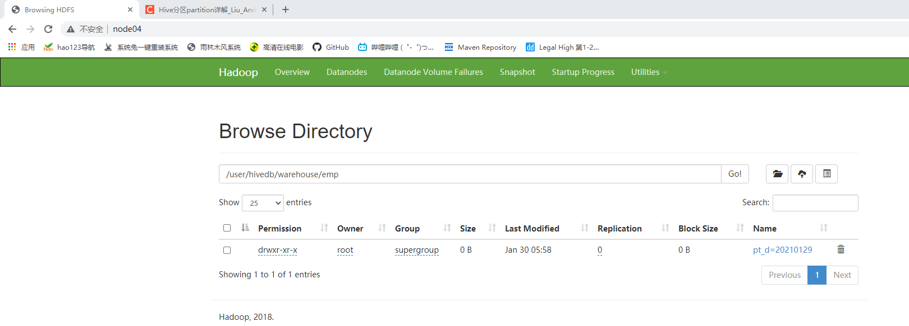
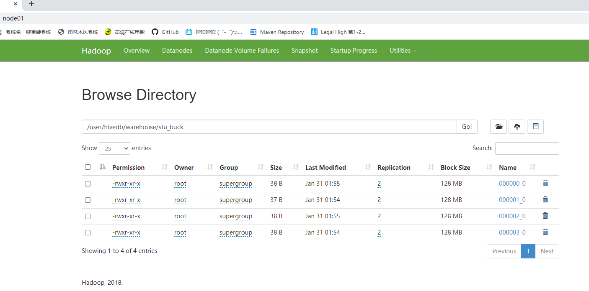

# 数据定义_DDL

## 一、数据库

### 1、新建数据库

- 语法

  ```shell
  CREATE DATABASE [IF NOT EXISTS] database_name
  [COMMENT database_comment]
  [LOCATION hdfs_path]
  [WITH DBPROPERTIES (property_name=property_value, ...)];
  ```

  字段介绍： ([ ] 中括号中内容为创建库时的可选项)

  - COMMENT：数据库描述
  - LOCATION：指定数据库存放在 HDFS 的目录，默认存储在 hive 所指定的地址 /user/hive/warehouse/目录下，HDFS中数据库通常统一为 *.db。比如创建了一个 test库，在HDFS中默认地址为：/user/hive/warehouse/test.db
  - WITH DBPROPERTIES：DB数据库属性，设置数据库属性信息，以使用 key=value 格式添加，比如：创建时间、创建人、修改人 等信息。不常用

  注意：默认创建的库，存储在 Hive 默认路径下，如果通过 LOCATION 属性修改库所在的位置。如果指定库存储在 HDFS 根目录下。建议是 location '/库名.db'，而不是 location '/'。此处存储在根目录下，如果不指定库名.db，那么在 HDFS 根目录下是看不到这个库名的文件夹的，如果在该库中创建表，以表名命名的文件夹会直接在 根目录下，导致数据比较混乱，一般不建议这么干！！！

- 案例

  ```shell
  hive> create database if not exists mydb location '/user/hivedb'; # 若不指定路径，默认路径为 ${hive.metastore.warehouse.dir}/database_naem.db
  No rows affected (1.642 seconds)
  hive> show databases;
  +----------------+--+
  | database_name  |
  +----------------+--+
  | default        |
  | mydb           |
  +----------------+--+
  
  hive> show databases like '*db*'; # 模糊查询数据库
  +----------------+--+
  | database_name  |
  +----------------+--+
  | mydb           |
  +----------------+--+
  
  hive> desc database mydb; # 查询数据库的描述信息
  +----------+----------+-------------------------------+-------------+-------------+-------------+--+
  | db_name  | comment  |           location            | owner_name  | owner_type  | parameters  |
  +----------+----------+-------------------------------+-------------+-------------+-------------+--+
  | mydb     |          | hdfs://hacluster/user/hivedb  | root        | USER        |             |
  +----------+----------+-------------------------------+-------------+-------------+-------------+--+
  
  hive> desc database extended mydb; #查看数据库的扩展信息
  +----------+----------+-------------------------------+-------------+-------------+-------------+--+
  | db_name  | comment  |           location            | owner_name  | owner_type  | parameters  |
  +----------+----------+-------------------------------+-------------+-------------+-------------+--+
  | mydb     |          | hdfs://hacluster/user/hivedb  | root        | USER        |             |
  +----------+----------+-------------------------------+-------------+-------------+-------------+--+
  ```

### 2、修改数据库

用户可以使用`alter database`命令修改数据库某些信息，其中能够修改的信息包括`dbproperties、location、owner user`。需要注意的是：修改数据库`location`，不会改变当前已有表的路径信息，而只是改变后续创建的新表的默认的父目录

- 语法

  ```shell
  --修改dbproperties
  ALTER DATABASE database_name SET DBPROPERTIES (property_name=property_value, ...);
  --修改location
  ALTER DATABASE database_name SET LOCATION hdfs_path;
  --修改owner user
  ALTER DATABASE database_name SET OWNER USER user_name;
  ```

- 案例

  ```shell
  hive> alter database mydb set dbproperties('createtime'='20210127');
  No rows affected (0.394 seconds)
  hive> desc database extended mydb;
  +----------+----------+-------------------------------+-------------+-------------+------------------------+--+
  | db_name  | comment  |           location            | owner_name  | owner_type  |       parameters       |
  +----------+----------+-------------------------------+-------------+-------------+------------------------+--+
  | mydb     |          | hdfs://hacluster/user/hivedb  | root        | USER        | {createtime=20210127}  |
  +----------+----------+-------------------------------+-------------+-------------+------------------------+--+
  1 row selected (2.197 seconds)
  ```

### 3、删除数据库

- 语法

  ```sql
  DROP DATABASE [IF EXISTS] database_name [RESTRICT|CASCADE];
  ```

  `RESTRICT`：严格模式，若数据库不为空，则会删除失败，默认为该模式。
  `CASCADE`：级联模式，若数据库不为空，则会将库中的表一并删除。

- 案例

  如果数据库不为空，可以采用cascade命令，强制删除

  ```sql
  hive> drop database mydb cascade;
  No rows affected (4.809 seconds)
  hive> show databases;
  +----------------+--+
  | database_name  |
  +----------------+--+
  | default        |
  +----------------+--+
  1 row selected (0.171 seconds)
  ```

## 二、表

### 1、建表

#### (1)、普通建表语法

- 语法

  ```mysql
  CREATE [TEMPORARY] [EXTERNAL] TABLE [IF NOT EXISTS] [db_name.]table_name   
  [(col_name data_type [COMMENT col_comment], ...)]
  [COMMENT table_comment]
  [PARTITIONED BY (col_name data_type [COMMENT col_comment], ...)]
  [CLUSTERED BY (col_name, col_name, ...) 
  [SORTED BY (col_name [ASC|DESC], ...)] INTO num_buckets BUCKETS]
  [ROW FORMAT row_format] 
  [STORED AS file_format]
  [LOCATION hdfs_path]
  [TBLPROPERTIES (property_name=property_value, ...)]
  ```

- 关键字说明
  - **TEMPORARY**
    临时表，该表只在当前会话可见，会话结束，表会被删除。
    
  - **EXTERNAL**（重点）
    外部表，与之相对应的是内部表（管理表）。管理表意味着Hive会完全接管该表，包括元数据和HDFS中的数据。而外部表则意味着Hive只接管元数据，而不完全接管HDFS中的数据。
    
  - **data_type**（重点）
    Hive中的字段类型可分为基本数据类型和复杂数据类型。
    
  - **PARTITIONED BY**（重点）
    创建分区表
    
  - **CLUSTERED BY … SORTED BY…INTO … BUCKETS**（重点）
    创建分桶表
    
  - **ROW FORMAT**（重点）
    指定SERDE，SERDE是Serializer and Deserializer的简写。Hive使用SERDE序列化和反序列化每行数据。详情可参考  [Hive-Serde](https://cwiki.apache.org/confluence/display/Hive/DeveloperGuide#DeveloperGuide-HiveSerDe)

    Hive读写流程：

    ```
    HDFS files --> InputFileFormat --> <key, value> --> Deserializer --> Row object  # 读流程
    Row object --> Serializer --> <key, value> --> OutputFileFormat --> HDFS files   # 写流程
    ```

    ```mysql
    # 语法一：DELIMITED关键字表示对文件中的每个字段按照特定分割符进行分割，其会使用默认的SERDE对每行数据进行序列化和反序列化
    ROW FORAMT DELIMITED 
    [FIELDS TERMINATED BY char] 
    [COLLECTION ITEMS TERMINATED BY char] 
    [MAP KEYS TERMINATED BY char] 
    [LINES TERMINATED BY char] 
    [NULL DEFINED AS char]
    
    # 语法二：SERDE关键字可用于指定其他内置的SERDE或者用户自定义的SERDE。例如JSON SERDE，可用于处理JSON字符串
    ROW FORMAT SERDE serde_name [WITH SERDEPROPERTIES 
    (property_name=property_value,property_name=property_value, ...)] 
    ```

    注：

    - fields terminated by ：列分隔符
    - collection items terminated by ：复杂类型map、struct和array中每个元素之间的分隔符
    - map keys terminated by ：专门map中的key与value的分隔符（struct结构体只保留值！）
    - lines terminated by ：行分隔符
    - null defined as：声明底层文件中null值的分隔符（默认值\N）

  - **STORED AS**（重点）
    指定文件格式，常用的文件格式有，textfile（默认值），sequence file、orc file、parquet file等等
    
  - **LOCATION**
    指定表所对应的HDFS路径，若不指定路径，其默认值为${hive.metastore.warehouse.dir}/db_name.db/table_name
    
  - **TBLPROPERTIES**
    用于配置表的一些KV键值对参数


#### (2)、Create Table As Select 语法

该语法允许用户利用`select`查询语句返回的结果，直接建表，表的结构和查询语句的结构保持一致，且保证包含`select`查询语句放回的内容

- 语法

  ```mysql
  CREATE [TEMPORARY] TABLE [IF NOT EXISTS] table_name 
  [COMMENT table_comment] 
  [ROW FORMAT row_format] 
  [STORED AS file_format] 
  [LOCATION hdfs_path]
  [TBLPROPERTIES (property_name=property_value, ...)]
  [AS select_statement]
  ```

#### (3)、Create Table Like 语法

该语法允许用户复刻一张已经存在的表结构，与上述的CTAS语法不同，该语法创建出来的表中不包含数据

- 语法

  ```mysql
  CREATE [TEMPORARY] [EXTERNAL] TABLE [IF NOT EXISTS] [db_name.]table_name
  [LIKE exist_table_name]
  [ROW FORMAT row_format] 
  [STORED AS file_format] 
  [LOCATION hdfs_path]
  [TBLPROPERTIES (property_name=property_value, ...)]
  ```


### 2、建表案例

#### (1)、普通表建表

- 内部表和外部表

  在删除表的时候，**内部表的元数据和数据会被一起删除**，而外部表只删除元数据，不删除数据。

  ```mysql
  -- 创建部门表
  create table if not exists dept( -- 内部表
      deptno  int
     ,dname   string
     ,loc     int
  )row format delimited fields terminated by '\t';
  
  
  -- 创建部门表
  create external table if not exists dept( -- 外部表
      deptno  int
     ,dname   string
     ,loc     int
  )row format delimited fields terminated by '\t';
  ```

  查看表结构

  ```mysql
  hive> desc formatted dept;
  ```

  内外部表相互转换

  - 外转内

    ```mysql
    alter table dept set tblproperties('EXTERNAL'='FALSE');
    | Table Type:                   | MANAGED_TABLE      -- 内部表
    ```

  - 内转外

    ```mysql
    alter table dept set tblproperties('EXTERNAL'='TRUE');
    | Table Type:                   | EXTERNAL_TABLE     -- 外部表      
    ```

  注意：('EXTERNAL'='TRUE')和('EXTERNAL'='FALSE')为固定写法，区分大小写

#### (2)、create table as select

```mysql
hive> create table dept1 as select * from dept;
```

#### (3)、create table like

```shell
hive> create table dept2 like dept;
```

### 3、查看表

- 语法

  ```mysql
  # 展示所有表， like通配表达式说明：*表示任意个任意字符（select语句用%），|表示或的关系
  SHOW TABLES [IN database_name] LIKE ['identifier_with_wildcards'];
  
  # 查看表信息 EXTENDED：展示详细信息 ， FORMATTED：对详细信息进行格式化的展示
  DESCRIBE [EXTENDED | FORMATTED] [db_name.]table_name
  ```

- 案例

  ```mysql
  # 展示所有匹配到的表
  show tables like 'dept*';
  show tables in db_hive1 like 'dept*';
  
  # 查看单个表明细
  desc dept;
  desc extended dept;
  desc formatted dept;
  ```

### 4、修改表

#### (1)、修改表名

- 语法

  ```mysql
  ALTER TABLE table_name RENAME TO new_table_name
  ```

- 案例

  ```mysql
  alter table ods_emp rename to dwd_emp;
  ```

#### (2)、修改表

- 语法

  修改列信息（只修改元数据，HDFS不受影响）

  ```mysql
  # 增加列，该语句允许用户增加新的列，新增列的位置位于末尾
  ALTER TABLE table_name ADD [COLUMN] col_old_name col_new_name column_type [COMMENT col_comment] [FIRST|AFTER column_name]
  
  # 更新列，该语句允许用户修改指定列的列名、数据类型、注释信息以及在表中的位置
  ALTER TABLE table_name change [COLUMN] col_old_name col_new_name column_type [COMMENT col_comment] [FIRST|AFTER column_name]
  
  # 替换列，该语句允许用户用新的列集替换表中原有的全部列
  ALTER TABLE table_name REPLACE COLUMNS (col_name data_type [COMMENT col_comment], ...)
  ```

- 案例

  ```mysql
  -- 添加字段age
  alter table stu add columns(age int);
  
  -- 修改字段顺序(先关闭校验)
  set hive.metastore.disallow.incomptible.col.type.changes=false;
  alter table stu change column age age int after id;
  
  -- 替换成原来一样的表
  alter table stu replace columns (id int,name string);
  ```

### 5、删除清空表

- 语法

  ```mysql
  -- 删除表
  DROP TABLE [IF EXISTS] table_name;
  
  -- 清空表
  TRUNCATE [TABLE] table_name
  -- truncate只能清空内部表的数据，不能删除外部表中数据
  ```

  

#### 分区表

Hive 中的分区就是分目录，在WHERE条件里用分区字段筛选，可以提高查询效率。 注意分区字段不能和表里已有的字段一样，不然会报错 Column repeated in partitioning columns。

##### 建分区表

```sql
# 按 pt_d 为分区字段创建员工表, 分区字段任意
create external table if not exists emp(
    empno       int
   ,ename       string
   ,job         string
   ,mgr         int
   ,hiredate    string
   ,sal         double
   ,comm        double
   ,deptno      int
)
partitioned by (pt_d int)
row format delimited fields terminated by '\t';
```

##### 添加分区

```sql
alter table emp add partition(pt_d='20210129');
```



同时给表添加多个分区

```sql
alter table emp add partition(pt_d='20210127') partition(pt_d='20210128');
```

##### 删除分区

```sql
alter table emp drop partition(pt_d='20210129');
```

删除多个分区

```sql
alter table emp drop partition(pt_d='20210127'),partition(pt_d='20210128');
alter table emp drop partition (pt_d>='20210127',pt_d<='20210128')
```

##### 查看分区

```sql
show partitions emp;
```

##### 多级分区

```sql
create external table if not exists ods_emp
(
   empno       int
   ,ename       string
   ,job         string
   ,mgr         int
   ,hiredate    string
   ,sal         double
   ,comm        double
   ,deptno      int
)
partitioned by (pt_m String, pt_d String)
row format delimited fields terminated by '\t';
```

##### 修复分区

```sql
msck repair table emp;
```

#### 分桶表

分区针对的是数据的存储路径；分桶针对的是数据文件。

分区会增加一个分区字段，分桶是对表里的数据进行分桶，需要指明分桶的个数

分区提供一个隔离数据和优化查询的便利方式。不过，并非所有的数据集都可形成合理的分区。

分桶是将数据集分解成更容易管理的若干部分的另一个技术。

**要使分桶表生效，必须把普通表的数据倒数到分桶表中**

新建一张普通表，表字段和分桶表一样，并导入数据

```sql
create table stu_shadow
(
    id int
   ,name string
)
row format delimited fields terminated by '\t';
hdfs dfs -put stu.txt /user/hivedb/warehouse/stu_shadow
```

##### 建分桶表

```sql
create table stu_buck
(
    id int
   ,name string
)
clustered by(id) into 4 buckets
row format delimited fields terminated by '\t';
```

##### 设置分桶属性

```sql
set hive.enforce.bucketing=true;
set mapreduce.job.reduces=-1;
```

##### 导入普通表的数据到分桶表

```sql
insert into table stu_buck select id, name from stu_shadow;
```

##### 查看分桶

```sql
hive> select * from stu_buck;
+--------------+----------------+--+
| stu_buck.id  | stu_buck.name  |
+--------------+----------------+--+
| 1016         | ss16           |
| 1012         | ss12           |
| 1008         | ss8            |
| 1004         | ss4            |
| 1009         | ss9            |
| 1005         | ss5            |
| 1001         | ss1            |
| 1013         | ss13           |
| 1010         | ss10           |
| 1002         | ss2            |
| 1006         | ss6            |
| 1014         | ss14           |
| 1003         | ss3            |
| 1011         | ss11           |
| 1007         | ss7            |
| 1015         | ss15           |
+--------------+----------------+--+
# 观察id可以发现 1到4行对4取余为0，5到8行对4取余为1，9到12行对4取余为2，13到16行对四取余为3
```




##### 分桶抽样查询

对于非常大的数据集，有时用户需要使用的是一个具有代表性的查询结果而不是全部结果。Hive可以通过对表进行抽样来满足这个需求。

分桶查询表stu_buck中的数据

```sql
hive> select * from stu_buck tablesample(bucket 1 out of 4 on id);
+--------------+----------------+--+
| stu_buck.id  | stu_buck.name  |
+--------------+----------------+--+
| 1016         | ss16           |
| 1012         | ss12           |
| 1008         | ss8            |
| 1004         | ss4            |
+--------------+----------------+--+
4 rows selected (1.924 seconds)
hive> select * from stu_buck tablesample(bucket 1 out of 8 on id);
+--------------+----------------+--+
| stu_buck.id  | stu_buck.name  |
+--------------+----------------+--+
| 1016         | ss16           |
| 1008         | ss8            |
+--------------+----------------+--+
2 rows selected (0.268 seconds)
```

注：tablesample是抽样语句，语法：TABLESAMPLE(BUCKET x OUT OF y) 。

y必须是table总bucket数的倍数或者因子。hive根据y的大小，决定抽样的比例。例如，table总共分了4份，当y=4时，抽取(4/4=)1个bucket的数据，当y=8时，抽取(4/8=)1/2个bucket的数据。

x表示从哪个bucket开始抽取，如果需要取多个分区，以后的分区号为当前分区号加上y。例如，table总bucket数为4，tablesample(bucket 1 out of 2)，表示总共抽取（4/2=）2个bucket的数据，抽取第1(x)个和第3(x+y)个bucket的数据。

注意：x的值必须小于等于y的值，否则

FAILED: SemanticException [Error 10061]: Numerator should not be bigger than denominator in sample clause for table stu_buck

### 改表

#### 新增修改列

```sql
alter table dwd_emp add columns(id String, name String); # 新增列
alter table dwd_emp change column name sp_name String; # 修改列名
alter table dwd_emp change column sp_name sp_name int; # 修改列类型
```

#### 追加列

```sql
alter table dwd_emp add columns(no String); # 第一步新增列
alter table dwd_emp change column no no String after id; # 第二步将新增的列改到指定的位置
```

#### replace

注：ADD是新增字段， 字段位置再所有列后面(position 列前)， **REPLACE** 则是表示替换表中的所有字段。

```sql
hive> alter table dwd_emp replace columns(id String);
No rows affected (0.353 seconds)
hive> desc dwd_emp;
+--------------------------+-----------------------+-----------------------+--+
|         col_name         |       data_type       |        comment        |
+--------------------------+-----------------------+-----------------------+--+
| id                       | string                |                       |
| pt_m                     | string                |                       |
| pt_d                     | string                |                       |
|                          | NULL                  | NULL                  |
| # Partition Information  | NULL                  | NULL                  |
| # col_name               | data_type             | comment               |
|                          | NULL                  | NULL                  |
| pt_m                     | string                |                       |
| pt_d                     | string                |                       |
+--------------------------+-----------------------+-----------------------+--+
```

