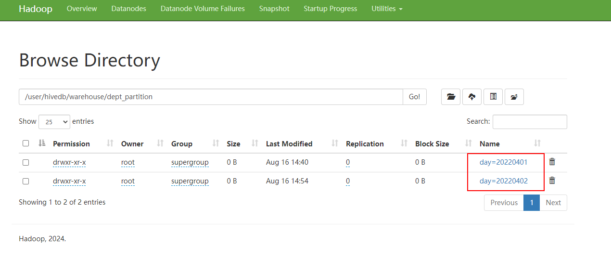
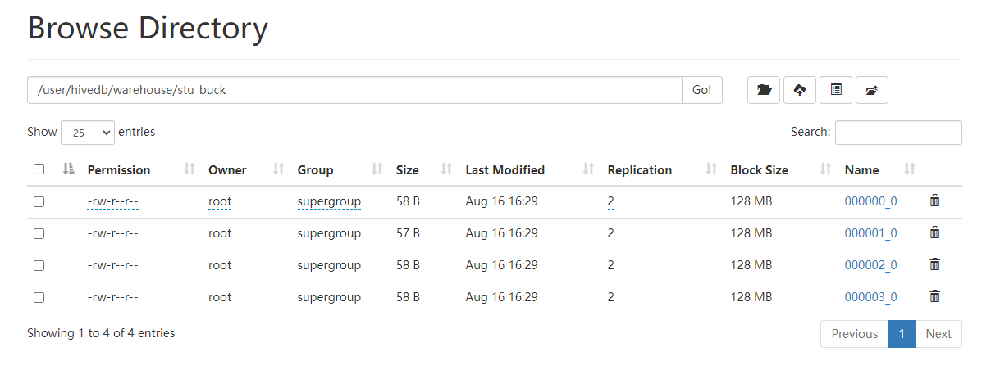
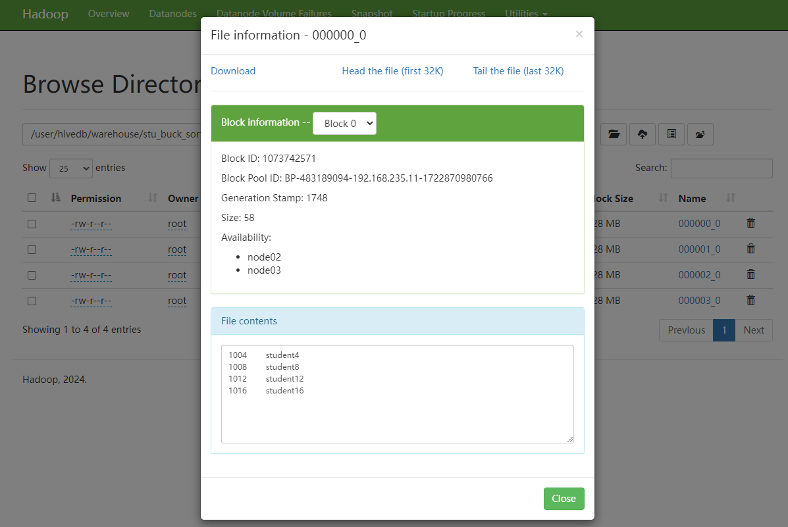

# 分区表和分桶表

## 一、分区表

Hive中的分区就是把一张大表的数据按照业务需要分散的存储到多个目录，每个目录就称为该表的一个分区。在查询时通过where子句中的表达式选择查询所需要的分区，这样的查询效率会提高很多。 注意分区字段不能和表里已有的字段一样，不然会报错 Column repeated in partitioning columns。

### 1、分区表基本语法

#### (1)、创建分区表

```mysql
create table dept_partition
(
    deptno int,    -- 部门编号
    dname  string, -- 部门名称
    loc    string  -- 部门位置
)
partitioned by (day string)
row format delimited fields terminated by '\t';
```

#### (2)、分区表读写数据

- 写数据

  数据准备

  ```shell
  [root@node01 ~]# vim dept_20220401.log
  10	行政部	1700
  20	财务部	1800
  ```

  - **load**

    ```shell
    load data local inpath '/root/dept_20220401.log' 
    into table dept_partition 
    partition(day='20220401');
    ```

  - **insert**

    将**day='20220401'**分区的数据插入到**day='20220402'**分区，可执行如下装载语句

    ```shell
    insert overwrite table dept_partition partition (day = '20220402')
    select deptno, dname, loc
    from dept_partition
    where day = '20220401';
    ```

- 分区表在HDFS的存储路径

  

- 读数据

  查询分区表数据时，可以将分区字段看作表的伪列，可像使用其他字段一样使用分区字段。

  ```mysql
  select deptno, dname, loc ,day
  from dept_partition
  where day = '20220401';
  ```

#### (3)、分区表基本操作

1. 查看分区

   ```mysql
   show partitions dept_partition;
   ```

2. 增加分区

   ```mysql
   -- 增加单个分区
   alter table dept_partition add partition(day='20220403');
-- 增加多个分区
alter table dept_partition add partition(day='20220404') partition(day='20220405'); -- 增加多个分区时，多个分区之间没有逗号
   ```
   
3. 删除分区

   ```mysql
   -- 删除单个分区
   alter table dept_partition drop partition(day='2020-04-03');
   
   -- 删除多个分区
   alter table dept_partition drop partition(day='20220404'),partition(day='20220405'); -- 删除多个分区时，多个分区之间有逗号
   alter table dept_partition drop partition (day>='20220402',day<='20220403')
   ```

4. 修复分区

   Hive将分区表的所有分区信息都保存在了元数据中，只有元数据与HDFS上的分区路径一致时，分区表才能正常读写数据。若用户手动创建/删除分区路径，Hive都是感知不到的，这样就会导致Hive的元数据和HDFS的分区路径不一致。再比如，若分区表为外部表，用户执行drop partition命令后，分区元数据会被删除，而HDFS的分区路径不会被删除，同样会导致Hive的元数据和HDFS的分区路径不一致。

   若出现元数据和HDFS路径不一致的情况，可通过如下几种手段进行修复。

   - （1）add partition

     若手动创建HDFS的分区路径，Hive无法识别，可通过add partition命令增加分区元数据信息，从而使元数据和分区路径保持一致。

   - （2）drop partition

     若手动删除HDFS的分区路径，Hive无法识别，可通过drop partition命令删除分区元数据信息，从而使元数据和分区路径保持一致。

   - （3）msck

     若分区元数据和HDFS的分区路径不一致，还可使用msck命令进行修复，以下是该命令的用法说明。

     ```mysql
     hive (default)> 
     msck repair table table_name [add/drop/sync partitions];
     ```

     说明：

     `msck repair table table_name add partitions`：该命令会增加HDFS路径存在但元数据缺失的分区信息。

     `msck repair table table_name drop partitions`：该命令会删除HDFS路径已经删除但元数据仍然存在的分区信息。

     `msck repair table table_name sync partitions`：该命令会同步HDFS路径和元数据分区信息，相当于同时执行上述的两个命令。

     `msck repair table table_name`：等价于msck repair table table_name add partitions命令。

### 2、多级分区

#### (1)、建表

```mysql
create table dept_partition2(
    deptno int,    -- 部门编号
    dname string, -- 部门名称
    loc string     -- 部门位置
)
partitioned by (day string, hour string)
row format delimited fields terminated by '\t';
```

#### (2)、装载数据

```mysql
load data local inpath '/root/dept_20220401.log' 
into table dept_partition2 
partition(day='20220401', hour='12');
```

#### (3)、查询

```mysql
select 
    * 
from dept_partition2 
where day='20220401' and hour='12';
```

### 3、动态分区

动态分区是指向分区表insert数据时，被写往的分区不由用户指定，而是由每行数据的最后一个字段的值来动态的决定。使用动态分区，可只用一个insert语句将数据写入多个分区。

#### (1)、动态分区相关参数

```properties
#(1) 动态分区功能总开关（默认true，开启）
set hive.exec.dynamic.partition=true

#(2) 严格模式和非严格模式
#动态分区的模式，默认strict（严格模式），要求必须指定至少一个分区为静态分区，nonstrict（非严格模式）允许所有的分区字段都使用动态分区。
set hive.exec.dynamic.partition.mode=nonstrict

#(3) 一条insert语句可同时创建的最大的分区个数，默认为1000。
set hive.exec.max.dynamic.partitions=1000

#(4) 单个Mapper或者Reducer可同时创建的最大的分区个数，默认为100。
set hive.exec.max.dynamic.partitions.pernode=100

#(5) 一条insert语句可以创建的最大的文件个数，默认100000。
hive.exec.max.created.files=100000

#(6) 当查询结果为空时且进行动态分区时，是否抛出异常，默认false。
hive.error.on.empty.partition=false
```

#### (2）案例实操

需求：将dept表中的数据按照地区（loc字段），插入到目标表dept_partition_dynamic的相应分区中。

（1）创建目标分区表

```mysql
create table dept_partition_dynamic(
    id int, 
    name string
) 
partitioned by (loc int) 
row format delimited fields terminated by '\t';

-- 测试表 --------------------------------------------------------------
[root@node01 ~]# vim dept.txt
10	行政部	1700
20	财务部	1800
30	教学部	1900
40	销售部	1700

create table if not exists dept(
    deptno int,    -- 部门编号
    dname string,  -- 部门名称
    loc int        -- 部门位置
)
row format delimited fields terminated by '\t';

load data local inpath '/root/dept.txt' into table dept;
```

（2）设置动态分区

```mysql
set hive.exec.dynamic.partition.mode = nonstrict;

insert into table dept_partition_dynamic 
partition(loc) 
select 
    deptno, 
    dname, 
    loc 
from dept;
```

（3）查看目标分区表的分区情况

```mysql
show partitions dept_partition_dynamic;
```

## 二、分桶表

分区提供一个隔离数据和优化查询的便利方式。不过，并非所有的数据集都可形成合理的分区。对于一张表或者分区，Hive 可以进一步组织成桶，也就是更为细粒度的数据范围划分，分区针对的是数据的存储路径，分桶针对的是数据文件。

分桶表的基本原理是，首先为每行数据计算一个指定字段的数据的hash值，然后模以一个指定的分桶数，最后将取模运算结果相同的行，写入同一个文件中，这个文件就称为一个分桶（bucket）。

说明：Hive新版本load数据可以直接跑MapReduce，老版的Hive需要将数据传到一张表里，再通过查询的方式导入到分桶表里面。

### 1、分桶表的基本语法

#### (1)、建表语句

```mysql
create table stu_buck(
    id int, 
    name string
)
clustered by(id)  -- 指定分桶字段
into 4 buckets   -- 把数据经过哈希算法后分到4个文件
row format delimited fields terminated by '\t';
```

#### (2)、装载数据

```mysql
[root@node01 ~]# vim student.txt

1001	student1
1002	student2
1003	student3
1004	student4
1005	student5
1006	student6
1007	student7
1008	student8
1009	student9
1010	student10
1011	student11
1012	student12
1013	student13
1014	student14
1015	student15
1016	student16
-----------------------------------------------------------------------

load data local inpath '/root/student.txt' 
into table stu_buck;
```

#### (3)、数据验证

- 查看数据分桶， 可见数据被分成了四个桶

  

- 观察数据

  ```mysql
  select * from stu_buck;
  
  +--------------+----------------+
  | stu_buck.id  | stu_buck.name  |
  +--------------+----------------+
  | 1016         | student16      |
  | 1012         | student12      |
  | 1008         | student8       |
  | 1004         | student4       |
  | 1009         | student9       |
  | 1005         | student5       |
  | 1001         | student1       |
  | 1013         | student13      |
  | 1010         | student10      |
  | 1002         | student2       |
  | 1006         | student6       |
  | 1014         | student14      |
  | 1003         | student3       |
  | 1011         | student11      |
  | 1007         | student7       |
  | 1015         | student15      |
  +--------------+----------------+
  
  # 观察id可以发现 1到4行对4取余为0，5到8行对4取余为1，9到12行对4取余为2，13到16行对四取余为3
  ```

补充说明：老版的Hive需要将数据传到一张表里，再通过查询的方式导入到分桶表里面。

```sql
-- 新建一张普通表，表字段和分桶表一样，并导入数据
create table stu_shadow
(
    id int
   ,name string
)
row format delimited fields terminated by '\t';
hdfs dfs -put stu.txt /user/hivedb/warehouse/stu_shadow

-- 建分桶表
create table stu_buck
(
    id int
   ,name string
)
clustered by(id) into 4 buckets
row format delimited fields terminated by '\t';

-- 设置分桶属性
set hive.enforce.bucketing=true;
set mapreduce.job.reduces=-1;

-- 导入普通表的数据到分桶表
insert into table stu_buck select id, name from stu_shadow;
```

#### (4)、分桶抽样查询

对于非常大的数据集，有时用户需要使用的是一个具有代表性的查询结果而不是全部结果。Hive可以通过对表进行抽样来满足这个需求。

语法：TABLESAMPLE(BUCKET x OUT OF y)

- y必须是table总bucket数的倍数或者因子。hive根据y的大小，决定抽样的比例。例如，table总共分了4份，当y=4时，抽取(4/4=)1个bucket的数据，当y=8时，抽取(4/8=)1/2个bucket的数据。

- x表示从哪个bucket开始抽取，如果需要取多个分区，以后的分区号为当前分区号加上y。例如，table总bucket数为4，tablesample(bucket 1 out of 2)，表示总共抽取（4/2=）2个bucket的数据，抽取第1(x)个和第3(x+y)个bucket的数据。

- 注意：x的值必须小于等于y的值，否则会报如下错误

  FAILED: SemanticException [Error 10061]: Numerator should not be bigger than denominator in sample clause for table stu_buck

```sql
hive> select * from stu_buck tablesample(bucket 1 out of 4 on id);
+--------------+----------------+
| stu_buck.id  | stu_buck.name  |
+--------------+----------------+
| 1016         | student16      |
| 1004         | student4       |
| 1009         | student9       |
| 1002         | student2       |
| 1003         | student3       |
+--------------+----------------+

hive> select * from stu_buck tablesample(bucket 1 out of 8 on id);
+--------------+----------------+
| stu_buck.id  | stu_buck.name  |
+--------------+----------------+
| 1016         | student16      |
| 1009         | student9       |
| 1003         | student3       |
+--------------+----------------+

```

### 2、分桶排序表

#### (1)、建表语句

```mysql
create table stu_buck_sort(
    id int, 
    name string
)
clustered by(id) sorted by(id)
into 4 buckets
row format delimited fields terminated by '\t';
```

#### (2)、装载数据

```shell
load data local inpath '/root/student.txt' 
into table stu_buck_sort;
```

#### (3)、观察数据

会发现桶中的数据已经按id升序排序




