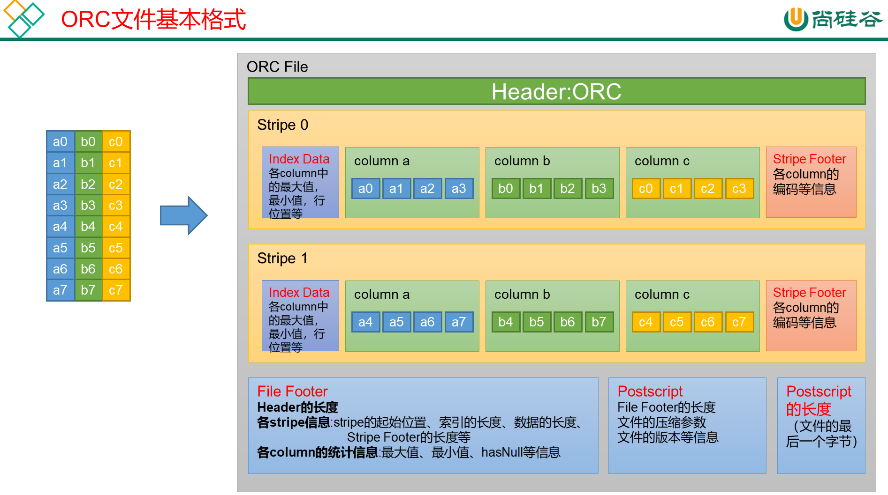
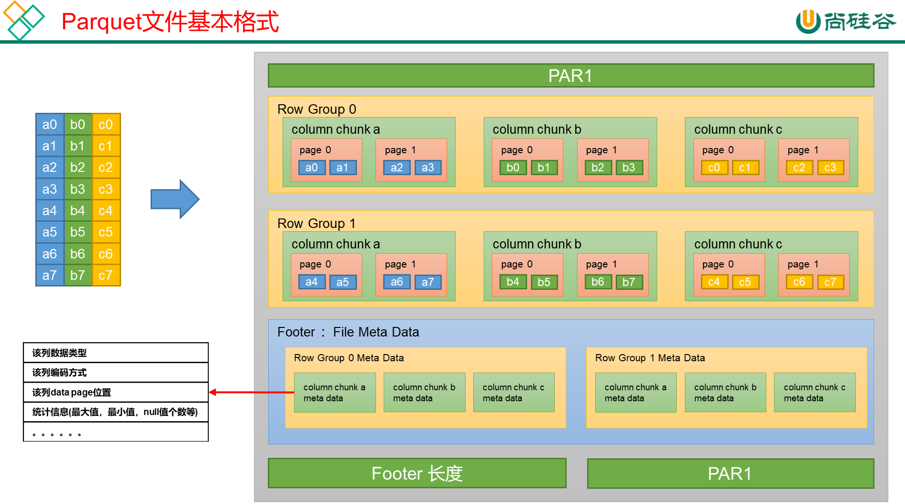

# 文件格式和压缩

## 一、Hadoop压缩概述

| **压缩格式** | **算法** | **文件扩展名** | **是否可切分** |
| ------------ | -------- | -------------- | -------------- |
| DEFLATE      | DEFLATE  | .deflate       | 否             |
| Gzip         | DEFLATE  | .gz            | 否             |
| bzip2        | bzip2    | .bz2           | **是**         |
| LZO          | LZO      | .lzo           | **是**         |
| Snappy       | Snappy   | .snappy        | 否             |

为了支持多种压缩/解压缩算法，Hadoop引入了编码/解码器，如下表所示：

Hadoop查看支持压缩的方式hadoop checknative。

Hadoop在driver端设置压缩。

| 压缩格式 | 对应的编码/码器                            |
| -------- | ------------------------------------------ |
| DEFLATE  | org.apache.hadoop.io.compress.DefaultCodec |
| gzip     | org.apache.hadoop.io.compress.GzipCodec    |
| bzip2    | org.apache.hadoop.io.compress.BZip2Codec   |
| LZO      | com.hadoop.compression.lzo.LzopCodec       |
| Snappy   | org.apache.hadoop.io.compress.SnappyCodec  |

压缩性能的比较：

| **压缩算法** | **原始文件大小** | **压缩文件大小** | **压缩速度** | **解压速度** |
| ------------ | ---------------- | ---------------- | ------------ | ------------ |
| gzip         | 8.3GB            | 1.8GB            | 17.5MB/s     | 58MB/s       |
| bzip2        | 8.3GB            | 1.1GB            | 2.4MB/s      | 9.5MB/s      |
| LZO          | 8.3GB            | 2.9GB            | 49.3MB/s     | 74.6MB/s     |

```shell
[root@node01 native]# hadoop checknative
21/02/05 06:09:10 INFO bzip2.Bzip2Factory: Successfully loaded & initialized native-bzip2 library system-native
21/02/05 06:09:10 INFO zlib.ZlibFactory: Successfully loaded & initialized native-zlib library
Native library checking:
hadoop:  true /opt/stanlong/hadoop-ha/hadoop-2.9.2/lib/native/libhadoop.so.1.0.0
zlib:    true /lib64/libz.so.1
snappy:  true /lib64/libsnappy.so.1
zstd  :  false 
lz4:     true revision:10301
bzip2:   true /lib64/libbz2.so.1
openssl: true /lib64/libcrypto.so
```

## 二、Hive文件格式

为Hive表中的数据选择一个合适的文件格式，对提高查询性能的提高是十分有益的。Hive表数据的存储格式，可以选择text file、orc、parquet、sequence file等。

### 1、Text File

文本文件是Hive默认使用的文件格式，文本文件中的一行内容，就对应Hive表中的一行记录。

可通过以下建表语句指定文件格式为文本文件:

```mysql
create table textfile_table
(column_specs)
stored as textfile;
```

### 2、ORC

#### (1)、文件格式

ORC（Optimized Row Columnar）file format是Hive 0.11版里引入的一种**列式存储**的文件格式。ORC文件能够提高Hive读写数据和处理数据的性能。

与列式存储相对的是行式存储，下图是两者的对比：


- 行存储的特点

  查询满足条件的一整行数据的时候，列存储则需要去每个聚集的字段找到对应的每个列的值，行存储只需要找到其中一个值，其余的值都在相邻地方，所以此时行存储查询的速度更快。

- 列存储的特点

  因为每个字段的数据聚集存储，在查询只需要少数几个字段的时候，能大大减少读取的数据量；每个字段的数据类型一定是相同的，列式存储可以针对性的设计更好的设计压缩算法。

前文提到的text file和sequence file都是基于行存储的，orc和parquet是基于列式存储的。

orc文件的具体结构如下图所示：



每个Orc文件由Header、Body和Tail三部分组成。

其中Header内容为ORC，用于表示文件类型。

Body由1个或多个stripe组成，每个stripe一般为HDFS的块大小，每一个stripe包含多条记录，这些记录按照列进行独立存储，每个stripe里有三部分组成，分别是Index Data，Row Data，Stripe Footer。

- Index Data：一个轻量级的index，默认是为各列每隔1W行做一个索引。每个索引会记录第n万行的位置，和最近一万行的最大值和最小值等信息。
- Row Data：存的是具体的数据，按列进行存储，并对每个列进行编码，分成多个Stream来存储。
- Stripe Footer：存放的是各个Stream的位置以及各column的编码信息。

Tail由File Footer和PostScript组成。File Footer中保存了各Stripe的其实位置、索引长度、数据长度等信息，各Column的统计信息等；PostScript记录了整个文件的压缩类型以及File Footer的长度信息等。

在读取ORC文件时，会先从最后一个字节读取PostScript长度，进而读取到PostScript，从里面解析到File Footer长度，进而读取FileFooter，从中解析到各个Stripe信息，再读各个Stripe，即从后往前读。

#### (2)、建表语句

```mysql
create table orc_table
(column_specs)
stored as orc
tblproperties (property_name=property_value, ...);
```

ORC文件格式支持的参数如下：

| **参数**             | **默认值** | **说明**                                |
| -------------------- | ---------- | --------------------------------------- |
| orc.compress         | ZLIB       | 压缩格式，可选项：NONE、ZLIB,、SNAPPY   |
| orc.compress.size    | 262,144    | 每个压缩块的大小（ORC文件是分块压缩的） |
| orc.stripe.size      | 67,108,864 | 每个stripe的大小                        |
| orc.row.index.stride | 10,000     | 索引步长（每隔多少行数据建一条索引）    |

### 3、Parquet

Parquet文件是Hadoop生态中的一个通用的文件格式，它也是一个列式存储的文件格式。

#### (1)、文件格式

Parquet文件的格式如下图所示：




上图展示了一个Parquet文件的基本结构，文件的首尾都是该文件的Magic Code，用于校验它是否是一个Parquet文件。

首尾中间由若干个Row Group和一个Footer（File Meta Data）组成。

每个Row Group包含多个Column Chunk，每个Column Chunk包含多个Page。以下是Row Group、Column Chunk和Page三个概念的说明：

- 行组（Row Group）：一个行组对应逻辑表中的若干行。 

- 列块（Column Chunk）：一个行组中的一列保存在一个列块中。 
- 页（Page）：一个列块的数据会划分为若干个页。 

Footer（File Meta Data）中存储了每个行组（Row Group）中的每个列快（Column Chunk）的元数据信息，元数据信息包含了该列的数据类型、该列的编码方式、该类的Data Page位置等信息。

#### (2)、建表语句

```mysql
Create table parquet_table
(column_specs)
stored as parquet
tblproperties (property_name=property_value, ...);
```

支持的参数如下：

| **参数**            | **默认值**   | **说明**                                                     |
| ------------------- | ------------ | ------------------------------------------------------------ |
| parquet.compression | uncompressed | 压缩格式，可选项：uncompressed，snappy，gzip，lzo，brotli，lz4 |
| parquet.block.size  | 134217728    | 行组大小，通常与HDFS块大小保持一致                           |
| parquet.page.size   | 1048576      | 页大小                                                       |

## 三、压缩

在Hive表中和计算过程中，保持数据的压缩，对磁盘空间的有效利用和提高查询性能都是十分有益的。

### 1、Hive表数据进行压缩

在Hive中，不同文件类型的表，声明数据压缩的方式是不同的。

#### (1)、TextFile

若一张表的文件类型为TextFile，若需要对该表中的数据进行压缩，多数情况下，无需在建表语句做出声明。直接将压缩后的文件导入到该表即可，Hive在查询表中数据时，可自动识别其压缩格式，进行解压。

需要注意的是，在执行往表中导入数据的SQL语句时，用户需设置以下参数，来保证写入表中的数据是被压缩的。

```properties
# SQL语句的最终输出结果是否压缩
set hive.exec.compress.output=true;
# 开启mapreduce最终输出数据压缩
set mapreduce.output.fileoutputformat.compress=true;
# 输出结果的压缩格式（以下示例为snappy）
set mapreduce.output.fileoutputformat.compress.codec =org.apache.hadoop.io.compress.SnappyCodec;
# 设置mapreduce最终数据输出压缩为块压缩
set mapreduce.output.fileoutputformat.compress.type=BLOCK;
```

#### (2)、ORC

若一张表的文件类型为ORC，若需要对该表数据进行压缩，需在建表语句中声明压缩格式如下：

```mysql
create table orc_table
(column_specs)
stored as orc
tblproperties ("orc.compress"="snappy");
```

#### (3)、Parquet

若一张表的文件类型为Parquet，若需要对该表数据进行压缩，需在建表语句中声明压缩格式如下：

```mysql
create table orc_table
(column_specs)
stored as parquet
tblproperties ("parquet.compression"="snappy");
```

### 2、计算过程中使用压缩

#### (1)、单个MR的中间结果进行压缩

单个MR的中间结果是指Mapper输出的数据，对其进行压缩可降低shuffle阶段的网络IO，可通过以下参数进行配置：

```properties
# 开启hive中间传输数据压缩功能
set hive.exec.compress.intermediate=true;
# 开启MapReduce中间数据压缩功能
set mapreduce.map.output.compress=true;
# 设置MapReduce中间数据数据的压缩方式（以下示例为snappy）
set mapreduce.map.output.compress.codec=org.apache.hadoop.io.compress.SnappyCodec;
```

#### (2)、单条SQL语句的中间结果进行压缩

单条SQL语句的中间结果是指，两个MR（一条SQL语句可能需要通过MR进行计算）之间的临时数据，可通过以下参数进行配置：

```properties
--是否对两个MR之间的临时数据进行压缩
set hive.exec.compress.intermediate=true;
--压缩格式（以下示例为snappy）
set hive.intermediate.compression.codec= org.apache.hadoop.io.compress.SnappyCodec;
```

