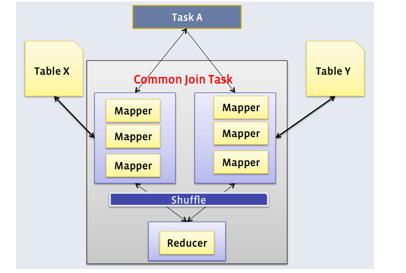
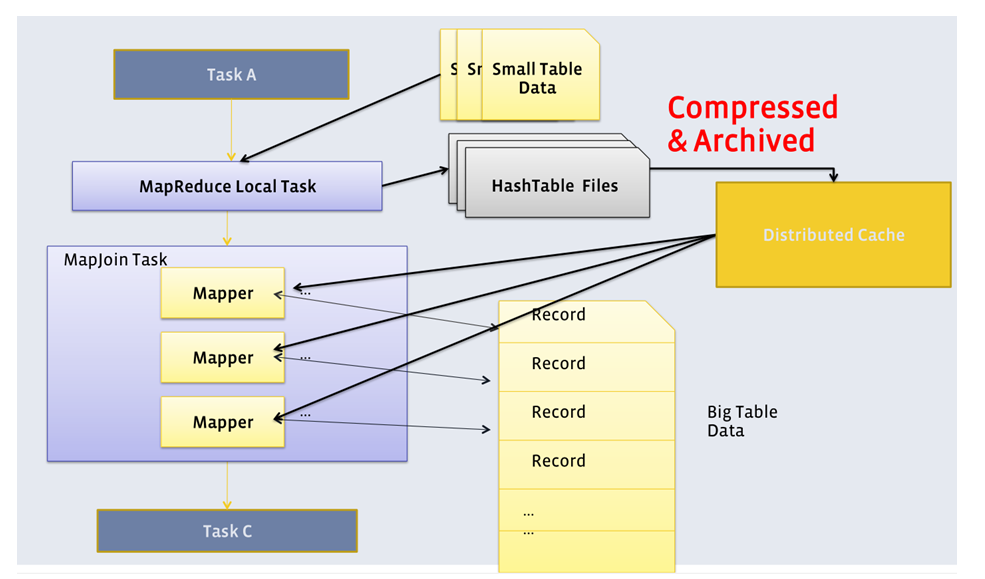
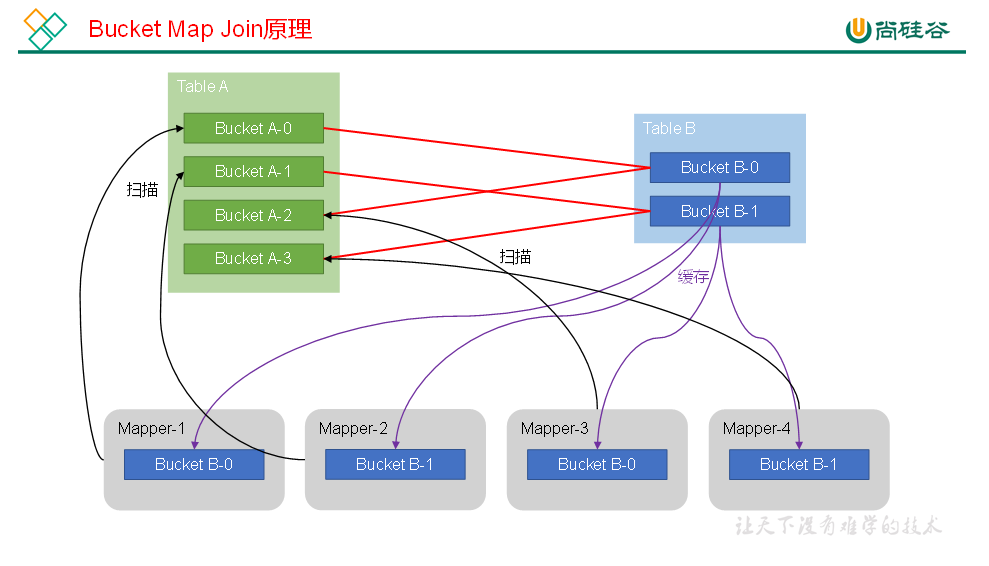
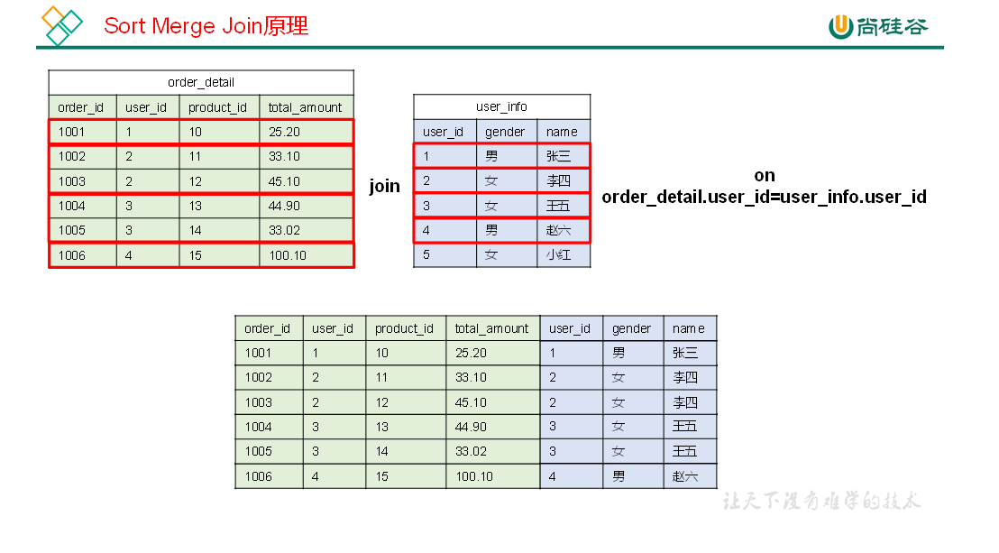
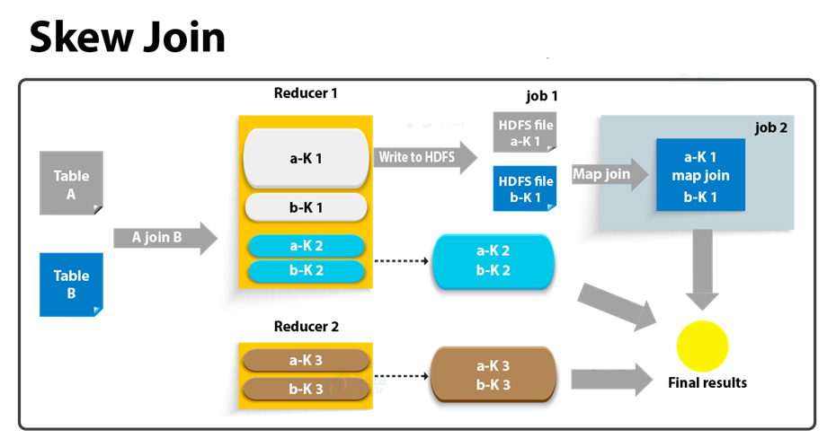

# 企业级调优

## 一、Yarn资源配置

### 1、Yarn配置说明

需要调整的Yarn参数均与CPU、内存等资源有关，核心配置参数如下

（1）`yarn.nodemanager.resource.memory-mb`

该参数的含义是，一个NodeManager节点分配给Container使用的内存。该参数的配置，取决于NodeManager所在节点的总内存容量和该节点运行的其他服务的数量。

考虑上述因素，此处可将该参数设置为64G，如下：

```xml
<property>
    <name>yarn.nodemanager.resource.memory-mb</name>
    <value>65536</value>
</property>
```

（2）`yarn.nodemanager.resource.cpu-vcores`

该参数的含义是，一个NodeManager节点分配给Container使用的CPU核数。该参数的配置，同样取决于NodeManager所在节点的总CPU核数和该节点运行的其他服务。

考虑上述因素，此处可将该参数设置为16。

```xml
<property>
    <name>yarn.nodemanager.resource.cpu-vcores</name>
    <value>16</value>
</property>
```

（3）`yarn.scheduler.maximum-allocation-mb`

该参数的含义是，单个Container能够使用的最大内存。推荐配置如下：

```xml
<property>
    <name>yarn.scheduler.maximum-allocation-mb</name>
    <value>16384</value>
</property>
```

（4）`yarn.scheduler.minimum-allocation-mb`

该参数的含义是，单个Container能够使用的最小内存，推荐配置如下：

```xml
<property>
    <name>yarn.scheduler.minimum-allocation-mb</name>
    <value>512</value>
</property>
```

### 2、Yarn配置

（1）修改$HADOOP_HOME/etc/hadoop/yarn-site.xml文件

（2）修改如下参数

```xml
<property>
    <name>yarn.nodemanager.resource.memory-mb</name>
    <value>65536</value>
</property>
<property>
    <name>yarn.nodemanager.resource.cpu-vcores</name>
    <value>16</value>
</property>
<property>
    <name>yarn.scheduler.maximum-allocation-mb</name>
    <value>16384</value>
</property>
<property>
    <name>yarn.scheduler.minimum-allocation-mb</name>
    <value>512</value>
</property>
```

（3）分发该配置文件

（4）重启Yarn。

## 二、MapReduce资源配置

MapReduce资源配置主要包括Map Task的内存和CPU核数，以及Reduce Task的内存和CPU核数。核心配置参数如下：

### 1、mapreduce.map.memory.mb

该参数的含义是，单个Map Task申请的container容器内存大小，其默认值为1024。该值不能超出yarn.scheduler.maximum-allocation-mb和yarn.scheduler.minimum-allocation-mb规定的范围。

该参数需要根据不同的计算任务单独进行配置，在hive中，可直接使用如下方式为每个SQL语句单独进行配置：

```mysql
set mapreduce.map.memory.mb=2048;
```

### 2、mapreduce.map.cpu.vcores

该参数的含义是，单个Map Task申请的container容器cpu核数，其默认值为1。该值一般无需调整。

### 3、mapreduce.reduce.memory.mb

该参数的含义是，单个Reduce Task申请的container容器内存大小，其默认值为1024。该值同样不能超出yarn.scheduler.maximum-allocation-mb和yarn.scheduler.minimum-allocation-mb规定的范围。

该参数需要根据不同的计算任务单独进行配置，在hive中，可直接使用如下方式为每个SQL语句单独进行配置：

```mysql
set mapreduce.reduce.memory.mb=2048;
```

### 4、mapreduce.reduce.cpu.vcores

该参数的含义是，单个Reduce Task申请的container容器cpu核数，其默认值为1。该值一般无需调整。

## 三、执行计划

### 1、 Explain执行计划概述

Explain呈现的执行计划，由一系列Stage组成，这一系列Stage具有依赖关系，每个Stage对应一个MapReduce Job，或者一个文件系统操作等。

若某个Stage对应的一个MapReduce Job，其Map端和Reduce端的计算逻辑分别由Map Operator Tree和Reduce Operator Tree进行描述，Operator Tree由一系列的Operator组成，一个Operator代表在Map或Reduce阶段的一个单一的逻辑操作，例如TableScan Operator，Select Operator，Join Operator等。

下图是由一个执行计划绘制而成：


常见的Operator及其作用如下：

Ø TableScan：表扫描操作，通常map端第一个操作肯定是表扫描操作

Ø Select Operator：选取操作

Ø Group By Operator：分组聚合操作

Ø Reduce Output Operator：输出到 reduce 操作

Ø Filter Operator：过滤操作

Ø Join Operator：join 操作

Ø File Output Operator：文件输出操作

Ø Fetch Operator 客户端获取数据操作

### 2、基本语法

`EXPLAIN [FORMATTED | EXTENDED | DEPENDENCY] query-sql`

注：FORMATTED、EXTENDED、DEPENDENCY关键字为可选项，各自作用如下。

Ø FORMATTED：将执行计划以JSON字符串的形式输出

Ø EXTENDED：输出执行计划中的额外信息，通常是读写的文件名等信息

Ø DEPENDENCY：输出执行计划读取的表及分区

### 3、案例实操

```mysql
EXPLAIN  SELECT
    user_id
   ,count(*)
FROM order_info
group by user_id;


+----------------------------------------------------+
|                      Explain                       |
+----------------------------------------------------+
| STAGE DEPENDENCIES:                                |
|   Stage-1 is a root stage                          |
|   Stage-0 depends on stages: Stage-1               |
|                                                    |
| STAGE PLANS:                                       |
|   Stage: Stage-1                                   |
|     Map Reduce                                     |
|       Map Operator Tree:                           |
|           TableScan                                |
|             alias: order_info                      |
|             Statistics: Num rows: 14 Data size: 383 Basic stats: COMPLETE Column stats: NONE |
|             Select Operator                        |
|               expressions: user_id (type: string)  |
|               outputColumnNames: user_id           |
|               Statistics: Num rows: 14 Data size: 383 Basic stats: COMPLETE Column stats: NONE |
|               Group By Operator                    |
|                 aggregations: count()              |
|                 keys: user_id (type: string)       |
|                 mode: hash                         |
|                 outputColumnNames: _col0, _col1    |
|                 Statistics: Num rows: 14 Data size: 383 Basic stats: COMPLETE Column stats: NONE |
|                 Reduce Output Operator             |
|                   key expressions: _col0 (type: string) |
|                   sort order: +                    |
|                   Map-reduce partition columns: _col0 (type: string) |
|                   Statistics: Num rows: 14 Data size: 383 Basic stats: COMPLETE Column stats: NONE |
|                   value expressions: _col1 (type: bigint) |
|       Execution mode: vectorized                   |
|       Reduce Operator Tree:                        |
|         Group By Operator                          |
|           aggregations: count(VALUE._col0)         |
|           keys: KEY._col0 (type: string)           |
|           mode: mergepartial                       |
|           outputColumnNames: _col0, _col1          |
|           Statistics: Num rows: 7 Data size: 191 Basic stats: COMPLETE Column stats: NONE |
|           File Output Operator                     |
|             compressed: false                      |
|             Statistics: Num rows: 7 Data size: 191 Basic stats: COMPLETE Column stats: NONE |
|             table:                                 |
|                 input format: org.apache.hadoop.mapred.SequenceFileInputFormat |
|                 output format: org.apache.hadoop.hive.ql.io.HiveSequenceFileOutputFormat |
|                 serde: org.apache.hadoop.hive.serde2.lazy.LazySimpleSerDe |
|                                                    |
|   Stage: Stage-0                                   |
|     Fetch Operator                                 |
|       limit: -1                                    |
|       Processor Tree:                              |
|         ListSink                                   |
|                                                    |
+----------------------------------------------------+
```

## 四、分组聚合优化

### 1、优化说明

Hive中未经优化的分组聚合，是通过一个MapReduce Job实现的。Map端负责读取数据，并按照分组字段分区，通过Shuffle，将数据发往Reduce端，各组数据在Reduce端完成最终的聚合运算。

Hive对分组聚合的优化主要围绕着减少Shuffle数据量进行，具体做法是map-side聚合。所谓map-side聚合，就是在map端维护一个hash table，利用其完成部分的聚合，然后将部分聚合的结果，按照分组字段分区，发送至reduce端，完成最终的聚合。map-side聚合能有效减少shuffle的数据量，提高分组聚合运算的效率。

map-side 聚合相关的参数如下：

```mysql
-- 启用map-side聚合， 默认为True
set hive.map.aggr=true;

-- 用于检测源表数据是否适合进行map-side聚合。检测的方法是：先对若干条数据进行map-side聚合，若聚合后的条数和聚合前的条数比值小于该值，则认为该表适合进行map-side聚合；否则，认为该表数据不适合进行map-side聚合，后续数据便不再进行map-side聚合。
set hive.map.aggr.hash.min.reduction=0.5;

-- 用于检测源表是否适合map-side聚合的条数。
set hive.groupby.mapaggr.checkinterval=100000;

-- map-side聚合所用的hash table，占用map task堆内存的最大比例，若超出该值，则会对hash table进行一次flush。
set hive.map.aggr.hash.force.flush.memory.threshold=0.9;

-- 有数据倾斜的时候进行负载均衡（默认是false）
hive.groupby.skewindata = true
-- 当选项设定为 true，生成的查询计划会有两个MR Job。第一个MR Job中，Map的输出结果会随机分布到Reduce中，每个Reduce做部分聚合操作，并输出结果，这样处理的结果是相同的Group By Key有可能被分发到不同的Reduce中，从而达到负载均衡的目的；第二个MR Job再根据预处理的数据结果按照Group By Key分布到Reduce中（这个过程可以保证相同的Group By Key被分布到同一个Reduce中），最后完成最终的聚合操作
```

## 五、Join优化

### 1、Join算法概述

Hive拥有多种join算法，包括Common Join，Map Join，Bucket Map Join，Sort Merge Buckt Map Join等，下面对每种join算法做简要说明：

#### (1)、Common Join

Common Join是Hive中最稳定的join算法，其通过一个MapReduce Job完成一个join操作。Map端负责读取join操作所需表的数据，并按照关联字段进行分区，通过Shuffle，将其发送到Reduce端，相同key的数据在Reduce端完成最终的Join操作。如下图所示：



需要注意的是，sql语句中的join操作和执行计划中的Common Join任务并非一对一的关系，一个sql语句中的相邻的且关联字段相同的多个join操作可以合并为一个Common Join任务。

例如：

```mysql
select 
    a.val, 
    b.val, 
    c.val 
from a 
join b on (a.key = b.key1) 
join c on (c.key = b.key1)
```

上述sql语句中两个join操作的关联字段均为b表的key1字段，则该语句中的两个join操作可由一个Common Join任务实现，也就是可通过一个Map Reduce任务实现。 

```mysql
select 
    a.val, 
    b.val, 
    c.val 
from a 
join b on (a.key = b.key1) 
join c on (c.key = b.key2)
```

上述sql语句中的两个join操作关联字段各不相同，则该语句的两个join操作需要各自通过一个Common Join任务实现，也就是通过两个Map Reduce任务实现。

#### (2)、Map Join

Map Join算法可以通过两个只有map阶段的Job完成一个join操作。其适用场景为大表join小表。若某join操作满足要求，则第一个Job会读取小表数据，将其制作为hash table，并上传至Hadoop分布式缓存（本质上是上传至HDFS）。第二个Job会先从分布式缓存中读取小表数据，并缓存在Map Task的内存中，然后扫描大表数据，这样在map端即可完成关联操作。如下图所示：



#### (3)、Bucket Map Join

Bucket Map Join是对Map Join算法的改进，其打破了Map Join只适用于大表join小表的限制，可用于大表join大表的场景。

Bucket Map Join的核心思想是：若能保证参与join的表均为分桶表，且关联字段为分桶字段，且其中一张表的分桶数量是另外一张表分桶数量的整数倍，就能保证参与join的两张表的分桶之间具有明确的关联关系，所以就可以在两表的分桶间进行Map Join操作了。这样一来，第二个Job的Map端就无需再缓存小表的全表数据了，而只需缓存其所需的分桶即可。其原理如图所示：



#### (4)、Sort Merge Bucket Map Join

Sort Merge Bucket Map Join（简称SMB Map Join）基于Bucket Map Join。SMB Map Join要求，参与join的表均为分桶表，且需保证分桶内的数据是有序的，且分桶字段、排序字段和关联字段为相同字段，且其中一张表的分桶数量是另外一张表分桶数量的整数倍。

SMB Map Join同Bucket Join一样，同样是利用两表各分桶之间的关联关系，在分桶之间进行join操作，不同的是，分桶之间的join操作的实现原理。Bucket Map Join，两个分桶之间的join实现原理为Hash Join算法；而SMB Map Join，两个分桶之间的join实现原理为Sort Merge Join算法。

Hash Join和Sort Merge Join均为关系型数据库中常见的Join实现算法。Hash Join的原理相对简单，就是对参与join的一张表构建hash table，然后扫描另外一张表，然后进行逐行匹配。Sort Merge Join需要在两张按照关联字段排好序的表中进行，其原理如图所示：



Hive中的SMB Map Join就是对两个分桶的数据按照上述思路进行Join操作。可以看出，SMB Map Join与Bucket Map Join相比，在进行Join操作时，Map端是无需对整个Bucket构建hash table，也无需在Map端缓存整个Bucket数据的，每个Mapper只需按顺序逐个key读取两个分桶的数据进行join即可。

### 2、Map Join

#### (1)、优化说明

Map Join有两种触发方式，一种是用户在SQL语句中增加hint提示，另外一种是Hive优化器根据参与join表的数据量大小，自动触发。

1. Hint提示

   用户可通过如下方式，指定通过map join算法，并且`ta`将作为map join中的小表。这种方式已经过时，不推荐使用。

   ```mysql
   select /*+ mapjoin(ta) */
       ta.id,
       tb.id
   from table_a ta
   join table_b tb
   on ta.id=tb.id;
   ```

2. 自动触发

   Hive在编译SQL语句阶段，起初所有的join操作均采用Common Join算法实现。

   之后在物理优化阶段，Hive会根据每个Common Join任务所需表的大小判断该Common Join任务是否能够转换为Map Join任务，若满足要求，便将Common Join任务自动转换为Map Join任务。

   但有些Common Join任务所需的表大小，在SQL的编译阶段是未知的（例如对子查询进行join操作），所以这种Common Join任务是否能转换成Map Join任务在编译阶是无法确定的。

   针对这种情况，Hive会在编译阶段生成一个条件任务（Conditional Task），其下会包含一个计划列表，计划列表中包含转换后的Map Join任务以及原有的Common Join任务。最终具体采用哪个计划，是在运行时决定的。大致思路如下图所示：

   

   Map join自动转换的具体判断逻辑如下图所示：

   

   图中涉及到的参数如下：

   ```mysql
   --启动Map Join自动转换
   set hive.auto.convert.join=true;
   
   --一个Common Join operator转为Map Join operator的判断条件,若该Common Join相关的表中,存在n-1张表的已知大小总和<=该值,则生成一个Map Join计划,此时可能存在多种n-1张表的组合均满足该条件,则hive会为每种满足条件的组合均生成一个Map Join计划,同时还会保留原有的Common Join计划作为后备(back up)计划,实际运行时,优先执行Map Join计划，若不能执行成功，则启动Common Join后备计划。
   set hive.mapjoin.smalltable.filesize=250000;
   
   --开启无条件转Map Join
   set hive.auto.convert.join.noconditionaltask=true;
   
   --无条件转Map Join时的小表之和阈值,若一个Common Join operator相关的表中，存在n-1张表的大小总和<=该值,此时hive便不会再为每种n-1张表的组合均生成Map Join计划,同时也不会保留Common Join作为后备计划。而是只生成一个最优的Map Join计划。
   set hive.auto.convert.join.noconditionaltask.size=10000000;
   ```


### 3、Bucket Map Join

#### (1)、优化说明

Bucket Map Join不支持自动转换，发须通过用户在SQL语句中提供如下Hint提示，并配置如下相关参数，方可使用。

- Hint提示

  ```mysql
  select /*+ mapjoin(ta) */
      ta.id,
      tb.id
  from table_a ta
  join table_b tb on ta.id=tb.id;
  ```

- 相关参数

  ```mysql
  --关闭cbo优化，cbo会导致hint信息被忽略
  set hive.cbo.enable=false;
  --map join hint默认会被忽略(因为已经过时)，需将如下参数设置为false
  set hive.ignore.mapjoin.hint=false;
  --启用bucket map join优化功能
  set hive.optimize.bucketmapjoin = true;
  ```

### 4、Sort Merge Bucket Map Join

#### (1)、优化说明

Sort Merge Bucket Map Join有两种触发方式，包括Hint提示和自动转换。Hint提示已过时，不推荐使用。下面是自动转换的相关参数：

```mysql
--启动Sort Merge Bucket Map Join优化
set hive.optimize.bucketmapjoin.sortedmerge=true;
--使用自动转换SMB Join
set hive.auto.convert.sortmerge.join=true;
```

## 六、HQL语法优化之数据倾斜

### 1、数据倾斜概述

数据倾斜问题，通常是指参与计算的数据分布不均，即某个key或者某些key的数据量远超其他key，导致在shuffle阶段，大量相同key的数据被发往同一个Reduce，进而导致该Reduce所需的时间远超其他Reduce，成为整个任务的瓶颈。

Hive中的数据倾斜常出现在分组聚合和join操作的场景中，下面分别介绍在上述两种场景下的优化思路。

### 2、分组聚合导致的数据倾斜

#### (1)、优化说明

前文提到过，Hive中未经优化的分组聚合，是通过一个MapReduce Job实现的。Map端负责读取数据，并按照分组字段分区，通过Shuffle，将数据发往Reduce端，各组数据在Reduce端完成最终的聚合运算。

如果group by分组字段的值分布不均，就可能导致大量相同的key进入同一Reduce，从而导致数据倾斜问题。

由分组聚合导致的数据倾斜问题，有以下两种解决思路：

#### (2)、Map-Side聚合

开启Map-Side聚合后，数据会现在Map端完成部分聚合工作。这样一来即便原始数据是倾斜的，经过Map端的初步聚合后，发往Reduce的数据也就不再倾斜了。最佳状态下，Map-端聚合能完全屏蔽数据倾斜问题。

相关参数如下：

```mysql
--启用map-side聚合
set hive.map.aggr=true;

--用于检测源表数据是否适合进行map-side聚合。检测的方法是：先对若干条数据进行map-side聚合，若聚合后的条数和聚合前的条数比值小于该值，则认为该表适合进行map-side聚合；否则，认为该表数据不适合进行map-side聚合，后续数据便不再进行map-side聚合。
set hive.map.aggr.hash.min.reduction=0.5;

--用于检测源表是否适合map-side聚合的条数。
set hive.groupby.mapaggr.checkinterval=100000;

--map-side聚合所用的hash table，占用map task堆内存的最大比例，若超出该值，则会对hash table进行一次flush。
set hive.map.aggr.hash.force.flush.memory.threshold=0.9;
```

#### (3)、Skew-GroupBy优化

Skew-GroupBy的原理是启动两个MR任务，第一个MR按照随机数分区，将数据分散发送到Reduce，完成部分聚合，第二个MR按照分组字段分区，完成最终聚合。

相关参数如下：

```mysql
--启用分组聚合数据倾斜优化
set hive.groupby.skewindata=true;
```

### 3、Join导致的数据倾斜

#### (1)、优化说明

前文提到过，未经优化的join操作，默认是使用common join算法，也就是通过一个MapReduce Job完成计算。Map端负责读取join操作所需表的数据，并按照关联字段进行分区，通过Shuffle，将其发送到Reduce端，相同key的数据在Reduce端完成最终的Join操作。

如果关联字段的值分布不均，就可能导致大量相同的key进入同一Reduce，从而导致数据倾斜问题。

由join导致的数据倾斜问题，有如下三种解决方案：

#### (2)、map join

使用map join算法，join操作仅在map端就能完成，没有shuffle操作，没有reduce阶段，自然不会产生reduce端的数据倾斜。该方案适用于大表join小表时发生数据倾斜的场景。

相关参数如下：

```mysql
--启动Map Join自动转换
set hive.auto.convert.join=true;

--一个Common Join operator转为Map Join operator的判断条件,若该Common Join相关的表中,存在n-1张表的大小总和<=该值,则生成一个Map Join计划,此时可能存在多种n-1张表的组合均满足该条件,则hive会为每种满足条件的组合均生成一个Map Join计划,同时还会保留原有的Common Join计划作为后备(back up)计划,实际运行时,优先执行Map Join计划，若不能执行成功，则启动Common Join后备计划。
set hive.mapjoin.smalltable.filesize=250000;

--开启无条件转Map Join
set hive.auto.convert.join.noconditionaltask=true;

--无条件转Map Join时的小表之和阈值,若一个Common Join operator相关的表中，存在n-1张表的大小总和<=该值,此时hive便不会再为每种n-1张表的组合均生成Map Join计划,同时也不会保留Common Join作为后备计划。而是只生成一个最优的Map Join计划。
set hive.auto.convert.join.noconditionaltask.size=10000000;
```

#### (3)、skew join

skew join的原理是，为倾斜的大key单独启动一个map join任务进行计算，其余key进行正常的common join。原理图如下：



相关参数如下：

```mysql
--启用skew join优化
set hive.optimize.skewjoin=true;
--触发skew join的阈值，若某个key的行数超过该参数值，则触发
set hive.skewjoin.key=100000;
```

这种方案对参与join的源表大小没有要求，但是对两表中倾斜的key的数据量有要求，要求一张表中的倾斜key的数据量比较小（方便走mapjoin）。

## 一、本地模式优化

大多数的Hadoop Job是需要Hadoop提供的完整的可扩展性来处理大数据集的。不过，有时Hive的输入数据量是非常小的。在这种情况下，为查询触发执行任务消耗的时间可能会比实际job的执行时间要多的多。对于这种情况，Hive可以通过本地模式在单台机器上处理所有的任务。对于小数据集，执行时间可以明显被缩短。

### 参数配置

```properties
# 开启本地mr
set hive.exec.mode.local.auto=true;  
# 设置local mr的最大输入数据量，当输入数据量小于这个值时采用local  mr的方式，默认为134217728，即128M
set hive.exec.mode.local.auto.inputbytes.max=50000000;
# 设置local mr的最大输入文件个数，当输入文件个数小于这个值时采用local mr的方式，默认为4
set hive.exec.mode.local.auto.input.files.max=10;
```

### 查询

**未开启本地模式查询**

```sql
0: jdbc:hive2://node01:10000> select count(1) as c1 from emp;
INFO  : Number of reduce tasks determined at compile time: 1
INFO  : In order to change the average load for a reducer (in bytes):
INFO  :   set hive.exec.reducers.bytes.per.reducer=<number>
INFO  : In order to limit the maximum number of reducers:
INFO  :   set hive.exec.reducers.max=<number>
INFO  : In order to set a constant number of reducers:
INFO  :   set mapreduce.job.reduces=<number>
INFO  : number of splits:2
INFO  : Submitting tokens for job: job_1612560336369_0001
INFO  : The url to track the job: http://node03:8088/proxy/application_1612560336369_0001/
INFO  : Starting Job = job_1612560336369_0001, Tracking URL = http://node03:8088/proxy/application_1612560336369_0001/
INFO  : Kill Command = /opt/stanlong/hadoop-ha/hadoop-2.9.2/bin/hadoop job  -kill job_1612560336369_0001
INFO  : Hadoop job information for Stage-1: number of mappers: 2; number of reducers: 1
INFO  : 2021-02-06 06:10:46,580 Stage-1 map = 0%,  reduce = 0%
INFO  : 2021-02-06 06:11:57,264 Stage-1 map = 0%,  reduce = 0%
INFO  : 2021-02-06 06:12:03,030 Stage-1 map = 50%,  reduce = 0%, Cumulative CPU 18.73 sec
INFO  : 2021-02-06 06:12:04,113 Stage-1 map = 100%,  reduce = 0%, Cumulative CPU 38.26 sec
INFO  : 2021-02-06 06:12:20,278 Stage-1 map = 100%,  reduce = 100%, Cumulative CPU 41.3 sec
INFO  : MapReduce Total cumulative CPU time: 41 seconds 300 msec
INFO  : Ended Job = job_1612560336369_0001
+-----+--+
| c1  |
+-----+--+
| 14  |
+-----+--+
1 row selected (149.883 seconds)
```

**开启本地查询**

```sql
0: jdbc:hive2://node01:10000> set hive.exec.mode.local.auto;
+---------------------------------+--+
|               set               |
+---------------------------------+--+
| hive.exec.mode.local.auto=true  |
+---------------------------------+--+
1 row selected (0.012 seconds)
0: jdbc:hive2://node01:10000> set hive.exec.mode.local.auto.inputbytes.max;
+----------------------------------------------------+--+
|                        set                         |
+----------------------------------------------------+--+
| hive.exec.mode.local.auto.inputbytes.max=50000000  |
+----------------------------------------------------+--+
1 row selected (0.009 seconds)
0: jdbc:hive2://node01:10000> set hive.exec.mode.local.auto.input.files.max;
+-----------------------------------------------+--+
|                      set                      |
+-----------------------------------------------+--+
| hive.exec.mode.local.auto.input.files.max=10  |
+-----------------------------------------------+--+
1 row selected (0.036 seconds)
0: jdbc:hive2://node01:10000> select count(1) as c1 from emp;
INFO  : Number of reduce tasks determined at compile time: 1
INFO  : In order to change the average load for a reducer (in bytes):
INFO  :   set hive.exec.reducers.bytes.per.reducer=<number>
INFO  : In order to limit the maximum number of reducers:
INFO  :   set hive.exec.reducers.max=<number>
INFO  : In order to set a constant number of reducers:
INFO  :   set mapreduce.job.reduces=<number>
INFO  : number of splits:2
INFO  : Submitting tokens for job: job_local1159835914_0001 # local
INFO  : The url to track the job: http://localhost:8080/
INFO  : Job running in-process (local Hadoop)               # local Hadoop
INFO  : 2021-02-06 06:14:02,677 Stage-1 map = 0%,  reduce = 0%
INFO  : 2021-02-06 06:14:10,599 Stage-1 map = 100%,  reduce = 0%
INFO  : 2021-02-06 06:14:11,620 Stage-1 map = 100%,  reduce = 100%
INFO  : Ended Job = job_local1159835914_0001
+-----+--+
| c1  |
+-----+--+
| 14  |
+-----+--+
1 row selected (12.037 seconds)
```

## 二、大表Join大表优化

### 空KEY过滤

有时join超时是因为某些key对应的数据太多，而相同key对应的数据都会发送到相同的reducer上，从而导致内存不够。此时我们应该仔细分析这些异常的key，很多情况下，这些key对应的数据是异常数据，我们需要在SQL语句中进行过滤。例如key对应的字段为空，操作如下：

**配置历史服务器**

```xml
配置mapred-site.xml
<property>
	<name>mapreduce.jobhistory.address</name>
	<value>node01:10020</value>
</property>
<property>
    <name>mapreduce.jobhistory.webapp.address</name>
    <value>node01:19888</value>
</property>
```

**启动历史服务器**

```shell
mr-jobhistory-daemon.sh start historyserver
```

### 空key转换

有时虽然某个key为空对应的数据很多，但是相应的数据不是异常数据，必须要包含在join的结果中，此时我们可以表a中key为空的字段赋一个随机的值，使得数据随机均匀地分不到不同的reducer上

如

```sql
select n.* 
from nullidtable n full join ori o on 
case when n.id is null then concat('hive', rand()) else n.id end = o.id;
```

这种方法消除了数据倾斜，负载均衡reducer的资源消耗

## 三、MapJoin优化

如果不指定MapJoin或者不符合MapJoin的条件，那么Hive解析器会将Join操作转换成Common Join，即：在Reduce阶段完成join。容易发生数据倾斜。可以用MapJoin把小表全部加载到内存在map端进行join，避免reducer处理

### 参数配置

```properties
# 设置自动选择Mapjoin
set hive.auto.convert.join = true; 
# 大表小表的阈值设置（默认25M一下认为是小表）
set hive.mapjoin.smalltable.filesize=25000000;
```


## 五、Count(Distinct) 优化

数据量小的时候无所谓，数据量大的情况下，由于COUNT DISTINCT操作需要用一个Reduce Task来完成，这一个Reduce需要处理的数据量太大，就会导致整个Job很难完成，一般COUNT DISTINCT使用先GROUP BY再COUNT的方式替换

## 六、避免笛卡尔积

## 七、行列过滤

列处理：在SELECT中，只拿需要的列，如果有，尽量使用分区过滤，少用SELECT *。

行处理：在分区剪裁中，当使用外关联时，如果将副表的过滤条件写在Where后面，那么就会先全表关联，之后再过滤。应该先对副表进行过滤后再关联主表。

## 八、动态分区调整

### 参数配置

```properties
# 开启动态分区功能
hive.exec.dynamic.partition=true
# 设置为非严格模式（动态分区的模式，默认strict，表示必须指定至少一个分区为静态分区，nonstrict模式表示允许所有的分区字段都可以使用动态分区)
hive.exec.dynamic.partition.mode=nonstrict
# 在所有执行MR的节点上，最大一共可以创建多少个动态分区
hive.exec.max.dynamic.partitions=1000
# 在每个执行MR的节点上，最大可以创建多少个动态分区。该参数需要根据实际的数据来设定。比如：源数据中包含了一年的数据，即day字段有365个值，那么该参数就需要设置成
大于365，如果使用默认值100，则会报错
hive.exec.max.dynamic.partitions.pernode=100
# 整个MR Job中，最大可以创建多少个HDFS文件
hive.exec.max.created.files=100000
# 当有空分区生成时，是否抛出异常。一般不需要设置
hive.error.on.empty.partition=false
```

## 九、数据倾斜优化

### 合理设置Map数

1）通常情况下，作业会通过input的目录产生一个或者多个map任务。

主要的决定因素有：input的文件总个数，input的文件大小，集群设置的文件块大小。

2）是不是map数越多越好？

答案是否定的。如果一个任务有很多小文件（远远小于块大小128m），则每个小文件也会被当做一个块，用一个map任务来完成，而一个map任务启动和初始化的时间远远大于逻辑处理的时间，就会造成很大的资源浪费。而且，同时可执行的map数是受限的。

3）是不是保证每个map处理接近128m的文件块，就高枕无忧了？

答案也是不一定。比如有一个127m的文件，正常会用一个map去完成，但这个文件只有一个或者两个小字段，却有几千万的记录，如果map处理的逻辑比较复杂，用一个map任务去做，肯定也比较耗时。

针对上面的问题2和3，我们需要采取两种方式来解决：即减少map数和增加map数

#### 小文件进行合并

在map执行前合并小文件，减少map数：CombineHiveInputFormat具有对小文件进行合并的功能（系统默认的格式）。HiveInputFormat没有对小文件合并功能

```properties
set hive.input.format= org.apache.hadoop.hive.ql.io.CombineHiveInputFormat;
```

#### 复杂文件增加Map数

当input的文件都很大，任务逻辑复杂，map执行非常慢的时候，可以考虑增加Map数，来使得每个map处理的数据量减少，从而提高任务的执行效率。

增加map的方法为：根据computeSliteSize(Math.max(minSize,Math.min(maxSize,blocksize)))=blocksize=128M公式，调整maxSize最大值。让maxSize最大值低于blocksize就可以增加map的个数

### 合理设置Reduce数

reduce个数并不是越多越好

1）过多的启动和初始化reduce也会消耗时间和资源；

2）另外，有多少个reduce，就会有多少个输出文件，如果生成了很多个小文件，那么如果这些小文件作为下一个任务的输入，则也会出现小文件过多的问题；

在设置reduce个数的时候也需要考虑这两个原则：处理大数据量利用合适的reduce数；使单个reduce任务处理数据量大小要合适

### 并行执行

Hive会将一个查询转化成一个或者多个阶段。这样的阶段可以是MapReduce阶段、抽样阶段、合并阶段、limit阶段。或者Hive执行过程中可能需要的其他阶段。默认情况下，Hive一次只会执行一个阶段。不过，某个特定的job可能包含众多的阶段，而这些阶段可能并非完全互相依赖的，也就是说有些阶段是可以并行执行的，这样可能使得整个job的执行时间缩短。不过，如果有更多的阶段可以并行执行，那么job可能就越快完成。

​    通过设置参数hive.exec.parallel值为true，就可以开启并发执行。不过，在共享集群中，需要注意下，如果job中并行阶段增多，那么集群利用率就会增加。

#### 参数配置

```properties
# 打开任务并行执行
set hive.exec.parallel=true;
# 同一个sql允许最大并行度，默认为8。
set hive.exec.parallel.thread.number=16;
```

### 严格模式

Hive提供了一个严格模式，可以防止用户执行那些可能意想不到的不好的影响的查询。

通过设置属性hive.mapred.mode值为默认是非严格模式nonstrict 。开启严格模式需要修改hive.mapred.mode值为strict，开启严格模式可以禁止3种类型的查询

```xml
<property>
    <name>hive.mapred.mode</name>
    <value>strict</value>
</property>
```

1)    对于分区表，除非where语句中含有分区字段过滤条件来限制范围，否则不允许执行。换句话说，就是用户不允许扫描所有分区。

2)    对于使用了order by语句的查询，要求必须使用limit语句。因为order by为了执行排序过程会将所有的结果数据分发到同一个Reducer中进行处理，强制要求用户增加这个LIMIT语句可以防止Reducer额外执行很长一段时间。

3)    限制笛卡尔积的查询。对关系型数据库非常了解的用户可能期望在执行JOIN查询的时候不使用ON语句而是使用where语句，这样关系数据库的执行优化器就可以高效地将WHERE语句转化成那个ON语句。不幸的是，Hive并不会执行这种优化，因此，如果表足够大，那么这个查询就会出现不可控的情况。

## 十、执行计划

```sql
0: jdbc:hive2://node01:10000> explain select count(1) as c1 from dwd_emp;
+--------------------------------------------------------------------------------------------------+--+
|                                             Explain                                              |
+--------------------------------------------------------------------------------------------------+--+
| STAGE DEPENDENCIES:                                                                              |
|   Stage-1 is a root stage                                                                        |
|   Stage-0 depends on stages: Stage-1                                                             |
|                                                                                                  |
| STAGE PLANS:                                                                                     |
|   Stage: Stage-1                                                                                 |
|     Map Reduce                                                                                   |
|       Map Operator Tree:                                                                         |
|           TableScan                                                                              |
|             alias: dwd_emp                                                                       |
|             Statistics: Num rows: 1 Data size: 0 Basic stats: PARTIAL Column stats: NONE         |
|             Select Operator                                                                      |
|               Statistics: Num rows: 1 Data size: 0 Basic stats: PARTIAL Column stats: NONE       |
|               Group By Operator                                                                  |
|                 aggregations: count(1)                                                           |
|                 mode: hash                                                                       |
|                 outputColumnNames: _col0                                                         |
|                 Statistics: Num rows: 1 Data size: 8 Basic stats: COMPLETE Column stats: NONE    |
|                 Reduce Output Operator                                                           |
|                   sort order:                                                                    |
|                   Statistics: Num rows: 1 Data size: 8 Basic stats: COMPLETE Column stats: NONE  |
|                   value expressions: _col0 (type: bigint)                                        |
|       Reduce Operator Tree:                                                                      |
|         Group By Operator                                                                        |
|           aggregations: count(VALUE._col0)                                                       |
|           mode: mergepartial                                                                     |
|           outputColumnNames: _col0                                                               |
|           Statistics: Num rows: 1 Data size: 8 Basic stats: COMPLETE Column stats: NONE          |
|           File Output Operator                                                                   |
|             compressed: false                                                                    |
|             Statistics: Num rows: 1 Data size: 8 Basic stats: COMPLETE Column stats: NONE        |
|             table:                                                                               |
|                 input format: org.apache.hadoop.mapred.TextInputFormat                           |
|                 output format: org.apache.hadoop.hive.ql.io.HiveIgnoreKeyTextOutputFormat        |
|                 serde: org.apache.hadoop.hive.serde2.lazy.LazySimpleSerDe                        |
|                                                                                                  |
|   Stage: Stage-0                                                                                 |
|     Fetch Operator                                                                               |
|       limit: -1                                                                                  |
|       Processor Tree:                                                                            |
|         ListSink                                                                                 |
|                                                                                                  |
+--------------------------------------------------------------------------------------------------+--+
```

```sql
0: jdbc:hive2://node01:10000> explain extended select count(1) as c1 from dwd_emp;
+---------------------------------------------------------------------------------------------------------------------------------------------------------------------------------------------------------------------------------------------------------+--+
|                                                                                                                         Explain                                                                                                                         |
+---------------------------------------------------------------------------------------------------------------------------------------------------------------------------------------------------------------------------------------------------------+--+
| ABSTRACT SYNTAX TREE:                                                                                                                                                                                                                                   |
|                                                                                                                                                                                                                                                         |
| TOK_QUERY                                                                                                                                                                                                                                               |
|    TOK_FROM                                                                                                                                                                                                                                             |
|       TOK_TABREF                                                                                                                                                                                                                                        |
|          TOK_TABNAME                                                                                                                                                                                                                                    |
|             dwd_emp                                                                                                                                                                                                                                     |
|    TOK_INSERT                                                                                                                                                                                                                                           |
|       TOK_DESTINATION                                                                                                                                                                                                                                   |
|          TOK_DIR                                                                                                                                                                                                                                        |
|             TOK_TMP_FILE                                                                                                                                                                                                                                |
|       TOK_SELECT                                                                                                                                                                                                                                        |
|          TOK_SELEXPR                                                                                                                                                                                                                                    |
|             TOK_FUNCTION                                                                                                                                                                                                                                |
|                count                                                                                                                                                                                                                                    |
|                1                                                                                                                                                                                                                                        |
|             c1                                                                                                                                                                                                                                          |
|                                                                                                                                                                                                                                                         |
|                                                                                                                                                                                                                                                         |
| STAGE DEPENDENCIES:                                                                                                                                                                                                                                     |
|   Stage-1 is a root stage                                                                                                                                                                                                                               |
|   Stage-0 depends on stages: Stage-1                                                                                                                                                                                                                    |
|                                                                                                                                                                                                                                                         |
| STAGE PLANS:                                                                                                                                                                                                                                            |
|   Stage: Stage-1                                                                                                                                                                                                                                        |
|     Map Reduce                                                                                                                                                                                                                                          |
|       Map Operator Tree:                                                                                                                                                                                                                                |
|           TableScan                                                                                                                                                                                                                                     |
|             alias: dwd_emp                                                                                                                                                                                                                              |
|             Statistics: Num rows: 1 Data size: 0 Basic stats: PARTIAL Column stats: NONE                                                                                                                                                                |
|             GatherStats: false                                                                                                                                                                                                                          |
|             Select Operator                                                                                                                                                                                                                             |
|               Statistics: Num rows: 1 Data size: 0 Basic stats: PARTIAL Column stats: NONE                                                                                                                                                              |
|               Group By Operator                                                                                                                                                                                                                         |
|                 aggregations: count(1)                                                                                                                                                                                                                  |
|                 mode: hash                                                                                                                                                                                                                              |
|                 outputColumnNames: _col0                                                                                                                                                                                                                |
|                 Statistics: Num rows: 1 Data size: 8 Basic stats: COMPLETE Column stats: NONE                                                                                                                                                           |
|                 Reduce Output Operator                                                                                                                                                                                                                  |
|                   sort order:                                                                                                                                                                                                                           |
|                   Statistics: Num rows: 1 Data size: 8 Basic stats: COMPLETE Column stats: NONE                                                                                                                                                         |
|                   tag: -1                                                                                                                                                                                                                               |
|                   value expressions: _col0 (type: bigint)                                                                                                                                                                                               |
|                   auto parallelism: false                                                                                                                                                                                                               |
|       Needs Tagging: false                                                                                                                                                                                                                              |
|       Reduce Operator Tree:                                                                                                                                                                                                                             |
|         Group By Operator                                                                                                                                                                                                                               |
|           aggregations: count(VALUE._col0)                                                                                                                                                                                                              |
|           mode: mergepartial                                                                                                                                                                                                                            |
|           outputColumnNames: _col0                                                                                                                                                                                                                      |
|           Statistics: Num rows: 1 Data size: 8 Basic stats: COMPLETE Column stats: NONE                                                                                                                                                                 |
|           File Output Operator                                                                                                                                                                                                                          |
|             compressed: false                                                                                                                                                                                                                           |
|             GlobalTableId: 0                                                                                                                                                                                                                            |
|             directory: hdfs://hacluster/tmp/hive/root/12409b41-c78b-429a-b341-1d23dd59a2ee/hive_2021-02-07_05-58-43_474_2576791855329421681-1/-mr-10000/.hive-staging_hive_2021-02-07_05-58-43_474_2576791855329421681-1/-ext-10001                     |
|             NumFilesPerFileSink: 1                                                                                                                                                                                                                      |
|             Statistics: Num rows: 1 Data size: 8 Basic stats: COMPLETE Column stats: NONE                                                                                                                                                               |
|             Stats Publishing Key Prefix: hdfs://hacluster/tmp/hive/root/12409b41-c78b-429a-b341-1d23dd59a2ee/hive_2021-02-07_05-58-43_474_2576791855329421681-1/-mr-10000/.hive-staging_hive_2021-02-07_05-58-43_474_2576791855329421681-1/-ext-10001/  |
|             table:                                                                                                                                                                                                                                      |
|                 input format: org.apache.hadoop.mapred.TextInputFormat                                                                                                                                                                                  |
|                 output format: org.apache.hadoop.hive.ql.io.HiveIgnoreKeyTextOutputFormat                                                                                                                                                               |
|                 properties:                                                                                                                                                                                                                             |
|                   columns _col0                                                                                                                                                                                                                         |
|                   columns.types bigint                                                                                                                                                                                                                  |
|                   escape.delim \                                                                                                                                                                                                                        |
|                   hive.serialization.extend.additional.nesting.levels true                                                                                                                                                                              |
|                   serialization.format 1                                                                                                                                                                                                                |
|                   serialization.lib org.apache.hadoop.hive.serde2.lazy.LazySimpleSerDe                                                                                                                                                                  |
|                 serde: org.apache.hadoop.hive.serde2.lazy.LazySimpleSerDe                                                                                                                                                                               |
|             TotalFiles: 1                                                                                                                                                                                                                               |
|             GatherStats: false                                                                                                                                                                                                                          |
|             MultiFileSpray: false                                                                                                                                                                                                                       |
|                                                                                                                                                                                                                                                         |
|   Stage: Stage-0                                                                                                                                                                                                                                        |
|     Fetch Operator                                                                                                                                                                                                                                      |
|       limit: -1                                                                                                                                                                                                                                         |
|       Processor Tree:                                                                                                                                                                                                                                   |
|         ListSink                                                                                                                                                                                                                                        |
|                                                                                                                                                                                                                                                         |
+---------------------------------------------------------------------------------------------------------------------------------------------------------------------------------------------------------------------------------------------------------+--+
```

