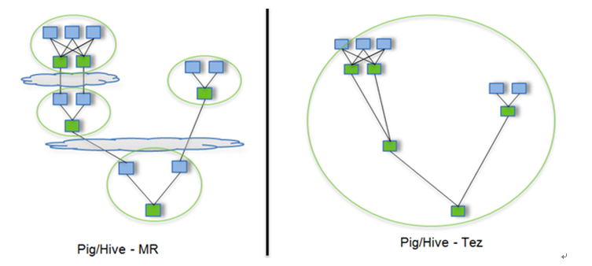

# Hive运行Tez引擎

Tez是一个Hive的运行引擎，性能优于MR。看下图



用Hive直接编写MR程序，假设有四个有依赖关系的MR作业，上图中，绿色是Reduce Task，云状表示写屏蔽，需要将中间结果持久化写到HDFS。

Tez可以将多个有依赖的作业转换为一个作业，这样只需写一次HDFS，且中间节点较少，从而大大提升作业的计算性能。

官网安装说明：  https://tez.apache.org/install.html

## 实验环境

- hadoop-3.4.0
- hive-3.1.3
- tez-0.10.1

tez-0.10.1 自带的 hadoop jar包版本是hadoop-3.1.3, 需要将这些jar包替换掉

```shell
cp $HADOOP_HOME/share/hadoop/hdfs/hadoop-hdfs-client-3.4.0.jar /opt/tez-0.10.1/lib
cp $HADOOP_HOME/share/hadoop/mapreduce/hadoop-mapreduce-client-common-3.4.0.jar /opt/tez-0.10.1/lib
cp $HADOOP_HOME/share/hadoop/mapreduce/hadoop-mapreduce-client-core-3.4.0.jar /opt/tez-0.10.1/lib
cp $HADOOP_HOME//share/hadoop/yarn/hadoop-yarn-server-timeline-pluginstorage-3.4.0.jar /opt/tez-0.10.1/lib

# 删除 tez-0.10.1 自带的 hadoop-3.1.3
rm -rf /opt/tez-0.10.1/lib/hadoop-*-3.1.3.jar
```

## 节点规划

| node01            |
| ----------------- |
| apache-tez-0.10.1 |

## 解压安装

```shell
[root@node01 ~]# tar -zxf apache-tez-0.10.1-bin.tar.gz -C /opt/
```

## 一、在hive中配置Tez

### 1、hive-env.sh

```shell
vim /opt/hive-3.1.3/conf/hive-env.sh

# Folder containing extra libraries required for hive compilation/execution can be controlled by:
export TEZ_HOME=/opt/tez-0.10.1  
export TEZ_JARS=""
for jar in `ls $TEZ_HOME |grep jar`; do
    export TEZ_JARS=$TEZ_JARS:$TEZ_HOME/$jar
done
for jar in `ls $TEZ_HOME/lib`; do
    export TEZ_JARS=$TEZ_JARS:$TEZ_HOME/lib/$jar
done
export HIVE_AUX_JARS_PATH=/opt/hadoop-3.4.0/share/hadoop/common$TEZ_JARS
```

### 2、hive-site.xml

在hive-site.xml文件中添加如下配置，更改hive计算引擎

```xml
<property>
    <name>hive.execution.engine</name>
    <value>tez</value>
</property>
```

## 二、hadoop中配置tez

### 1、上传依赖包到hdfs

```shell
hdfs dfs -mkdir /user/tez
hdfs dfs -put /opt/tez-0.10.1/share/tez.tar.gz /user/tez
```

#### 2、tez-site.xml

在 hadoop 的目录下面创建一个 tez-site.xml 文件 （不要放在hive/conf/目录下）

```shell
vi $HADOOP_HOME/etc/hadoop/tez-site.xml
```

添加如下内容

```xml
<?xml version="1.0" encoding="UTF-8"?>
<?xml-stylesheet type="text/xsl" href="configuration.xsl"?>
<configuration>
    <property>
        <name>tez.lib.uris</name>
        <value>hdfs://hacluster/user/tez/tez.tar.gz</value>
    </property>
    <property>
        <name>tez.use.cluster.hadoop-libs</name>
        <value>true</value>
    </property>
    <property>
        <name>tez.history.logging.service.class</name>        
        <value>org.apache.tez.dag.history.logging.ats.ATSHistoryLoggingService</value>
    </property>
    <!--AM 容器大小（MB），建议大于等于yarn.scheduler.minimum-allocation-mb值-->
    <property>
        <name>tez.am.resource.memory.mb</name>
        <value>1024</value>
    </property>
    <!--每个AM 容器的虚拟核数-->
    <property>
        <name>tez.am.resource.cpu.vcores</name>
        <value>1</value>
    </property>
    <!--Tez容器占用Java堆空间最大的比例-->
    <property>
        <name>tez.container.max.java.heap.fraction</name>
        <value>0.8</value>
    </property>
    <!-- 为Tez 任务容器分配的内存大小（MB），如果太小可能导致Tez任务运行不起来-->
    <property>
        <name>tez.task.resource.memory.mb</name>
        <value>1024</value>
    </property>
    <!-- 为Tez 任务容器分配的虚拟核数-->
    <property>
        <name>tez.task.resource.cpu.vcores</name>
        <value>1</value>
    </property>
</configuration>
```

#### 2、修改Hadoop环境变量

```shell
vi $HADOOP_HOME/etc/hadoop/shellprofile.d/tez.sh
```

```shell
hadoop_add_profile tez
function _tez_hadoop_classpath
{
    hadoop_add_classpath "$HADOOP_HOME/etc/hadoop" after
    hadoop_add_classpath "/opt/tez-0.10.1/*" after
    hadoop_add_classpath "/opt/tez-0.10.1/lib/*" after
}
```

## 四、解决日志Jar包冲突

```shell
rm /opt/stanlong/hive/apache-tez-0.9.2-bin/lib/slf4j-log4j12-1.7.10.jar
```

## 测试

```shell
show databases;
+----------------+--+
| database_name  |
+----------------+--+
| default        |
| gmall          |
| homework       |
+----------------+--+

use default;

create table stu_tez(
id int,
name string);

0: jdbc:hive2://node01:10000> insert into stu_tez values(1,"zhangsan");
INFO  : Tez session hasn't been created yet. Opening session
INFO  : 

INFO  : Status: Running (Executing on YARN cluster with App id application_1613928585113_0002)

INFO  : Map 1: -/-	
INFO  : Map 1: 0/1	
INFO  : Map 1: 0/1	
INFO  : Map 1: 0/1	
INFO  : Map 1: 0/1	
INFO  : Map 1: 0/1	
INFO  : Map 1: 0(+1)/1	
INFO  : Map 1: 0(+1)/1	
INFO  : Map 1: 1/1	
INFO  : Loading data to table default.stu_tez from hdfs://hacluster/user/hivedb/warehouse/stu_tez/.hive-staging_hive_2021-02-22_01-50-43_055_6010164217206492839-4/-ext-10000
INFO  : Table default.stu_tez stats: [numFiles=1, numRows=1, totalSize=11, rawDataSize=10]
No rows affected (83.419 seconds)
```

## 小结

运行Tez时检查到用过多内存而被NodeManager杀死进程问题

```shell
0: jdbc:hive2://node01:10000> insert into stu_tez values(1,"zhangsan");
INFO  : Session is already open
INFO  : Tez session was closed. Reopening...
ERROR : Failed to execute tez graph.
org.apache.tez.dag.api.SessionNotRunning: TezSession has already shutdown. Application application_1613928585113_0001 failed 2 times due to AM Container for appattempt_1613928585113_0001_000002 exited with  exitCode: -103
Failing this attempt.Diagnostics: [2021-02-22 01:41:14.426]Container [pid=8464,containerID=container_1613928585113_0001_02_000001] is running beyond virtual memory limits. Current usage: 81.0 MB of 1 GB physical memory used; 2.5 GB of 2.1 GB virtual memory used. Killing container.
Dump of the process-tree for container_1613928585113_0001_02_000001 :
```

这种问题是从机上运行的Container试图使用过多的内存，而被NodeManager kill掉了

**解决方法**

关掉虚拟内存检查。修改yarn-site.xml

```shell
[root@node01 hadoop]# pwd
/opt/stanlong/hadoop-ha/hadoop-2.9.2/etc/hadoop
[root@node01 hadoop]# vi yarn-site.xml
```

```xml
<property>
    <name>yarn.nodemanager.vmem-check-enabled</name>
    <value>false</value>
</property>
```

```shell
分发到其他节点后重启yarn
[root@node01 hadoop]# ~/myshell/rsyncd.sh yarn-site.xml
```

