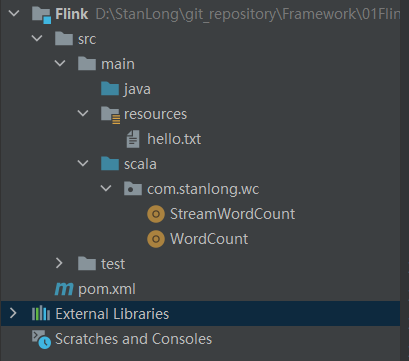
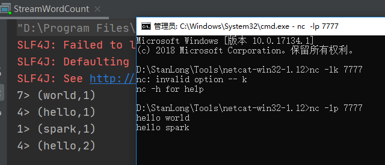

参考笔记

https://ashiamd.github.io/docsify-notes/#/study/BigData/Flink/


# Flink

Apache Flink 是一个框架和分布式处理引擎，用于对无界和有界数 据流进行状态计算

## 特点

- 低延迟
- 高吞吐
- 结果的准确性和良好的容错性

## 快速上手

新建maven工程， 并添加scala的框架支持。见 Framework\10Idea



配置pom.xml

```xml
<?xml version="1.0" encoding="UTF-8"?>
<project xmlns="http://maven.apache.org/POM/4.0.0"
         xmlns:xsi="http://www.w3.org/2001/XMLSchema-instance"
         xsi:schemaLocation="http://maven.apache.org/POM/4.0.0 http://maven.apache.org/xsd/maven-4.0.0.xsd">
    <modelVersion>4.0.0</modelVersion>

    <groupId>org.example</groupId>
    <artifactId>Flink</artifactId>
    <version>1.0-SNAPSHOT</version>

    <dependencies>
        <dependency>
            <groupId>org.apache.flink</groupId>
            <artifactId>flink-scala_2.12</artifactId>
            <version>1.10.1</version>
        </dependency>
        <!-- https://mvnrepository.com/artifact/org.apache.flink/flink-streaming-scala -->
        <dependency>
            <groupId>org.apache.flink</groupId>
            <artifactId>flink-streaming-scala_2.12</artifactId>
            <version>1.10.1</version>
        </dependency>

    </dependencies>

    <build>
        <plugins>
            <!-- 该插件用于将Scala代码编译成class文件 -->
            <plugin>
                <groupId>net.alchim31.maven</groupId>
                <artifactId>scala-maven-plugin</artifactId>
                <version>4.4.0</version>
                <executions>
                    <execution>
                        <!-- 声明绑定到maven的compile阶段 -->
                        <goals>
                            <goal>compile</goal>
                        </goals>
                    </execution>
                </executions>
            </plugin>
            <plugin>
                <groupId>org.apache.maven.plugins</groupId>
                <artifactId>maven-assembly-plugin</artifactId>
                <version>3.3.0</version>
                <configuration>
                    <descriptorRefs>
                        <descriptorRef>jar-with-dependencies</descriptorRef>
                    </descriptorRefs>
                </configuration>
                <executions>
                    <execution>
                        <id>make-assembly</id>
                        <phase>package</phase>
                        <goals>
                            <goal>single</goal>
                        </goals>
                    </execution>
                </executions>
            </plugin>
        </plugins>
    </build>
</project>
```

hello.txt

```
hello world
hello flink
hello scala
how are you
fine thank you
and you
```

WordCount

```scala
package com.stanlong.wc

import org.apache.flink.api.scala._

/**
 * 批处理 WordCount
 */
object WordCount {
    def main(args: Array[String]): Unit = {
        // 创建一个批处理执行环境
        val env = ExecutionEnvironment.getExecutionEnvironment

        // 从文件中读取数据
        val inputPath = "D:\\StanLong\\git_repository\\Framework\\01Flink\\Flink\\src\\main\\resources\\hello.txt"
        val inputDataSet = env.readTextFile(inputPath)

        // 对数据进行转换处理统计, 先分词，再按照word进行分组，最后进行聚合统计
        val resultDataSet = inputDataSet.flatMap(_.split(" "))
          .map((_, 1))
          .groupBy(0) // 以第1个元素作为key进行分组
          .sum(1) // 对当前分组的所有数据的第二个元素进行求和

        // 打印输出
        resultDataSet.print()
    }
}
```

StreamWordCount

```scala
package com.stanlong.wc

import org.apache.flink.api.java.utils.ParameterTool
import org.apache.flink.streaming.api.scala._

/**
 * 流处理 WordCount
 */
object StreamWordCount {
    def main(args: Array[String]): Unit = {
        // 创建流处理的执行环境
        val env = StreamExecutionEnvironment.getExecutionEnvironment

        // env.setParallelism(4) 设置并行度， 默认并行度是电脑的核心数量

        // 从外部命令中提取参数，作为 hostname 和 port
        // val paramTool = ParameterTool.fromArgs(args)
        // val host = paramTool.get("host")
        // val port = paramTool.getInt("port")

        // 接收一个 socket 文本流
        val inputDataStream = env.socketTextStream("localhost", 7777)

        // 进行转换处理统计
        val resultDataStream = inputDataStream.flatMap(_.split(" "))
          .filter(_.nonEmpty)
          .map((_,1)) // map((_,1)).setParallelism(4) 可以给每个算子设置并行度
          .keyBy(0)
          .sum(1)

        // 打印输出
        resultDataStream.print()

        // resultDataStream.print().setParallelism(1) // 并行度为1，不显示子任务编号

        // 启动任务执行
        env.execute("stream word count")
    }
}
```

流处理测试



二元组前面的 `数字> ` 表示并行子任务的任务序号

