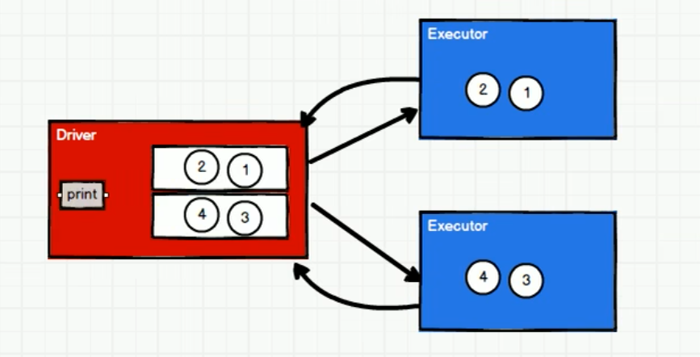
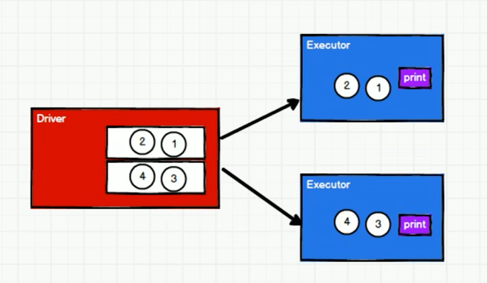

# RDD 行动算子

所谓行动算子，其实就是触发作业执行的方法，底层代码调用的是环境对象的 runjob 方法

## 常见行动算子

```scala
package com.stanlong.spark.core.rdd.operator.transform

import org.apache.spark.{SparkConf, SparkContext}

object Spark01_RDD_Operator_Transform {

    def main(args: Array[String]): Unit = {
        val sparkConf = new SparkConf().setMaster("local[*]").setAppName("RDD")
        val sc = new SparkContext(sparkConf)
        
        val rdd = sc.makeRDD(List(1, 2, 3, 4))
        
        // reduce 聚合
        val result = rdd.reduce(_ + _)
        println(result) // 10
        
        // collect 方法会将不同分区的数据按照分区的顺序采集到driver端内存中，形成数组
        val ints = rdd.collect()
        println(ints.mkString(",")) // 1,2,3,4
        
        // count 统计数据源中数据的个数
        val l = rdd.count()
        println(l) // 4
        
        // first 获取数据源中的第一个
        val i = rdd.first()
        println(i) // 1
        
        // take 获取N个数据
        val ints1 = rdd.take(3)
        println(ints1.mkString(",")) // 1,2,3
        
        // takeOrdered 先排序再取N个数据, 默认升序
        val ints2 = rdd.takeOrdered(3)
        println(ints2.mkString(",")) // 1,2,3
        
        // aggregateByKey 初始值只会参与分区内计算
        // aggregate 初始值会参与分区内的计算，也会参与分区间的计算
        val result1 = rdd.aggregate(10)(_ + _, _ + _)
        println(result1) // 分区间计算 1+2+3+4=10， 分区间计算（12核） 12*10=120, 初始值参与运算 10+120+10 = 140
        
        // fold 当分区内和分区间的计算规则相同时aggregate的简化写法
        val result2 = rdd.fold(10)(_ + _)
        print(result2)
        
        // countByValue 统计每个value出现的次数
        val rdd1 = sc.makeRDD(List(1, 1, 1, 4), 2)
        val result3 = rdd1.countByValue()
        println(result3) // Map(4 -> 1, 1 -> 3)
        
        // countByKey 统计key出现的次数
        val rdd2 = sc.makeRDD(List(("a", 1),("a", 2),("a" ,3),("b", 1)))
        val result4 = rdd2.countByKey()
        println(result4) // Map(a -> 3, b -> 1)

        sc.stop()
    }
}
```

## save 相关算子

函数签名: 

```scala
def saveAsTextFile(path: String): Unit 
def saveAsObjectFile(path: String): Unit 

def saveAsSequenceFile(
path: String,
codec: Option[Class[_ <: CompressionCodec]] = None
): Unit
```

函数说明: 将数据保存到不同格式的文件中

实例:

```scala
val rdd = sc.makeRDD(List(("a", 1), ("a", 2), ("a", 3), ("b", 1)), 2)
rdd.saveAsTextFile("output")
rdd.saveAsObjectFile("output1")
// saveAsSequenceFile 要求数据格式必须时key-value类型
rdd.saveAsSequenceFile("output2")
```

**RDD文件读取与保存**

Spark 的数据读取及数据保存可以从两个维度来作区分：文件格式以及文件系统。文件格式分为：text 文件、csv 文件、sequence 文件以及Object 文件；
文件系统分为：本地文件系统、HDFS、HBASE 以及数据库。

- text 文件

- sequence 文件

  SequenceFile 文件是Hadoop 用来存储二进制形式的key-value 对而设计的一种平面文件(Flat File)。在 SparkContext 中，可以调用sequenceFile[keyClass, valueClass](path)。

- object 对象文件
  对象文件是将对象序列化后保存的文件，采用 Java 的序列化机制。可以通过objectFile[T: ClassTag](path)函数接收一个路径，读取对象文件，返回对应的 RDD，也可以通过调用saveAsObjectFile()实现

## foreach

函数签名:

```scala
def foreach(f: T => Unit): Unit = withScope { 
    val cleanF = sc.clean(f)
	sc.runJob(this, (iter: Iterator[T]) => iter.foreach(cleanF)
)
```

函数说明: 分布式遍历RDD 中的每一个元素，调用指定函数

实例:

```scala
val rdd = sc.makeRDD(List(1,2,3,4))

// foreach 其实是 Driver端内存集合的循环遍历方法
rdd.collect().foreach(println) // 结果有序

println("*****************")

//rdd直接调用foreach, foreach 其实是 Executor端内存数据打印
rdd.foreach(println) // 结果无序
```

rdd.collect().foreach(println) : foreach 其实是 Driver端内存集合的循环遍历方法，数据会拉回 Driver端，打印结果有序



rdd.foreach(println):  foreach 其实是 Executor端内存数据打印，数据不拉取回来，Executor 并行执行，打印结果无序 



> 补充说明：RDD算子

- RDD的方法和Scala集合对象的方法不一样。
- 集合对象的方法都是在同一个节点的内存中完成的。
- RDD的方法可以将计算逻辑发送到Executor端（分布式节点）执行。
- 为了区分不同的处理效果，所以将RDD的方法称之为算子。
- RDD的方法外部的操作都是在Driver端执行的，而方法内部的逻辑代码都是在Executor端执行的。

foreach 小练习

```scala
package com.stanlong.spark.core.rdd.operator.action

import org.apache.spark.{SparkConf, SparkContext}

object Spark01_RDD_Operator_Action {
    def main(args: Array[String]): Unit = {
        val sparkConf = new SparkConf().setMaster("local[*]").setAppName("RDD")
        val sc = new SparkContext(sparkConf)

        val rdd = sc.makeRDD(List(1,2,3,4))
        var user = new User() 
        rdd.foreach(
            num =>{
                println("age=" + (user.age + num))
            }
        )
        sc.stop()
    }
}

// 由于 driver 和 executor 涉及网络通信，所以类需要序列化
// 序列化方式一：
class User extends Serializable{
    var age = 30
}

// 序列化方式二：使用样例类 样例类在编译时会自动混入序列化特质
// case class User() {
//     var age = 30
// }
```

