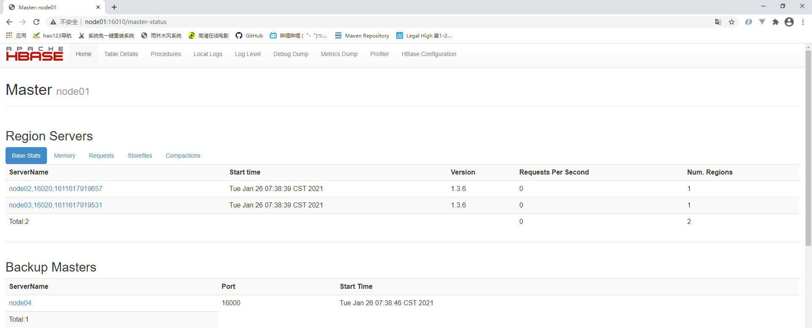

# Hbase安装

https://www.cnblogs.com/huangwenchao0821/p/14746625.html

本实例只搭建Hbase高可用， 安装版本 hbase-2.4.11-bin.tar

## 一、节点规划

|               | node01      | node02        | node03        | node04        |
| ------------- | ----------- | ------------- | ------------- | ------------- |
| HMaster       | HMaster(主) | HMaster(备)   |               |               |
| HRegionServer |             | HRegionServer | HRegionServer | HRegionServer |

### 1、角色说明

#### 1.1 HMaster

1. 监控RegionServer
2. 处理RegionServer故障转移
3. 处理元数据变更
4. 处理region的分配或移除
5. 空闲时对数据进行负载均衡
6. 通过zookeeper发布自己的位置给客户端

#### 1.2 HRegionServer

1. 负责存储Hbase的实际数据
2. 处理分配给它的region
3. 刷新缓存到HDFS上
4. 维护HLog
5. 执行压缩
6. 负责处理Region分片

## 二、安装部署

### 1、解压

```shell
tar -zxf hbase-2.4.11-bin.tar.gz 
```

### 2、配置环境变量

```shell
vi /etc/profile
export HBASE_HOME=/opt/hbase-2.4.11 # Hbase 环境变量
export PATH=$PATH:$JAVA_HOME/bin:$HADOOP_HOME/bin:$HADOOP_HOME/sbin:$HIVE_HOME/bin:$HBASE_HOME/bin

source /etc/profile # 使环境变量生效
```

### 3、改配置文件

```shell
[root@node01 conf]# pwd
/opt/stanlong/hbase/hbase-2.4.11/conf
[root@node01 conf]# ll
total 44
-rw-r--r-- 1 503 games 1811 Oct  5  2019 hadoop-metrics2-hbase.properties
-rw-r--r-- 1 503 games 7530 Oct 15  2019 hbase-env.sh
-rw-r--r-- 1 503 games 2257 Oct  5  2019 hbase-policy.xml
-rw-r--r-- 1 503 games  934 Oct  5  2019 hbase-site.xml
-rw-r--r-- 1 503 games 1169 Oct 11  2019 log4j-hbtop.properties
-rw-r--r-- 1 503 games 4722 Oct 15  2019 log4j.properties
-rw-r--r-- 1 503 games   10 Oct  5  2019 regionservers
```

#### 3.1 hbase-env.sh

```shell
# The java implementation to use.  Java 1.7+ required.
# 配置Java环境变量
export JAVA_HOME=/usr/java/jdk1.8.0_221-amd64

# Tell HBase whether it should manage it's own instance of Zookeeper or not.
# 不使用Hbase自带的zk
export HBASE_MANAGES_ZK=false

# 修改hbase默认日志路径
export HBASE_LOG_DIR=/var/log/hbase

# 把这行的注释打开
# https://www.cnblogs.com/yeyuzhuanjia/p/17717381.html
export HBASE_DISABLE_HADOOP_CLASSPATH_LOOKUP="true" 
```

#### 3.2 hbase-site.xml

```xml
<configuration>
    <!--配置为core-site.xml 中的fs.defaultFS -->
    <property>
      <name>hbase.rootdir</name>
      <value>hdfs://hacluster/hbase</value>
    </property>
    <!-- 分布式集群 -->
    <property>
        <name>hbase.cluster.distributed</name>
        <value>true</value>
    </property>
    <!-- zookeeper集群 -->
    <property>
        <name>hbase.zookeeper.quorum</name>
        <value>node02,node03,node04</value>
    </property>
    <property>
        <name>hbase.zookeeper.property.clientPort</name>
        <value>2181</value>
    </property>

    <!-- Hbase 在zookeeper 上数据的根目录znode节点 -->
    <property>
        <name>hbase.znode.parent</name>
        <value>/hbase</value>
    </property>
    <!-- 本地文件系统 tmp 目录 -->
    <property>
        <name>hbase.tmp.dir</name>
        <value>/var/data/hbase/tmp</value>
    </property>


    <!-- hbae master 节点默认端口16000， 可不配置 -->
    <property>
        <name>hbase.master.port</name>
        <value>16000</value>
    </property>
    <!-- hbae master 的webui页面默认绑定的地址， 可不配置 -->
    <property>
        <name>hbase.master.info.port</name>
        <value>16010</value>
    </property>
    <!-- 配置zookeeper的dataDir路径(会自动创建)  -->
    <property>
        <name>hbase.zookeeper.property.dataDir</name>
        <value>/var/data/zk</value>
    </property>
    
    <!-- 配置预写日志文件格式 -->
    <property>
        <name>hbase.wal.provider</name>
        <value>filesystem</value>
    </property>
</configuration>
```

#### 3.3 regionservers

```properties
node02
node03
node04
```

#### 3.4 back-masters

如果需要配置HMaster主备，需要在conf目录下创建  back-masters 文件，输入备节点的主机名

```shell
echo "node02" > backup-masters
```

### 4、软连接hadoop的配置文件

```shell
[root@node01 conf]# pwd
/opt/stanlong/hbase/hbase-2.4.11/conf
[root@node01 conf]# ln -s /opt/stanlong/hadoop-3.4.0/etc/hadoop/core-site.xml /opt/stanlong/hbase-2.4.11/conf/core-site.xml
[root@node01 conf]# ln -s /opt/stanlong/hadoop-3.4.0/etc/hadoop/hdfs-site.xml /opt/stanlong/hbase-2.4.11/conf/hdfs-site.xml
```

### 5、替换冲突的jar包

```shell
mv /opt/hbase-2.4.11/lib/client-facing-thirdparty/slf4j-api-1.7.33.jar  .. slf4j-api-1.7.33.jar_bak
mv /opt/hbase-2.4.11/lib/client-facing-thirdparty/slf4j-reload4j-1.7.36.jar  .. slf4j-reload4j-1.7.36.jar_bak
cp /opt/hadoop-3.4.0/share/hadoop/common/lib/slf4j-api-1.7.36.jar /opt/hbase-2.4.11/lib/client-facing-thirdparty/
cp /opt/hadoop-3.4.0/share/hadoop/common/lib/slf4j-reload4j-1.7.36.jar  /opt/hbase-2.4.11/lib/client-facing-thirdparty/
```

## 三、分发Hbase

分发脚本参考 23自定义集群脚本/分发脚本， 并到HRegionServer节点上配置相应的环境变量

```shell
[root@node01 myshell]#  ./rsyncd.sh /opt/stanlong/hbase/hbase-2.4.11/
```

修改HRegionServer的环境变量

## 四、启动Hbase

1. 先启动Hadoop-ha，启动脚本见 Hadoop/18自定义集群脚本

```shell
[root@node01 myshell]# ./hadoop-ha-start.sh
```

2. 启动Hbase集群

```shell
[root@node01 ~]# start-hbase.sh 

# 到节点上执行 jps, 查看HMaster进程和HRegionServer进程是否正常启动
```

## 五、页面访问

http://node01:16010/master-status



## 补充：Hbase启停单机服务

```shell
# 启停 HMaster 服务
hbase-daemon.sh start master
hbase-daemon.sh stop master

# 启停 HRegionServer
hbase-daemon.sh start regionserver
hbase-daemon.sh stop regionserver
```

如果集群之间的节点时间不同步，会导致regionserver无法启动，抛出ClockOutOfSyncException异常。

修复提示：

a、同步时间服务

请参看帮助文档：《尚硅谷大数据技术之Hadoop入门》

b、属性：hbase.master.maxclockskew设置更大的值

```xml
<property>
        <name>hbase.master.maxclockskew</name>
        <value>180000</value>
        <description>Time difference of regionserver from master</description>
 </property>
```

