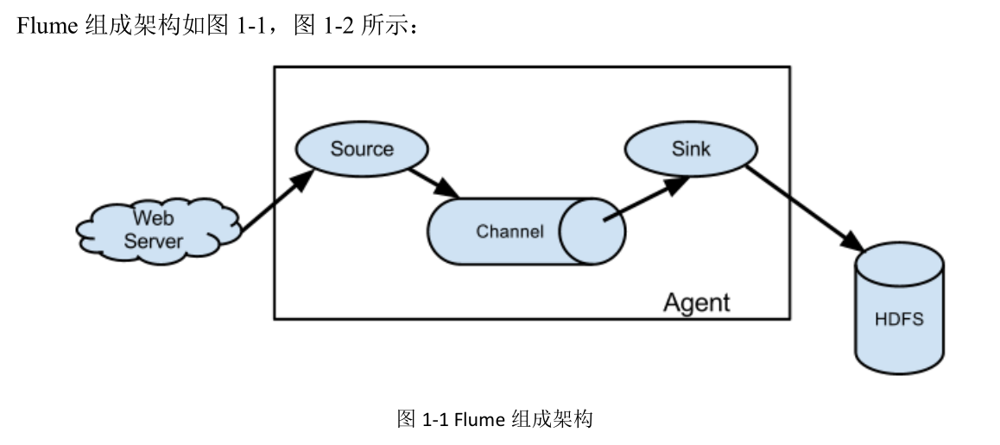
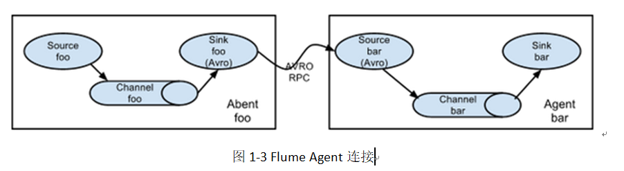
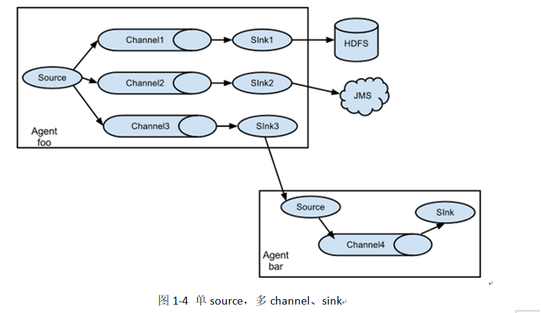
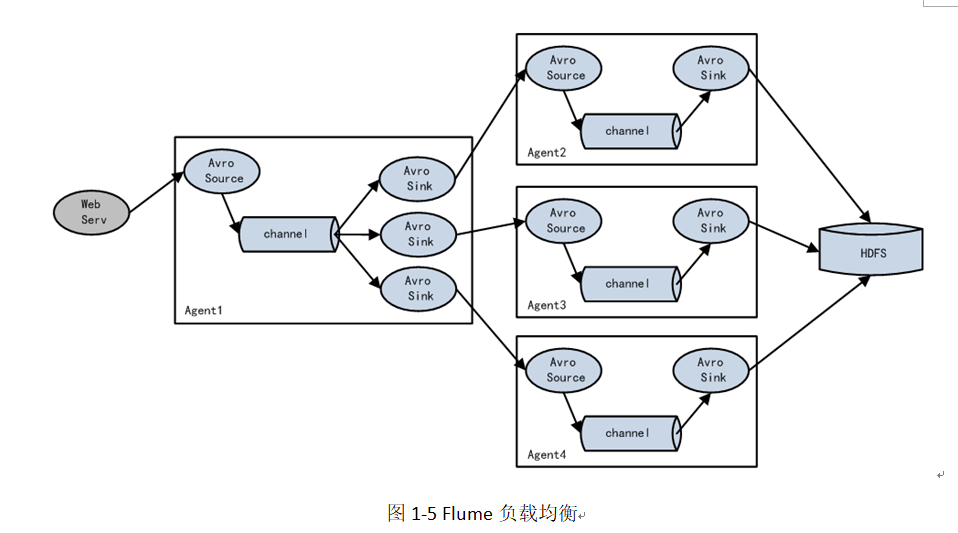
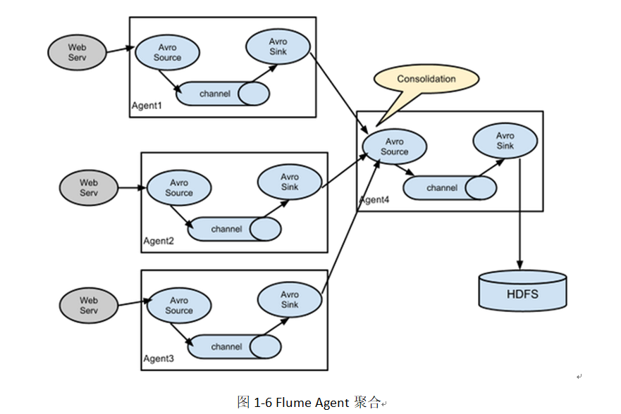

# Flume

## 一、定义

Flume是Cloudera提供的一个高可用的，高可靠的，分布式的海量日志采集、聚合和传输的系统。Flume基于流式架构，灵活简单

## 二、架构图



## 三、组件

- Agent

  Agent是一个JVM进程，它以事件的形式将数据从源头送至目的，是Flume数据传输的基本单元。

  Agent主要有3个部分组成，Source、Channel、Sink。

- Source

  Source是负责接收数据到Flume Agent的组件。Source组件可以处理各种类型、各种格式的日志数据，包括avro、thrift、exec、jms、spooling directory、netcat、sequence generator、syslog、http、legacy。

- Channel

  Channel是位于Source和Sink之间的缓冲区。因此，Channel允许Source和Sink运作在不同的速率上。Channel是线程安全的，可以同时处理几个Source的写入操作和几个Sink的读取操作。

  Flume自带两种Channel：Memory Channel和File Channel。

  - Memory Channel是内存中的队列。Memory Channel在不需要关心数据丢失的情景下适用。如果需要关心数据丢失，那么Memory Channel就不应该使用，因为程序死亡、机器宕机或者重启都会导致数据丢失。
  - File Channel将所有事件写到磁盘。因此在程序关闭或机器宕机的情况下不会丢失数据。

- Sink

  Sink不断地轮询Channel中的事件且批量地移除它们，并将这些事件批量写入到存储或索引系统、或者被发送到另一个Flume Agent。

  Sink是完全事务性的。在从Channel批量删除数据之前，每个Sink用Channel启动一个事务。批量事件一旦成功写出到存储系统或下一个Flume Agent，Sink就利用Channel提交事务。事务一旦被提交，该Channel从自己的内部缓冲区删除事件。

  Sink组件目的地包括hdfs、logger、avro、thrift、ipc、file、null、HBase、solr、自定义。

- Event

  传输单元，Flume数据传输的基本单元，以事件的形式将数据从源头送至目的地

## 四、拓扑结构









## 五、节点规划

| flume-1.9.0 | node01     | node02     |
| ----------- | ---------- | ---------- |
| flume 采集  | flume 采集 |            |
| flume消费   |            | flume 消费 |

## 六、安装

### 1、解压

```shell
[root@node01 ~]# tar -zxf apache-flume-1.9.0-bin.tar.gz -C /opt/stanlong/flume/

# 如果hadoop是 3.x 版本的，那需要删除flume lib包下的 guava-11.0.2.jar ，避免冲突
```

### 2、修改配置文件

```shell
[root@node01 conf]# pwd
/opt/stanlong/flume/apache-flume-1.9.0-bin/conf
[root@node01 conf]# cp flume-env.sh.template flume-env.sh

# 配置Java环境
[root@node01 conf]# vi flume-env.sh
export JAVA_HOME=/usr/java/jdk1.8.0_65
```

### 3、分发

分发脚本参考 25自定义集群脚本/分发脚本.md

```shell
[root@node01 flume]# ~/myshell/rsyncd.sh apache-flume-1.9.0-bin/
```

## 七、官方案例-监控端口

- 案例需求：

  使用flume监听一个端口，收集该端口数据，并打印到控制台

- 案例分析：

  通过 netcat 工具向本机的44444端口发送数据

- 实现步骤

  - 安装 netcat 工具

  ```shell
  [root@node01 conf]# yum install -y nc
  ```

  - 判断44444端口是否被占用

  ```shell
  [root@node01 conf]# netstat -tunlp | grep 44444
  ```

  - 创建 flume agent 配置文件 flume-netcat-logger.conf

  ```shell
  [root@node01 flume]# mkdir job
  [root@node01 flume]# cd job/
  [root@node01 job]# vi flume-netcat-logger.conf
  
  # Name the components on this agent
  a1.sources = r1
  a1.sinks = k1
  a1.channels = c1
  
  # Describe/configure the source
  a1.sources.r1.type = netcat
  a1.sources.r1.bind = localhost
  a1.sources.r1.port = 44444
  
  # Describe the sink
  a1.sinks.k1.type = logger
  
  # Use a channel which buffers events in memory
  a1.channels.c1.type = memory
  a1.channels.c1.capacity = 1000
  a1.channels.c1.transactionCapacity = 100
  
  # Bind the source and sink to the channel
  a1.sources.r1.channels = c1
  a1.sinks.k1.channel = c1
  ```

  配置文件解析

  ```shell
  # Name the components on this agent
  a1.sources = r1          a1:表示agent的名称, r1:表示a1的输入源
  a1.sinks = k1            k1:表示a1的输出目的地
  a1.channels = c1         c1:表示a1的缓冲区
  
  # Describe/configure the source
  a1.sources.r1.type = netcat            表示a1的输入源类型为netcat端口类型
  a1.sources.r1.bind = localhost         表示a1的监听的主机
  a1.sources.r1.port = 44444             表示a1的监听的端口号
  
  # Describe the sink
  a1.sinks.k1.type = logger              表示a1的输出目的地是控制台logger类型
  
  # Use a channel which buffers events in memory
  a1.channels.c1.type = memory              表示a1的channel类型是memory内存型
  a1.channels.c1.capacity = 1000            表示a1的channel总容量1000个event
  a1.channels.c1.transactionCapacity = 100  表示a1的channel传输时收集到了100 条event以后再去提交事务
  
  # Bind the source and sink to the channel
  a1.sources.r1.channels = c1                         表示将r1和c1连接起来
  a1.sinks.k1.channel = c1                            表示将k1和c1连接起来
  ```

  - 开启flume监听端口

  ```shell
  [root@node01 flume]# bin/flume-ng agent --conf conf/ --name a1 --conf-file job/flume-netcat-logger.conf -Dflume.root.logger=INFO,console
  出现从一下几行日志代表flume启动成功
   CHANNEL, name: c1: Successfully registered new MBean.
   Starting Sink k1
   Starting Source r1
   Source starting
   Created serverSocket:sun.nio.ch.ServerSocketChannelImpl[/127.0.0.1:44444]
  ```

  - 重新开一个窗口，使用telnet向44444端口发送数据

  ```shell
  [root@node01 ~]# nc localhost 44444
  Hello Flume
  OK
  
  flume会接收到数据
  Event: { headers:{} body: 48 65 6C 6C 6F 20 46 6C 75 6D 65                Hello Flume }
  ```

## 八、flume对接kafka

**Channel** 采用Kafka Channel，省去了Sink，提高了效率。

```properties
#bin/flume-ng agent -n a1 -f conf/a1.conf -c conf -Dflume.root.logger=INFO,console
#定义agent名， source、channel、sink的名称
a1.sources = r1 
a1.channels = c1


#具体定义source
a1.sources.r1.type = TAILDIR
a1.sources.r1.posiFile = /opt/stanlong/flume/test/log_position1.json
a1.sources.r1.filegroups = f1
a1.sources.r1.filegroups.f1 = /tmp/logs/abc.txt
a1.sources.r1.interval = 1000 
a1.sources.r1.charset = UTF-8


#具体定义channel
a1.channels.c1.type = org.apache.flume.channel.kafka.KafkaChannel
a1.channels.c1.kafka.bootstrap.servers = node01:9092,node02:9092,node03:9092
a1.channels.c1.kafka.topic=topic-event
a1.channels.c1.parseAsFlumeEvent=false


#组装source、channel
a1.sources.r1.channels = c1
```


