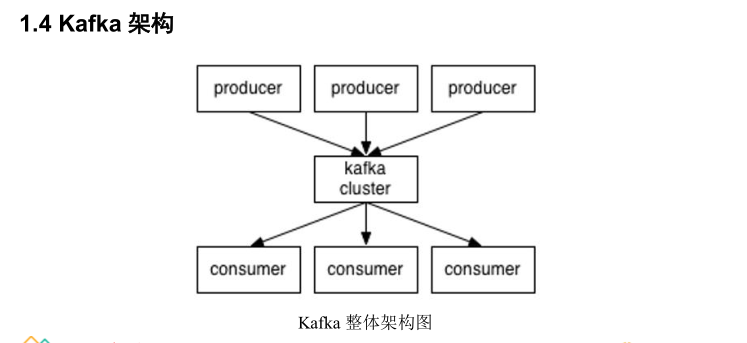
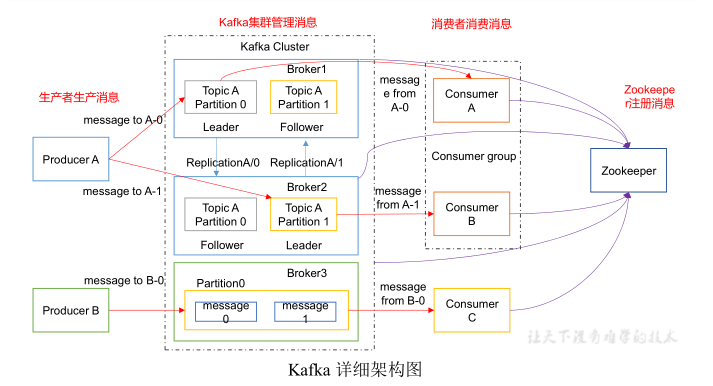

# Kafka

## 一、定义

Kafka 是一个分布式的基于发布/订阅模式的**消息队列**，主要应用于大数据实时处理领域。实现异步，削峰，解耦的功能

## 二、架构





## 三、组件

- **Producer** 

  生产者即数据的发布者，该角色将消息发布到Kafka的topic中。broker接收到生产者发送的消息后，broker将该消息追加到当前用于追加数据的segment文件中。生产者发送的消息，存储到一个partition中，生产者也可以指定数据存储的partition。

- **Consumer** 

  消息消费者，向 kafka broker 取消息的客户端，消费者可以消费多个topic中的数据

- **Topic** 

  每条发布到Kafka集群的消息都有一个类别，这个类别被称为Topic；

- **Consumer Group **

  消费者组由多个 consumer 组成。消费者组内每个消费者负责消费不同分区的数据，一个分区只能由一个组内消费者消费；消费者组之间互不影响。所有的消费者都属于某个消费者组，即消费者组是逻辑上的一个订阅者。消费者的个数不能超过分区的个数 ，多的消费者会消费不到数据。

- **Broker** 

  一台 kafka 服务器就是一个 broker。一个集群由多个 broker 组成。一个 broker可以容纳多个 topic；

- **Partition**

  为了方便扩展，并提高吞吐量，一个topic分为多个partition。每个 partition 是一个有序的队列。partition 中的每条消息都会被分配一个有序的 id（offset）。kafka 只保证按一个 partition 中的顺序将消息发给consumer，不保证一个 topic 的整体（多个 partition 间）的顺序；

- **Replica**

  副本，为保证集群中的某个节点发送故障时，该节点上的partition数据不丢失，且kafka仍然能够正常工作。一个topic的每个分区都有若干个副本，一个leader和若干个follower

- **Offset**

  kafka 的存储文件都是按照 offset.kafka 来命名，用 offset 做名字的好处是方便查找。例如你想找位于 2049 的位置，只要找到 2048.kafka 的文件即可。当然 the first offset 就是 00000000000.kafka。

- **Leader**

  每个partition有多个副本，其中有且仅有一个作为Leader，Leader是当前负责数据的读写的partition

- **Follower**

  Follower跟随Leader，所有写请求都通过Leader路由，数据变更会广播给所有Follower，Follower与Leader保持数据同步。如果Leader失效，则从Follower中选举出一个新的Leader。当Follower与Leader挂掉、卡住或者同步太慢，leader会把这个follower从“in sync replicas”（ISR）列表中删除，重新创建一个Follower

## 四、节点规划

2.13是scala的版本号，3.8.0是kafka的版本号

| kafka_2.13-3.8.0 | node01 | node02 | node03 |
| ---------------- | ------ | ------ | ------ |
| kafka            | kafka  | kafka  | kafka  |

## 五、安装

### 1、解压

```shell
[root@node01 ~]# tar -zxf kafka_2.13-3.8.0.tgz -C /opt/stanlong/kafka/
```

### 2、修改配置文件

```shell
[root@node01 config]# vi /opt/stanlong/kafka/kafka/config/server.properties
```

```properties
# 配置文件主要更改三个地方，其他不改动的地方略过
############################# Server Basics #############################

# The id of the broker. This must be set to a unique integer for each broker.
broker.id=1

############################# Log Basics #############################

# A comma separated list of directories under which to store log files
log.dirs=/var/data/kafka

############################# Zookeeper #############################

# Zookeeper connection string (see zookeeper docs for details).
# This is a comma separated host:port pairs, each corresponding to a zk
# server. e.g. "127.0.0.1:3000,127.0.0.1:3001,127.0.0.1:3002".
# You can also append an optional chroot string to the urls to specify the
# root directory for all kafka znodes.
zookeeper.connect=node01:2181,node02:2181,node03:2181
```

### 3、分发kafka

```shell
[root@node01 kafka]# pwd
/opt/stanlong/kafka
[root@node01 kafka]# ~/myshell/rsyncd.sh kafka/
```

分发完成后到`node02，node03`上去，改 `server.properties` 里`broker.id`的值分别为` 2，3`

### 4、启动kafka

kafka依赖zookeeper，需要先启动 zookeeper.  参考 27自定义集群脚本/启动Hadoop-HA.md

**kafka 启动脚本**

```shell
[root@node01 appmain]# pwd
/opt/stanlong/appmain
[root@node01 appmain]# vi kf.sh 
```

```shell
#!/bin/bash
KAFKA_HOME="/opt/stanlong/kafka/kafka"
case $1 in
"start"){
	for i in node{01..03}
	do
		echo "***********启动 $i Kafka***********"
		ssh $i "$KAFKA_HOME/bin/kafka-server-start.sh -daemon $KAFKA_HOME/config/server.properties"
	done
};;
"stop"){
	for i in node{01..03}
	do
		echo "***********停止 $i Kafka***********"
		ssh $i "$KAFKA_HOME/bin/kafka-server-stop.sh"
	done
};;
esac
```

```shell
[root@node01 appmain]# chmod +x kf.sh
```

```shell
[root@node01 appmain]# ./kf.sh start
 --------启动 node01 Kafka-------
 --------启动 node02 Kafka-------
 --------启动 node03 Kafka-------
# 启动成功后，各节点可以查看到Kafka的进程
[root@node01 myshell]# ./cluster-jps.sh 
--------- node01 ----------
6821 Kafka
--------- node02 ----------
5924 Kafka
--------- node03 ----------
6075 Kafka
```

## 六、常用命令

### 1、创建topic

```shell
[root@node01 kafka]# bin/kafka-topics.sh --bootstrap-server node02:9092 --create --replication-factor 3 --partitions 1 --topic first-topic
Created topic first-topic.

# --replication-factor 3 注意副本的数量不能超过 borker 节点的数量
```

### 2、查看 topic列表

```shell
[root@node01 kafka]# bin/kafka-topics.sh --bootstrap-server node02:9092 --list
first
first-topic
[root@node01 kafka]# 
```

### 3、查看 Topic 详情

```shell
[root@node01 kafka]# bin/kafka-topics.sh --bootstrap-server node02:9092 --describe --topic first-topic
Topic: first-topic	PartitionCount: 1	ReplicationFactor: 3	Configs: 
	Topic: first-topic	Partition: 0	Leader: 2	Replicas: 2,1,3	Isr: 2,1,3
[root@node01 kafka]# 
```

### 4、生产者发送消息

```shell
[root@node01 kafka]# bin/kafka-console-producer.sh --broker-list node02:9092 --topic first-topic
>Hello
>
```

### 5、消费者消费消息

```shell
[root@node02 kafka]# bin/kafka-console-consumer.sh --bootstrap-server node02:9092 --from-beginning --topic first-topic
Hello
---------------------------------------------------------------------------------------
--from-beginning: 会把topic里以往的数据都读出来
```

### 6、修改topic分区

注意，topic分区只能新增，不能减少

```shell
[root@node01 kafka]# bin/kafka-topics.sh --bootstrap-server node02:9092 --alter --partitions 2 --topic first-topic
WARNING: If partitions are increased for a topic that has a key, the partition logic or ordering of the messages will be affected
Adding partitions succeeded!

[root@node01 kafka]#  bin/kafka-topics.sh --bootstrap-server node02:9092 --describe --topic first-topic
Topic: first-topic	PartitionCount: 2	ReplicationFactor: 3	Configs: 
	Topic: first-topic	Partition: 0	Leader: 2	Replicas: 2,1,3	Isr: 2,1,3
	Topic: first-topic	Partition: 1	Leader: 3	Replicas: 3,1,2	Isr: 3,1,2
```

ISR说明：Leader维护了一个动态的 in-sync replica set(ISR)，意为和leader保持同步的follower集合。当ISR中的follower完成数据同步之后，leader就会给follower发送ack。如果follower长时间未向leader同步数据，则该follower将被踢出ISR。该时间阈值有replica.lag.time.max.ms参数设定。leader发生故障之后，就会从ISR中选举出新的leader

### 7、删除topic

```shell
[root@node01 kafka]# bin/kafka-topics.sh --bootstrap-server node02:9092 --delete --topic first-topic
Topic first is marked for deletion.
Note: This will have no impact if delete.topic.enable is not set to true.
[root@node01 kafka]# 
```

需要 server.properties 中设置 delete.topic.enable=true 否则只是标记删除或者直接重启
