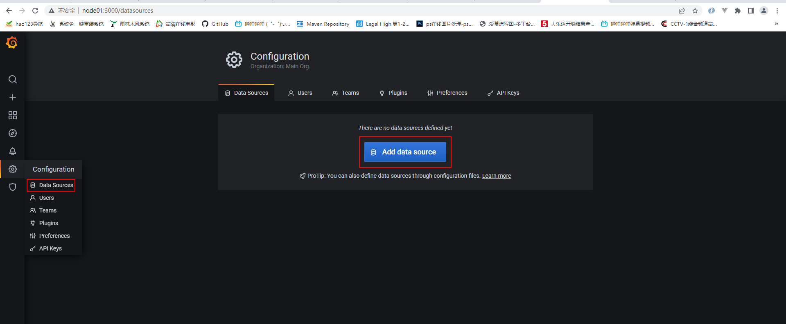
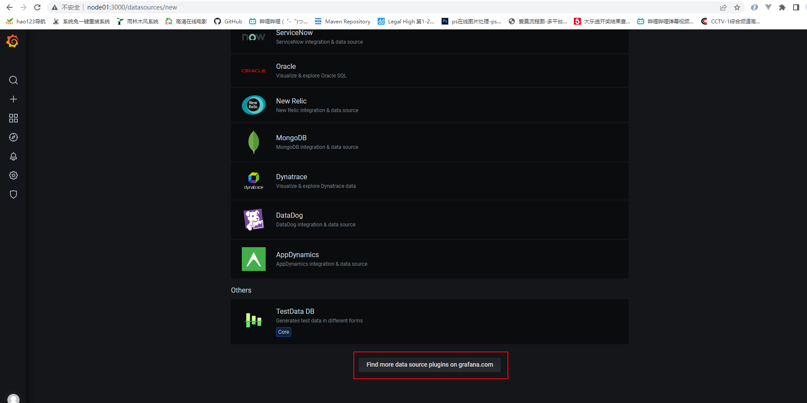
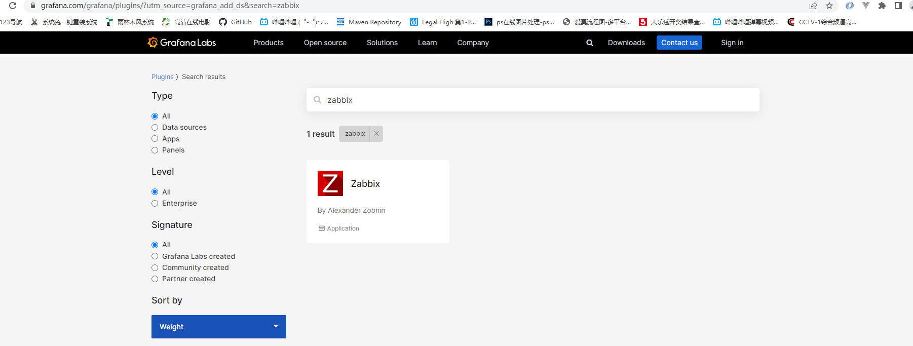
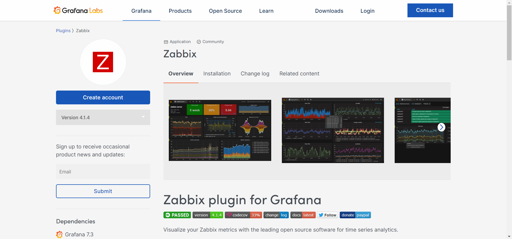
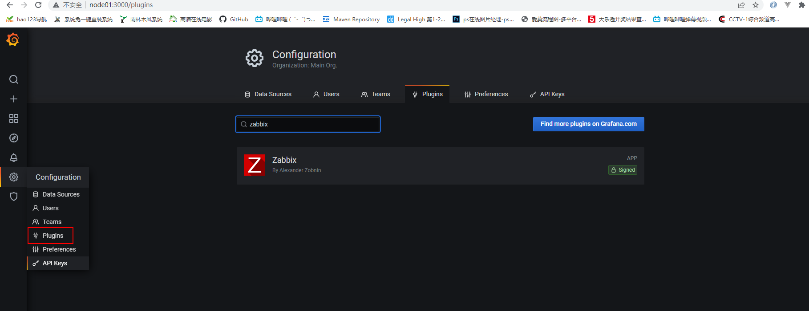
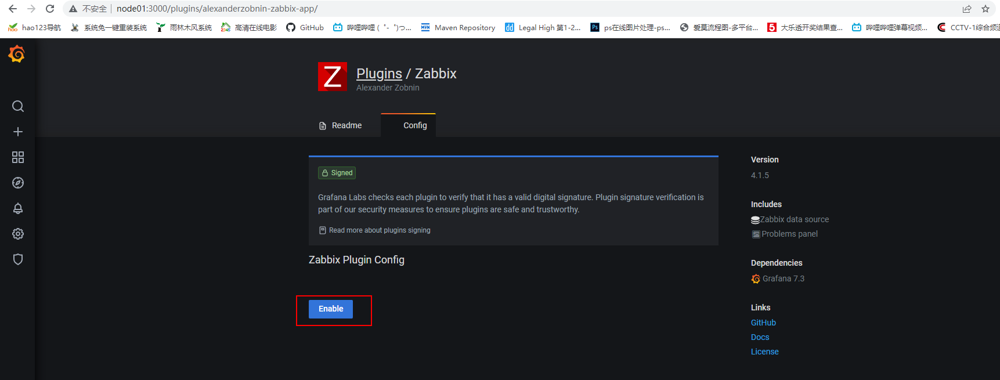
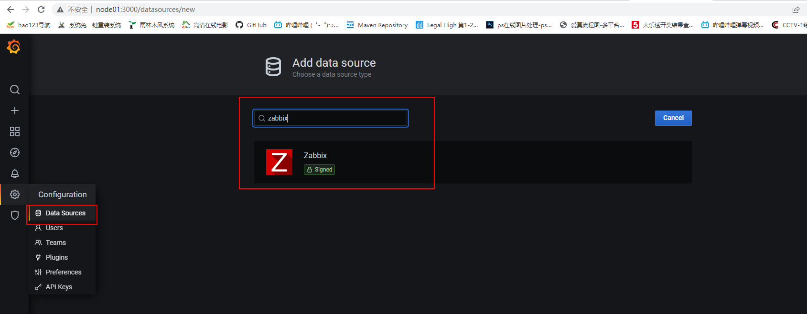
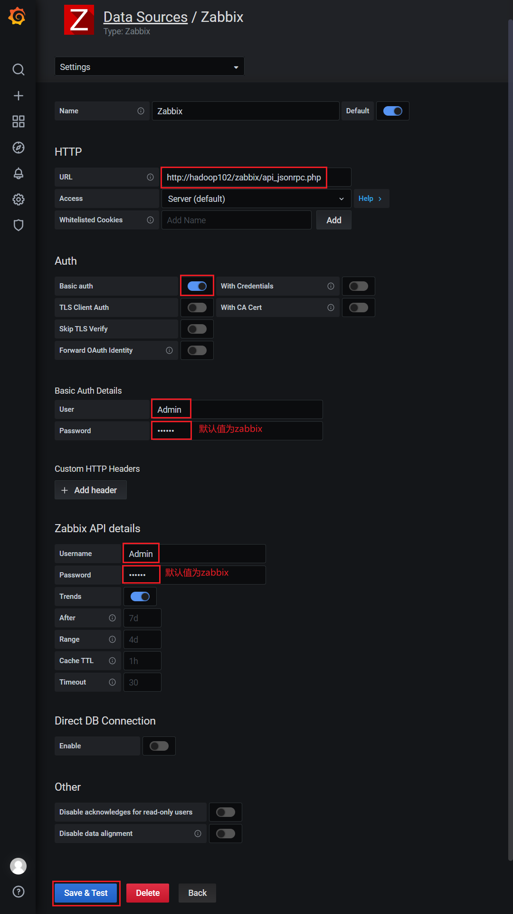

# 第4章 集成Grafana

## 4.1 部署Grafana

1.下载Grafana安装包

官方仓库：[https://dl.grafana.com/oss/release/grafana-7.4.3-1.x86_64.rpm](https://dl.grafana.com/oss/release/grafana-7.4.3-1.x86_64.rpm)

国内镜像：[https://repo.huaweicloud.com/grafana/7.4.3/grafana-7.4.3-1.x86_64.rpm](https://repo.huaweicloud.com/grafana/7.4.3/grafana-7.4.3-1.x86_64.rpm)

```shell
[root@node01 ~]# wget https://repo.huaweicloud.com/grafana/7.4.3/grafana-7.4.3-1.x86_64.rpm
```

2.将安装包上传到 node01 主机的 /opt/stanlong 路径

3.使用rpm安装Grafana

```shell
[root@node01 ~]# sudo rpm -ivh grafana-7.4.3-1.x86_64.rpm

安装的时候有报错
[root@node01 ~]# rpm -ivh grafana-7.4.3-1.x86_64.rpm
warning: grafana-7.4.3-1.x86_64.rpm: Header V4 RSA/SHA256 Signature, key ID 24098cb6: NOKEY
error: Failed dependencies:
	fontconfig is needed by grafana-7.4.3-1.x86_64
	urw-fonts is needed by grafana-7.4.3-1.x86_64
	
表示缺少依赖，则应先安装上依赖包，再进行安装grafana
yum -y install fontconfig
yum -y install urw-fonts
```

4.启动Grafana

```shell
[root@node01 ~]# systemctl start grafana-server
```

5.访问Grafana页面

访问地址为：`http://hadoop102:3000/`

首次登录用户名和密码均为 admin


设置新密码或者跳过


## 4.2 快速入门

1.创建Dashboard


2.新建panel


3.选择数据源，此处选择Grafana提供的随机测试数据


4.选择合适的可视化类型


5.保存Dashboard和panel，并命名


## 4.3 集成Zabbix

### 4.3.1 配置数据源

使用Grafana与其他系统集成时，需要配置对应的DataSource

1.点击下图所示按钮，增加数据源



2.选择所需数据源


3.如没有所需数据源，点击下图所示地址，获取更多数据源



4.搜索zabbix，并点击搜索结果



5.按照所需插件的说明进行部署



6.以下是插件部署步骤

1）安装插件

```shell
[root@node01 ~]# sudo grafana-cli plugins install alexanderzobnin-zabbix-app
```

2）重启Grafana

```shell
[root@node01 ~]# sudo systemctl restart grafana-server
```

3）启用插件

（1）点击设置/插件



（2）启用Zabbix插件



7.配置zabbix数据源

1）新增数据源



3）配置数据源



### 4.3.2 集成案例

1.为方便展示效果，在Zabbix中为hadoop102主机应用一个Zabbix内置的Linux系统监控模板。

1）找到hadoop102主机


2）点击模板，搜索linux，并选择Template OS Linux by Zabbix agent


3）点击更新


2.集成Grafana，展示模板中的系统监控项

1）点击Dashboards，找到前边创建的Test看板


2）新建panel


3）选择Zabbix数据源


4）选择要展示的监控项


5）选择合适的图标类型


6）保存配置

