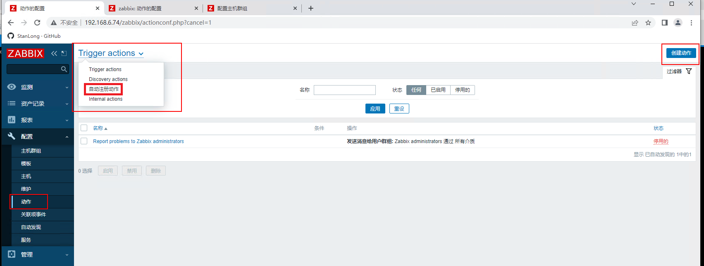
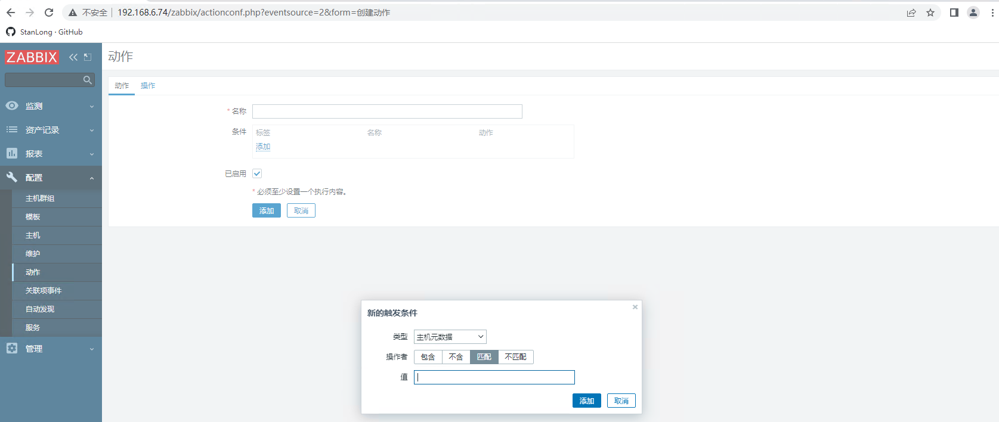

# 批量注册主机

如果服务器集群中有成百上千台agent， 一台一台注册主机会非常耗时，zabbix 提供了一种**自动注册动作**的功能。

zabbix 自动化监控---自动注册机制参考

https://developer.aliyun.com/article/887173

## 一、在配置文件中开启主动模式

zabbix自动注册的原理就类似主动模式，主动模式就是agent自己采集指标发送给zabbix server。

zabbix自动注册只需要配置四个地方即可生效

- **Server**=192.168.81.210 //允许谁向我取值，如果配置了zabbixserver，那么只能由zabbixserver才能取到值，即使在本地安装了zabbix_get也无法取值
- **ServerActive**=192.168.81.210 //主动向谁汇报，这里填zabbix-server的地址
- **Hostname**=Zabbix server //这里是添加监控主机时的名字，如果有很多机器都需要主动汇报必须要有一个唯一的名称来标识
- **HostMetadata**= //标签，自动注册可以很灵活的根据不同的标签去链接不同的监控模板

## 二、在web界面中配置自动注册动作

新的触发条件：

类型：主机元数据                        

值： 值自定义，但是要和 zabbix_agentd.conf 文件中的  HostMetadata 配置项保持一致。

