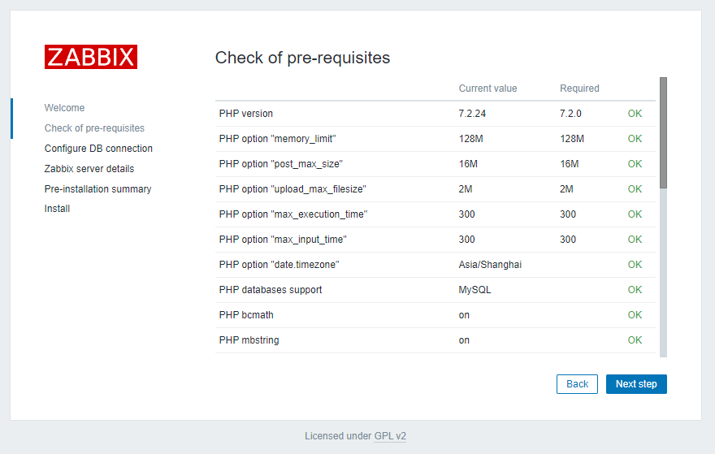

# 第1章 Zabbix入门

https://www.zabbix.com/download

## 1.1 Zabbix概述

Zabbix是一款能够监控各种网络参数以及服务器健康性和完整性的软件。Zabbix使用灵活的通知机制，允许用户为几乎任何事件配置基于邮件的告警。这样可以快速反馈服务器的问题。基于已存储的数据，Zabbix提供了出色的报告和数据可视化功能。

## 1.2 Zabbix 基础架构


# 第2章 Zabbix部署

## 2.1 集群规划

| 进程          | node01节点 | node02节点 | node03节点 |
| ------------- | ---------- | ---------- | ---------- |
| zabbix-agent  | √          | √          | √          |
| zabbix-server | √          |            |            |
| MySQL         | √          |            |            |
| zabbix-web    | √          |            |            |
## 2.2 准备工作

### 2.2.1 关闭集群

如果集群开启，先关闭集群。因为安装Zabbix前，需要重启虚拟机。

### 2.2.2 关闭防火墙（3台节点，已关闭）

### 2.2.3 关闭SELinux

## 2.3 配置Zabbix yum源（3台节点）

### 2.3.1 安装yum仓库

1）安装zabbix的yum仓库

```shell
[root@node01 ~]# sudo rpm -Uvh https://mirrors.aliyun.com/zabbix/zabbix/5.0/rhel/7/x86\_64/zabbix-release-5.0-1.el7.noarch.rpm

[root@node02 ~]# sudo rpm -Uvh https://mirrors.aliyun.com/zabbix/zabbix/5.0/rhel/7/x86\_64/zabbix-release-5.0-1.el7.noarch.rpm

[root@node03 ~]# sudo rpm -Uvh https://mirrors.aliyun.com/zabbix/zabbix/5.0/rhel/7/x86\_64/zabbix-release-5.0-1.el7.noarch.rpm
```

2）安装Software Collections仓库

```shell
[root@node01 ~]# sudo yum install -y centos-release-scl

[root@node02 ~]# sudo yum install -y centos-release-scl

[root@node03 ~]# sudo yum install -y centos-release-scl
```

### 2.3.2 修改zabbix仓库配置文件

node1、node02、node03三台节点，依次执行如下步骤。

**1）修改为阿里云镜像**

**（ 1）查看原始zabbix.repo文件 **

```shell
[root@node01 ~]# cat /etc/yum.repos.d/zabbix.repo
```

查看内容如下

```properties
[zabbix]
name=Zabbix Official Repository - $basearch
baseurl=http://repo.zabbix.com/zabbix/5.0/rhel/7/$basearch/
enabled=1
gpgcheck=1
gpgkey=file:///etc/pki/rpm-gpg/RPM-GPG-KEY-ZABBIX-A14FE591

[zabbix-frontend]
name=Zabbix Official Repository frontend - $basearch
baseurl=http://repo.zabbix.com/zabbix/5.0/rhel/7/$basearch/frontend
enabled=0
gpgcheck=1
gpgkey=file:///etc/pki/rpm-gpg/RPM-GPG-KEY-ZABBIX-A14FE591

[zabbix-debuginfo]
name=Zabbix Official Repository debuginfo - $basearch
baseurl=http://repo.zabbix.com/zabbix/5.0/rhel/7/$basearch/debuginfo/
enabled=0
gpgkey=file:///etc/pki/rpm-gpg/RPM-GPG-KEY-ZABBIX-A14FE591
gpgcheck=1

[zabbix-non-supported]
name=Zabbix Official Repository non-supported - $basearch
baseurl=http://repo.zabbix.com/non-supported/rhel/7/$basearch/
enabled=1
gpgkey=file:///etc/pki/rpm-gpg/RPM-GPG-KEY-ZABBIX
gpgcheck=1
```

**（ 2 ）执行以下命令完成全局替换 **

```shell
[root@node01 ~]# sed -i 's/http:\/\/repo.zabbix.com/https:\/\/mirrors.aliyun.com\/zabbix/g' /etc/yum.repos.d/zabbix.repo
```

**（ 3）查看修改之后的 zabbix.repo文件**

```shell
[root@node01 ~]# cat /etc/yum.repos.d/zabbix.repo
```

查看内容如下

```properties
[zabbix]
name=Zabbix Official Repository - $basearch
baseurl=https://mirrors.aliyun.com/zabbix/zabbix/5.0/rhel/7/$basearch/
enabled=1
gpgcheck=1
gpgkey=file:///etc/pki/rpm-gpg/RPM-GPG-KEY-ZABBIX-A14FE591

[zabbix-frontend]
name=Zabbix Official Repository frontend - $basearch
baseurl=https://mirrors.aliyun.com/zabbix/zabbix/5.0/rhel/7/$basearch/frontend
enabled=0
gpgcheck=1
gpgkey=file:///etc/pki/rpm-gpg/RPM-GPG-KEY-ZABBIX-A14FE591

[zabbix-debuginfo]
name=Zabbix Official Repository debuginfo - $basearch
baseurl=https://mirrors.aliyun.com/zabbix/zabbix/5.0/rhel/7/$basearch/debuginfo/
enabled=0
gpgkey=file:///etc/pki/rpm-gpg/RPM-GPG-KEY-ZABBIX-A14FE591
gpgcheck=1

[zabbix-non-supported]
name=Zabbix Official Repository non-supported - $basearch
baseurl=https://mirrors.aliyun.com/zabbix/non-supported/rhel/7/$basearch/
enabled=1
gpgkey=file:///etc/pki/rpm-gpg/RPM-GPG-KEY-ZABBIX
gpgcheck=1
```

**2 ）启用 zabbix-web 仓库 **

**打开 /etc/yum.repos.d/zabbix.repo 文件，做如下修改**

```properties
[zabbix]
name=Zabbix Official Repository - $basearch
baseurl=https://mirrors.aliyun.com/zabbix/zabbix/5.0/rhel/7/$basearch/
enabled=1
gpgcheck=1
gpgkey=file:///etc/pki/rpm-gpg/RPM-GPG-KEY-ZABBIX-A14FE591

[zabbix-frontend]
name=Zabbix Official Repository frontend - $basearch
baseurl=https://mirrors.aliyun.com/zabbix/zabbix/5.0/rhel/7/$basearch/frontend
# 这里改成1， 按照规划node01对外提供web服务，因此只改node01即可
enabled=1
gpgcheck=1
gpgkey=file:///etc/pki/rpm-gpg/RPM-GPG-KEY-ZABBIX-A14FE591

[zabbix-debuginfo]
name=Zabbix Official Repository debuginfo - $basearch
baseurl=https://mirrors.aliyun.com/zabbix/zabbix/5.0/rhel/7/$basearch/debuginfo/
enabled=0
gpgkey=file:///etc/pki/rpm-gpg/RPM-GPG-KEY-ZABBIX-A14FE591
gpgcheck=1

[zabbix-non-supported]
name=Zabbix Official Repository non-supported - $basearch
baseurl=https://mirrors.aliyun.com/zabbix/non-supported/rhel/7/$basearch/
enabled=1
gpgkey=file:///etc/pki/rpm-gpg/RPM-GPG-KEY-ZABBIX
gpgcheck=1
```

## 2.4 安装Zabbix

**在三台节点分别执行以下安装命令**

```shell
[root@node01 ~]#  yum install -y zabbix-server-mysql zabbix-agent zabbix-web-mysql-scl zabbix-apache-conf-scl

[root@node02 ~]#  sudo yum install -y zabbix-agent

[root@node03 ~]#  sudo yum install -y zabbix-agent
```

## 2.5 配置Zabbix

### 2.5.1 创建zabbix数据库

```shell
[root@node01 ~]#  mysql -uroot -proot -e "create database zabbix character set utf8 collate utf8_bin"
```

### 2.5.2 导入Zabbix建表语句

```shell
[root@node01 ~]# zcat /usr/share/doc/zabbix-server-mysql-5.0.*/create.sql.gz | mysql -uroot -proot zabbix
```

### 2.5.3 配置Zabbix\_Server（node01）

**修改 zabbix-server 配置文件**

```shell
[root@node01 ~]# sudo vi /etc/zabbix/zabbix_server.conf

DBHost=node01
DBName=zabbix
DBUser=root
DBPassword=root
```

### 2.5.4 配置Zabbix\_Agent

**修改 zabbix-agent 配置文件**

```shell
[root@node01 ~]# sudo vi /etc/zabbix/zabbix_agentd.conf
# 修改如下内容, 一个修改，两个注释：
Server=node01
#ServerActive=127.0.0.1
#Hostname=Zabbix server
```

修改完成后分发到另外两台节点上去

### 2.5.5 配置Zabbix\_Web时区

**修改 /etc/opt/rh/rh-php72/php-fpm.d/zabbix.conf 文件**

注意，是在node01上配置了Web，这个目录只能在node01上改

``` shell
[root@node01 ~]#  sudo vi /etc/opt/rh/rh-php72/php-fpm.d/zabbix.conf
```

修改如下内容：

```properties
[zabbix]
user = apache
group = apache

listen = /var/opt/rh/rh-php72/run/php-fpm/zabbix.sock
listen.acl_users = apache
listen.allowed_clients = 127.0.0.1

pm = dynamic
pm.max_children = 50
pm.start_servers = 5
pm.min_spare_servers = 5
pm.max_spare_servers = 35

php_value[session.save_handler] = files
php_value[session.save_path]    = /var/opt/rh/rh-php72/lib/php/session/

php_value[max_execution_time] = 300
php_value[memory_limit] = 128M
php_value[post_max_size] = 16M
php_value[upload_max_filesize] = 2M
php_value[max_input_time] = 300
php_value[max_input_vars] = 10000
php_value[date.timezone] = Asia/Shanghai
```

## 2.6 启动停止Zabbix

### 2.6.1 启动Zabbix

```shell
[root@node01 ~]# sudo systemctl start zabbix-server zabbix-agent httpd rh-php72-php-fpm
[root@node01 ~]# sudo systemctl enable zabbix-server zabbix-agent httpd rh-php72-php-fpm

[root@node02 ~]# sudo systemctl start zabbix-agent
[root@node02 ~]# sudo systemctl enable zabbix-agent

[root@node03 ~]# sudo systemctl start zabbix-agent
[root@node03 ~]# sudo systemctl enable zabbix-agent
```

### 2.6.2 停止Zabbix

```shell
[root@node01 ~]# sudo systemctl stop zabbix-server zabbix-agent httpd rh-php72-php-fpm
[root@node01 ~]# sudo systemctl disable zabbix-server zabbix-agent httpd rh-php72-php-fpm

[root@node02 ~]# sudo systemctl stop zabbix-agent
[root@node02 ~]# sudo systemctl disable zabbix-agent

[root@node03 ~]# sudo systemctl stop zabbix-agent
[root@node03 ~]# sudo systemctl disable zabbix-agent
```

### 2.6.3 连接Zabbix\_Web数据库

**1 ）浏览器访问 http://node01/zabbix/**


**2 ）检查配置**



**3 ）配置数据库**


**4 ）配置 zabbix-server**


### 2.6.4 登录Zabbix

1）用户名密码如下

用户名：Admin 密码：zabbix


2）点击User Settings，语言设成中文


# 第3章 Zabbix使用

## 3.1 Zabbix术语

### 3.1.1 主机（Host）

一台你想监控的网络设备，用IP或域名表示。

### 3.1.2 监控项（Item）

你想要接收的主机的特定数据，一个度量数据。

### 3.1.3 触发器（Trigger）

一个被用于定义问题阈值和&quot;评估&quot;监控项接收到的数据的逻辑表达式。

### 3.1.4 动作（Action）

一个对事件做出反应的预定义的操作，比如邮件通知。

## 3.2 Zabbix实战

### 3.2.1 创建Host

**1 ）点击配置 / 主机 / 创建主机**


**2 ）配置主机（ Host ）**


**3 ）查看新增（ Host ）**


**4 ）重复以上步骤，再创建 hadoop103 、 hadoop104 主机。**


### 3.2.2 创建监控项（Items）

**1**** ）点击监控项（ ****Items**** ）**


**2**** ）点击创建监控项（ ****Create Item**** ）**


**3**** ）配置监控项（ ****Item**** ）**


**4**** ）查看创建的监控项**


**5**** ）查看监控项最新数据**


### 3.2.3 创建触发器（Trigger）

**1**** ）点击配置 ****/**** 主机 ****/**** 触发器**


**2**** ）点击创建触发器**


**3**** ）编辑触发器**


### 3.2.4 创建动作（Action）

**1**** ）点击配置 ****/**** 动作 ****/**** 创建动作**


**2**** ）编辑动作（ ****Action**** ）**


### 3.2.5 申请邮箱

邮件报警，可以采用126、163、qq等邮箱。下面以126邮箱为例。

1）申请注册一个126邮箱

2）点击邮箱账号=》账号管理


3）开启SMTP服务


4）一定要记住授权码


### 3.2.6 创建报警媒介类型（Media type）

**1**** ）点击管理 ****/**** 报警媒介类型 ****/Email**


**2**** ）编辑 ****Email**


**3**** ）测试 ****Email**


**4**** ） ****Email**** 绑定收件人**


### 3.2.7 测试

**1**** ）关闭集群中的 ****HDFS**** ，会有如下效果**

[atguigu@hadoop102 hadoop-3.1.3]$ sbin/stop-dfs.sh

**2**** ）查看仪表盘故障信息**


**3**** ）查看邮件，接收故障信息**


## 3.3 创建模板

**1**** ）点击配置 ****/**** 模板 ****/**** 创建模板**


**2**** ）配置模板名称 ****/**** 群组**


**3**** ）配置监控项**


**4**** ）配置触发器**


**5**** ）配置动作**


**6**** ）为 ****hadoop103**** 应用模板**


**7**** ）为 ****hadoop104**** 应用模板**

**同上**

**8**** ）测试**

**（**** 1 ****）启动**** hadoop ****集群**

[atguigu@hadoop102 hadoop-3.1.3]$ sbin/start-dfs.sh

**（**** 2 ****）停止**** hadoop ****集群**

[atguigu@hadoop102 hadoop-3.1.3]$ sbin/stop-dfs.sh

**（**** 3 ****）查看报警邮件**

# 第4章 集成Grafana

## 4.1 部署Grafana

1.下载Grafana安装包

官方仓库：[https://dl.grafana.com/oss/release/grafana-7.4.3-1.x86\_64.rpm](https://dl.grafana.com/oss/release/grafana-7.4.3-1.x86_64.rpm)

国内镜像：[https://repo.huaweicloud.com/grafana/7.4.3/grafana-7.4.3-1.x86\_64.rpm](https://repo.huaweicloud.com/grafana/7.4.3/grafana-7.4.3-1.x86_64.rpm)

2.将安装包上传到hadoop102主机的/opt/software路径

3.使用rpm安装Grafana

[atguigu@hadoop102 software]$ sudo rpm -ivh grafana-7.4.3-1.x86\_64.rpm

4.启动Grafana

[atguigu@hadoop102 software]$ sudo systemctl start grafana-server

5.访问Grafana页面

访问地址为：[http://hadoop102:3000/](http://hadoop102:3000/)

首次登录用户名和密码均为 admin


设置新密码或者跳过


## 4.2 快速入门

1.创建Dashboard


2.新建panel


3.选择数据源，此处选择Grafana提供的随机测试数据


4.选择合适的可视化类型


5.保存Dashboard和panel，并命名


## 4.3 集成Zabbix

### 4.3.1 配置数据源

使用Grafana与其他系统集成时，需要配置对应的DataSource

1.点击下图所示按钮，增加数据源


2.选择所需数据源


3.如没有所需数据源，点击下图所示地址，获取更多数据源


4.搜索zabbix，并点击搜索结果


5.按照所需插件的说明进行部署


6.以下是插件部署步骤

1）安装插件

[atguigu@hadoop102 software]$ sudo grafana-cli plugins install alexanderzobnin-zabbix-app

2）重启Grafana

[atguigu@hadoop102 software]$ sudo systemctl restart grafana-server

3）启用插件

（1）点击设置/插件


（2）搜索zabbix，并点击搜索结果


（3）启用Zabbix插件


7.配置zabbix数据源

1）新增数据源


2）搜索zabbix，并点击搜索结果


3）配置数据源


### 4.3.2 集成案例

1.为方便展示效果，在Zabbix中为hadoop102主机应用一个Zabbix内置的Linux系统监控模板。

1）找到hadoop102主机


2）点击模板，搜索linux，并选择Template OS Linux by Zabbix agent


3）点击更新


2.集成Grafana，展示模板中的系统监控项

1）点击Dashboards，找到前边创建的Test看板


2）新建panel


3）选择Zabbix数据源


4）选择要展示的监控项


5）选择合适的图标类型


6）保存配置


更多Java –大数据 –前端 –python人工智能资料下载，可百度访问：尚硅谷官网

