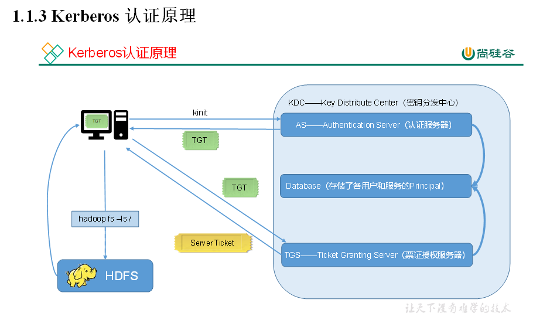

# 第1章 Kerberos部署

## 1.1 Kerberos概述

### 1.1.1 什么是Kerberos

Kerberos是一种计算机网络认证协议，用来在非安全网络中，对个人通信以安全的手段进行 **身份认证** 。这个词又指麻省理工学院为这个协议开发的一套计算机软件。软件设计上采用客户端/服务器结构，并且能够进行相互认证，即客户端和服务器端均可对对方进行身份认证。可以用于防止窃听、防止重放攻击、保护数据完整性等场合，是一种应用对称密钥体制进行密钥管理的系统。

### 1.1.2 Kerberos术语

Kerberos中有以下一些概念需要了解：

1）KDC（Key Distribute Center）：密钥分发中心，负责存储用户信息，管理发放票据。

2）Realm：Kerberos所管理的一个领域或范围，称之为一个Realm。

3）Principal：Kerberos所管理的一个用户或者一个服务，可以理解为Kerberos中保存的一个账号，其格式通常如下：

`primary/instance@realm`

4）keytab：Kerberos中的用户认证，可通过密码或者密钥文件证明身份，keytab指密钥文件。

### 1.1.3 Kerberos认证原理



## 1.2 Kerberos安装

### 1.2.1 安装Kerberos相关服务

选择集群中的一台主机（node01）作为Kerberos服务端，安装KDC，所有主机都需要部署Kerberos客户端。

服务端主机执行以下安装命令

```shell
[root@node01~]# yum install -y krb5-server
```

客户端主机执行以下安装命令

```shell
[root@node01 ~]# yum install -y krb5-workstation krb5-libs

[root@node02 ~]# yum install -y krb5-workstation krb5-libs

[root@node03 ~]# yum install -y krb5-workstation krb5-libs
```

### 1.2.2 修改配置文件

1.服务端主机（node01）

修改/var/kerberos/krb5kdc/kdc.conf文件，内容如下

```shell
[root@node ~]# vi /var/kerberos/krb5kdc/kdc.conf
```

修改如下内容

```properties
[kdcdefaults]

kdc_ports = 88

kdc_tcp_ports = 88

[realms]

EXAMPLE.COM = {

#master_key_type = aes256-cts

acl_file = /var/kerberos/krb5kdc/kadm5.acl

dict_file = /usr/share/dict/words

admin_keytab = /var/kerberos/krb5kdc/kadm5.keytab

supported_enctypes = aes256-cts:normal aes128-cts:normal des3-hmac-sha1:normal arcfour-hmac:normal camellia256-cts:normal camellia128-cts:normal des-hmac-sha1:normal des-cbc-md5:normal des-cbc-crc:normal

}
```

2.客户端主机（所有主机）

修改/etc/krb5.conf文件

```shell
[root@node01 ~]# vi /etc/krb5.conf
```

内容如下

```properties
# Configuration snippets may be placed in this directory as well
includedir /etc/krb5.conf.d/

[logging]
 default = FILE:/var/log/krb5libs.log
 kdc = FILE:/var/log/krb5kdc.log
 admin_server = FILE:/var/log/kadmind.log

[libdefaults]
 dns_lookup_realm = false
 # 关闭认证时联网
 dns_lookup_kdc = false
 ticket_lifetime = 24h
 renew_lifetime = 7d
 forwardable = true
 rdns = false
 pkinit_anchors = FILE:/etc/pki/tls/certs/ca-bundle.crt
 default_realm = EXAMPLE.COM
 #default_ccache_name = KEYRING:persistent:%{uid}

[realms]
 EXAMPLE.COM = {
  kdc = node01
  admin_server = node01
 }
[domain_realm]
# .example.com = EXAMPLE.COM
# example.com = EXAMPLE.COM
```

分发到node02, node03节点

### 1.2.3 初始化KDC数据库

在服务端主机（node01）执行以下命令，并根据提示输入密码。

```shell
[root@node01~]# kdb5_util create -s
```

### 1.2.4 修改管理员权限配置文件

在服务端主机（node01）修改/var/kerberos/krb5kdc/kadm5.acl文件，内容如下

```shell
*/admin@EXAMPLE.COM *
```

### 1.2.5 启动Kerberos相关服务

在主节点（node01）启动KDC，并配置开机自启

```shell
[root@node01~]# systemctl start krb5kdc
[root@node01~]# systemctl enable krb5kdc
```

在主节点（node01）启动kadmin，该服务为KDC数据库访问入口

```shell
[root@node01~]# systemctl start kadmin
[root@node01~]# systemctl enable kadmin
```

### 1.2.6 创建Kerberos管理员用户

在KDC所在主机（node01），执行以下命令，并按照提示输入密码

```shell
[root@node01~]# kadmin.local -q "addprinc admin/admin"
```

## 1.3 Kerberos使用概述

### 1.3.1 Kerberos数据库操作

**1. 登录数据库**

1）本地登录（无需认证）

```shell
[root@node01 ~]# kadmin.local # 进入 kerberos 交换客户端
Authenticating as principal root/admin@EXAMPLE.COM with password.
kadmin.local:  quit
```

2）远程登录（需进行主体认证，认证操作见下文）

```shell
# 使用node02测试远程登录
[root@node02~]# kadmin

Authenticating as principal admin/admin@EXAMPLE.COM with password.

Password for admin/admin@EXAMPLE.COM:

kadmin:

退出输入：exit
```

**2. 创建 Kerberos 主体**

登录数据库，输入以下命令，并按照提示输入密码

```shell
[root@node01 ~]# kadmin.local
Authenticating as principal root/admin@EXAMPLE.COM with password.
kadmin.local:  addprinc test # 新增一个test用户
WARNING: no policy specified for test@EXAMPLE.COM; defaulting to no policy
Enter password for principal "test@EXAMPLE.COM":  # 输入两次密码
Re-enter password for principal "test@EXAMPLE.COM": 
Principal "test@EXAMPLE.COM" created.
kadmin.local:  list_principals # 查看创建的用户
K/M@EXAMPLE.COM
admin/admin@EXAMPLE.COM
kadmin/admin@EXAMPLE.COM
kadmin/changepw@EXAMPLE.COM
kadmin/node01@EXAMPLE.COM
kiprop/node01@EXAMPLE.COM
krbtgt/EXAMPLE.COM@EXAMPLE.COM
test@EXAMPLE.COM # 创建的用户
kadmin.local:  
```

也可通过以下shell命令直接创建主体

```shell
[root@node01~]# kadmin.local -q"addprinc test"
```

**3. 修改主体密码**

```shell
kadmin.local :cpw test
```

修改admin密码： kpasswd 用户名

**4. 查看所有主体**

```shell
kadmin.local: list_principals
```

**5. 删除主体**

```shell
kadmin.local: delprinc test
```

### 1.3.2 Kerberos认证操作

**1. 密码认证**

1）使用kinit进行主体认证，并按照提示输入密码

```shell
[root@node01 ~]# kinit test
Password for test@EXAMPLE.COM:
```

2）查看认证凭证

```shell
[root@node01 ~]# klist
Ticket cache: FILE:/tmp/krb5cc_0
Default principal: test@EXAMPLE.COM

Valid starting       Expires              Service principal
08/10/2022 20:43:05  08/11/2022 20:43:05  krbtgt/EXAMPLE.COM@EXAMPLE.COM
```

**2. 密钥文件认证**

1）生成主体test的keytab文件到指定目录/root/test.keytab

```shell
[root@node01~]# kadmin.local -q "xst -norandkey -k /root/test.keytab test@EXAMPLE.COM"
```

注：-norandkey的作用是声明不随机生成密码，若不加该参数，会导致之前的密码失效。

2）使用keytab进行认证

```shell
[root@node01~]# kinit -kt /root/test.keytab test
```

3）查看认证凭证

```shell
[root@node01 ~]# klist
Ticket cache: FILE:/tmp/krb5cc_0
Default principal: test@EXAMPLE.COM

Valid starting       Expires              Service principal
08/10/2022 20:46:48  08/11/2022 20:46:48  krbtgt/EXAMPLE.COM@EXAMPLE.COM
```

**3. 销毁凭证**

```shell
[root@node01~]# kdestroy
[root@node01~]# klist
klist: No credentials cache found (ticket cache FILE:/tmp/krb5cc_0)
```

# 第2章 创建Hadoop系统用户

为Hadoop开启Kerberos，需为不同服务准备不同的用户，启动服务时需要使用相应的用户。须在 **所有节点** 创建以下用户和用户组。

| 用户:用户组       | 负责的进程                      |
| ----------------- | ------------------------------- |
| **hdfs:hadoop**   | NameNode, JournalNode, DataNode |
| **yarn:hadoop**   | ResourceManager, NodeManager    |
| **mapred:hadoop** | MapReduce,  JobHistory Server   |

创建hadoop组(所有节点)

```shell
[root@node01~]# groupadd hadoop
```

创建各用户并设置密码(所有节点)

```shell
[root@node01~]# useradd hdfs -g hadoop
[root@node01~]# echo hdfs | passwd --stdin hdfs

[root@node01~]# useradd yarn -g hadoop
[root@node01~]# echo yarn | passwd --stdin yarn

[root@node01~]# useradd mapred -g hadoop
[root@node01~]# echo mapred | passwd --stdin mapred
```

# 第3章 Hadoop Kerberos配置

## 3.1 为Hadoop各服务创建Kerberos主体（Principal）

主体格式如下：ServiceName/HostName@REALM，例如 `dn/node01@EXAMPLE.COM`

**1. 各服务所需主体如下**

环境：3台节点，主机名分别为node01，node02，node03

| **服务**              | **所在主机** | **主体（ Principal ）** |
| --------------------- | ------------ | ----------------------- |
| **NameNode**          | node01       | nn/node01               |
| **NameNode**          | node02       | nn/node02               |
| **JournalNode**       | node01       | jnn/node01              |
| **JournalNode**       | node02       | jnn/node02              |
| **JournalNode**       | node03       | jnn/node03              |
| **DataNode**          | node01       | dn/node01               |
| **DataNode**          | node02       | dn/node02               |
| **DataNode**          | node03       | dn/node03               |
| **ResourceManager**   | node01       | rm/node01               |
| **ResourceManager**   | node02       | rm/node02               |
| **NodeManager**       | node01       | nm/node01               |
| **NodeManager**       | node02       | nm/node02               |
| **NodeManager**       | node03       | nm/node03               |
| **JobHistory Server** | node03       | jhs/node03              |
| **Web UI**            | node01       | HTTP/node01             |
| **Web UI**            | node02       | HTTP/node02             |
| **Web UI**            | node03       | HTTP/node03             |

**2. 创建主体说明(这步不操作，学习流程)**

1）路径准备

为服务创建的主体，需要通过密钥文件keytab文件进行认证，故需为各服务准备一个安全的路径用来存储keytab文件。在各节点上执行如下语句

```shell
[root@node01~]# mkdir /etc/security/keytab/
[root@node01~]# chown -R root:hadoop /etc/security/keytab/
[root@node01~]# chmod 770 /etc/security/keytab/
```

2）管理员主体认证

为执行创建主体的语句，需**远程登录**Kerberos 数据库**客户端**，登录之前需先使用Kerberos的管理员用户进行认证，执行以下命令并根据提示输入密码。

```shell
[root@node02~]# kinit admin/admin
```

3）登录数据库客户端

```shell
[root@node02~]# kadmin
```

4）执行创建主体的语句

```shell
kadmin: addprinc -randkey test/test
kadmin: xst -k /etc/security/keytab/test.keytab test/test
```

说明：

（1）addprinc test/test：作用是新建主体

addprinc：增加主体

-randkey：密码随机，因hadoop各服务均通过keytab文件认证，故密码可随机生成

test/test：新增的主体

（2）xst -k /etc/security/keytab/test.keytab test/test：作用是将主体的密钥写入keytab文件

xst：将主体的密钥写入keytab文件

-k /etc/security/keytab/test.keytab：指明keytab文件路径和文件名

test/test：主体

（3）为方便创建主体，可使用如下命令

```shell
[root@node01~]# kadmin -padmin/admin -wadmin -q"addprinc -randkey test/test"
[root@node01~]# kadmin -padmin/admin -wadmin -q"xst -k /etc/security/keytab/test.keytab test/test"
```

说明：

-p：主体

-w：密码

-q：执行语句

（4）操作主体的其他命令，可参考官方文档，地址如下：

[http://web.mit.edu/kerberos/krb5-current/doc/admin/admin_commands/kadmin_local.html#commands](http://web.mit.edu/kerberos/krb5-current/doc/admin/admin_commands/kadmin_local.html#commands)

**3. 创建主体**

**1 ）在所有节点创建 keytab 文件目录**

```shell
[root@node01~]# mkdir /etc/security/keytab/
[root@node01~]# chown -R root:hadoop /etc/security/keytab/
[root@node01~]# chmod 770 /etc/security/keytab/
```

**2 ）以下命令在 node01节点执行**

**NameNode （ node01）**

```shell
[root@node01~]# kadmin -padmin/admin -wadmin -q"addprinc -randkey nn/node01"
[root@node01~]# kadmin -padmin/admin -wadmin -q"xst -k /etc/security/keytab/nn.service.keytab nn/node01"
```

**DataNode （ node01）**

```shell
[root@node01~]# kadmin -padmin/admin -wadmin -q"addprinc -randkey dn/node01"
[root@node01~]# kadmin -padmin/admin -wadmin -q"xst -k /etc/security/keytab/dn.service.keytab dn/node01"
```

**ResourceManager （ node01）**

```shell
[root@node02 ~]# kadmin -padmin/admin -wadmin -q"addprinc -randkey rm/node01"
[root@node02 ~]# kadmin -padmin/admin -wadmin -q"xst -k /etc/security/keytab/rm.service.keytab rm/node01"
```

**JournalNode（ node01）**

```shell
[root@node01~]# kadmin -padmin/admin -wadmin -q"addprinc -randkey jnn/node01"
[root@node01~]# kadmin -padmin/admin -wadmin -q"xst -k /etc/security/keytab/jnn.service.keytab jnn/node01"
```

**Web UI （ node01）**

```shell
[root@node01~]# kadmin -padmin/admin -wadmin -q"addprinc -randkey HTTP/node01"
[root@node01~]# kadmin -padmin/admin -wadmin -q"xst -k /etc/security/keytab/spnego.service.keytab HTTP/node01"
```

**ResourceManager （ node01）**

```shell
[root@node02 ~]# kadmin -padmin/admin -wadmin -q"addprinc -randkey rm/node01"
[root@node02 ~]# kadmin -padmin/admin -wadmin -q"xst -k /etc/security/keytab/rm.service.keytab rm/node01"
```

**2 ）以下命令在 node02 执行**

**NameNode （ node02）**

```shell
[root@node01~]# kadmin -padmin/admin -wadmin -q"addprinc -randkey nn/node01"
[root@node01~]# kadmin -padmin/admin -wadmin -q"xst -k /etc/security/keytab/nn.service.keytab nn/node01"
```

**DataNode （ node02）**

```shell
[root@node01~]# kadmin -padmin/admin -wadmin -q"addprinc -randkey dn/node01"
[root@node01~]# kadmin -padmin/admin -wadmin -q"xst -k /etc/security/keytab/dn.service.keytab dn/node01"
```

**JournalNode（ node02）**

```shell
[root@node02~]# kadmin -padmin/admin -wadmin -q"addprinc -randkey jnn/node02"
[root@node02~]# kadmin -padmin/admin -wadmin -q"xst -k /etc/security/keytab/jnn.service.keytab jnn/node02"
```

**NodeManager （ node02）**

```shell
[root@node02~]# kadmin -padmin/admin -wadmin -q"addprinc -randkey nm/node01"
[root@node02~]# kadmin -padmin/admin -wadmin -q"xst -k /etc/security/keytab/nm.service.keytab nm/node01"
```

**ResourceManager （ node02 ）**

```shell
[root@node02 ~]# kadmin -padmin/admin -wadmin -q"addprinc -randkey rm/node02"
[root@node02 ~]# kadmin -padmin/admin -wadmin -q"xst -k /etc/security/keytab/rm.service.keytab rm/node02"
```

**Web UI （ node02 ）**

```shell
[root@node02 ~]# kadmin -padmin/admin -wadmin -q"addprinc -randkey HTTP/node02"
[root@node02 ~]# kadmin -padmin/admin -wadmin -q"xst -k /etc/security/keytab/spnego.service.keytab HTTP/node02"
```

**3 ）以下命令在 node03 执行**

**DataNode （ node03 ）**

```shell
[root@node03 ~]# kadmin -padmin/admin -wadmin -q"addprinc -randkey dn/node03"

[root@node03 ~]# kadmin -padmin/admin -wadmin -q"xst -k /etc/security/keytab/dn.service.keytab dn/node03"
```

**NodeManager （ node03 ）**

```shell
[root@node03 ~]# kadmin -padmin/admin -wadmin -q"addprinc -randkey nm/node03"

[root@node03 ~]# kadmin -padmin/admin -wadmin -q"xst -k /etc/security/keytab/nm.service.keytab nm/node03"
```

**JournalNode（ node03）**

```shell
[root@node03~]# kadmin -padmin/admin -wadmin -q"addprinc -randkey jnn/node03"
[root@node03~]# kadmin -padmin/admin -wadmin -q"xst -k /etc/security/keytab/jnn.service.keytab jnn/node03"
```

**Web UI （ node03 ）**

```shell
[root@node03 ~]# kadmin -padmin/admin -wadmin -q"addprinc -randkey HTTP/node03"

[root@node03 ~]# kadmin -padmin/admin -wadmin -q"xst -k /etc/security/keytab/spnego.service.keytab HTTP/node03"
```

**JobHistory Server （ node03）**

```shell
[root@node03~]# kadmin -padmin/admin -wadmin -q"addprinc -randkey jhs/node03"
[root@node03~]# kadmin -padmin/admin -wadmin -q"xst -k /etc/security/keytab/jhs.service.keytab jhs/node03"
```

**4. 修改 所有节点 keytab 文件的所有者和访问权限**

```shell
[root@node01~]# chown -R root:hadoop /etc/security/keytab/
[root@node01~]# chmod 660 /etc/security/keytab/*
```

## 3.2 修改Hadoop配置文件

**需要修改的内容如下，修改完毕需要分发所改文件。**

**1.core-site.xml**

```shell
[root@node01~]# vi /opt/stanlong/hadoop/hadoop-2.9.2/etc/hadoop/core-site.xml
```

增加以下内容

```xml
<!-- Kerberos主体到系统用户的映射机制 -->
<property>
  <name>hadoop.security.auth_to_local.mechanism</name>
  <value>MIT</value>
</property>

<!-- Kerberos主体到系统用户的具体映射规则 -->
<property>
  <name>hadoop.security.auth_to_local</name>
  <value>
    RULE:[2:$1/$2@$0]([ndj]n+\/.*@EXAMPLE\.COM)s/.*/hdfs/
    RULE:[2:$1/$2@$0]([rn]m\/.*@EXAMPLE\.COM)s/.*/yarn/
    RULE:[2:$1/$2@$0](jhs\/.*@EXAMPLE\.COM)s/.*/mapred/
    DEFAULT
  </value>
</property>

<!-- 启用Hadoop集群Kerberos安全认证 -->
<property>
  <name>hadoop.security.authentication</name>
  <value>kerberos</value>
</property>

<!-- 启用Hadoop集群授权管理 -->
<property>
  <name>hadoop.security.authorization</name>
  <value>true</value>
</property>

<!-- Hadoop集群间RPC通讯设为仅认证模式 -->
<property>
  <name>hadoop.rpc.protection</name>
  <value>authentication</value>
</property>
```

**2.hdfs-site.xml**

```shell
[root@node01~]# vi /opt/stanlong/hadoop/hadoop-2.9.2/etc/hadoop/hdfs-site.xml
```

增加以下内容

```xml
<!-- 访问DataNode数据块时需通过Kerberos认证 -->
<property>
  <name>dfs.block.access.token.enable</name>
  <value>true</value>
</property>

<!-- NameNode服务的Kerberos主体,_HOST会自动解析为服务所在的主机名 -->
<property>
  <name>dfs.namenode.kerberos.principal</name>
  <value>nn/_HOST@EXAMPLE.COM</value>
</property>

<!-- NameNode服务的Kerberos密钥文件路径 -->
<property>
  <name>dfs.namenode.keytab.file</name>
  <value>/etc/security/keytab/nn.service.keytab</value>
</property>

<!-- JournalNode服务的Kerberos主体 -->
<property>
  <name>dfs.journalnode.keytab.file</name>
  <value>/etc/security/keytab/jnn.service.keytab</value>
</property>

<!-- JournalNode服务的Kerberos密钥文件路径 -->
<property>
  <name>dfs.secondary.namenode.kerberos.principal</name>
  <value>jnn/_HOST@EXAMPLE.COM</value>
</property>

<!-- NameNode Web服务的Kerberos主体 -->
<property>
  <name>dfs.namenode.kerberos.internal.spnego.principal</name>
  <value>HTTP/_HOST@EXAMPLE.COM</value>
</property>

<!-- WebHDFS REST服务的Kerberos主体 -->
<property>
  <name>dfs.web.authentication.kerberos.principal</name>
  <value>HTTP/_HOST@EXAMPLE.COM</value>
</property>

<!-- Hadoop Web UI的Kerberos密钥文件路径 -->
<property>
  <name>dfs.web.authentication.kerberos.keytab</name>
  <value>/etc/security/keytab/spnego.service.keytab</value>
</property>

<!-- DataNode服务的Kerberos主体 -->
<property>
  <name>dfs.datanode.kerberos.principal</name>
  <value>dn/_HOST@EXAMPLE.COM</value>
</property>

<!-- DataNode服务的Kerberos密钥文件路径 -->
<property>
  <name>dfs.datanode.keytab.file</name>
  <value>/etc/security/keytab/dn.service.keytab</value>
</property>

<!-- 配置NameNode Web UI 使用HTTPS协议 -->
<property>
  <name>dfs.http.policy</name>
  <value>HTTPS_ONLY</value>
</property>

<!-- 配置DataNode数据传输保护策略为仅认证模式 -->
<property>
  <name>dfs.data.transfer.protection</name>
  <value>authentication</value>
</property>
```

**3.yarn-site.xml**

```shell
[root@node01~]# vi /opt/stanlong/hadoop/hadoop-2.9.2/etc/hadoop/yarn-site.xml
```

增加以下内容

```xml
<!-- Resource Manager 服务的Kerberos主体 -->
<property>
  <name>yarn.resourcemanager.principal</name>
  <value>rm/_HOST@EXAMPLE.COM</value>
</property>

<!-- Resource Manager 服务的Kerberos密钥文件 -->
<property>
  <name>yarn.resourcemanager.keytab</name>
  <value>/etc/security/keytab/rm.service.keytab</value>
</property>

<!-- Node Manager 服务的Kerberos主体 -->
<property>
  <name>yarn.nodemanager.principal</name>
  <value>nm/_HOST@EXAMPLE.COM</value>
</property>

<!-- Node Manager 服务的Kerberos密钥文件 -->
<property>
  <name>yarn.nodemanager.keytab</name>
  <value>/etc/security/keytab/nm.service.keytab</value>
</property>
```

**4.mapred-site.xml**

```shell
[root@node01~]# vi /opt/stanlong/hadoop/hadoop-2.9.2/etc/hadoop/mapred-site.xml
```

增加以下内容

```xml
<!-- 历史服务器的Kerberos主体 -->
<property>
  <name>mapreduce.jobhistory.keytab</name>
  <value>/etc/security/keytab/jhs.service.keytab</value>
</property>

<!-- 历史服务器的Kerberos密钥文件 -->
<property>
  <name>mapreduce.jobhistory.principal</name>
  <value>jhs/_HOST@EXAMPLE.COM</value>
</property>
```

**（ 5 ）分发以上修改的配置文件**

```shell
[root@node01~]# xsync /opt/stanlong/hadoop/hadoop-2.9.2/etc/hadoop/core-site.xml
[root@node01~]# xsync /opt/stanlong/hadoop/hadoop-2.9.2/etc/hadoop/hdfs-site.xml
[root@node01~]# xsync /opt/stanlong/hadoop/hadoop-2.9.2/etc/hadoop/yarn-site.xml
[root@node01~]# xsync /opt/stanlong/hadoop/hadoop-2.9.2/etc/hadoop/mapred-site.xml
```

## 3.3 配置HDFS使用HTTPS安全传输协议

**1. 生成密钥对**

Keytool是java数据证书的管理工具，使用户能够管理自己的公/私钥对及相关证书。

- -keystore    指定密钥库的名称及位置(产生的各类信息将存在.keystore文件中)
- -genkey(或者-genkeypair)      生成密钥对
- -alias 为生成的密钥对指定别名，如果没有默认是mykey
- -keyalg  指定密钥的算法 RSA/DSA 默认是DSA

**1 ）生成  keystore 的密码及相应信息的密钥库**

```shell
[root@node01~]# keytool -keystore /etc/security/keytab/keystore -alias jetty -genkey -keyalg RSA

输入密钥库口令:

再次输入新口令:

您的名字与姓氏是什么?

[Unknown]:

您的组织单位名称是什么?

[Unknown]:

您的组织名称是什么?

[Unknown]:

您所在的城市或区域名称是什么?

[Unknown]:

您所在的省/市/自治区名称是什么?

[Unknown]:

该单位的双字母国家/地区代码是什么?

[Unknown]:

CN=Unknown, OU=Unknown, O=Unknown, L=Unknown, ST=Unknown, C=Unknown是否正确?

[否]: y

输入 \<jetty\> 的密钥口令

(如果和密钥库口令相同, 按回车):

再次输入新口令:
```

查看密钥库

```shell
[root@node01 ~]# cd /etc/security/keytab/
[root@node01 keytab]# ll
total 28
-rw-rw---- 1 root hadoop  538 2022-08-11 21:48:40 dn.service.keytab
-rw-rw---- 1 root hadoop  546 2022-08-14 11:30:37 jnn.service.keytab
-rw-r--r-- 1 root root   2242 2022-08-15 20:32:08 keystore
-rw-rw---- 1 root hadoop  538 2022-08-11 21:50:04 nm.service.keytab
-rw-rw---- 1 root hadoop  538 2022-08-11 21:48:29 nn.service.keytab
-rw-rw---- 1 root hadoop  538 2022-08-11 21:48:41 rm.service.keytab
-rw-rw---- 1 root hadoop  554 2022-08-11 21:50:04 spnego.service.keytab
[root@node01 keytab]# keytool -keystore keystore -list 
Enter keystore password:  
Keystore type: JKS
Keystore provider: SUN

Your keystore contains 1 entry

jetty, Aug 15, 2022, PrivateKeyEntry, 
Certificate fingerprint (SHA-256): 21:20:9A:BC:5D:2C:F7:4C:47:D1:9D:27:C4:45:EC:7E:FA:DA:4A:07:A6:C6:99:1A:47:1F:2E:D4:16:57:39:B0

Warning:
The JKS keystore uses a proprietary format. It is recommended to migrate to PKCS12 which is an industry standard format using "keytool -importkeystore -srckeystore keystore -destkeystore keystore -deststoretype pkcs12".
[root@node01 keytab]# 
```

**2 ）修改 keystore 文件的所有者和访问权限**

```shell
[root@node01~]# chown -R root:hadoop /etc/security/keytab/keystore
[root@node01~]# chmod 660 /etc/security/keytab/keystore
```

**注意：**

（1）密钥库的密码至少6个字符，可以是纯数字或者字母或者数字和字母的组合等等

（2）确保hdfs用户（HDFS的启动用户）具有对所生成keystore文件的读权限

**3 ）将该证书分发到集群中的每台节点的相同路径**

```shell
[root@node01~]# xsync /etc/security/keytab/keystore
```

**4 ）修改 hadoop 配置文件 ssl-server.xml.example ，**

该文件位于 $HADOOP_HOME/etc/hadoop 目录。修改文件名为 ssl-server.xml

```shell
[root@node01~]# cp $HADOOP_HOME/etc/hadoop/ssl-server.xml.example $HADOOP_HOME/etc/hadoop/ssl-server.xml
```

**修改以下内容**

```shell
[root@node01~]# vim $HADOOP_HOME/etc/hadoop/ssl-server.xml
```

修改以下参数

```xml
<!-- SSL密钥库路径 -->
<property>
    <name>ssl.server.keystore.location</name>
    <value>/etc/security/keytab/keystore</value>
</property>

<!-- SSL密钥库密码 -->
<property>
    <name>ssl.server.keystore.password</name>
    <value>123456</value>
</property>

<!-- SSL可信任密钥库路径 -->
<property>
    <name>ssl.server.truststore.location</name>
    <value>/etc/security/keytab/keystore</value>
</property>

<!-- SSL密钥库中密钥的密码 -->
<property>
    <name>ssl.server.keystore.keypassword</name>
    <value>123456</value>
</property>

<!-- SSL可信任密钥库密码 -->
<property>
    <name>ssl.server.truststore.password</name>
    <value>123456</value>
</property>
```

**5 ）分发 ssl-server.xml 文件**

```shell
[root@node01~]# xsync $HADOOP_HOME/etc/hadoop/ssl-server.xml
```

## 3.4 配置Yarn使用LinuxContainerExecutor

1）修改 **所有节点** 的container-executor所有者和权限，要求其所有者为root，所有组为hadoop（启动NodeManger的yarn用户的所属组），权限为6050。其默认路径为$HADOOP_HOME/bin

```shell
[root@node01~]# chown root:hadoop /opt/stanlong/hadoop/hadoop-2.9.2/bin/container-executor
[root@node01~]# chmod 6050 /opt/stanlong/hadoop/hadoop-2.9.2/bin/container-executor
```

2）修改 **所有节点** 的container-executor.cfg文件的所有者和权限，要求该文件及其所有的上级目录的所有者均为root，所有组为hadoop（启动NodeManger的yarn用户的所属组），权限为400。其默认路径为$HADOOP_HOME/etc/hadoop

```shell
[root@node01~]# chown root:hadoop /opt/stanlong/hadoop/hadoop-2.9.2/etc/hadoop/container-executor.cfg
[root@node01~]# chown root:hadoop /opt/stanlong/hadoop/hadoop-2.9.2/etc/hadoop
[root@node01~]# chown root:hadoop /opt/stanlong/hadoop/hadoop-2.9.2/etc
[root@node01~]# chown root:hadoop /opt/stanlong/hadoop/hadoop-2.9.2
[root@node01~]# chown root:hadoop /opt/stanlong/hadoop/
[root@node01~]# chmod 400 /opt/stanlong/hadoop/hadoop-2.9.2/etc/hadoop/container-executor.cfg
```

3）修改$HADOOP_HOME/etc/hadoop/container-executor.cfg

```shell
[root@node01~]# vi $HADOOP_HOME/etc/hadoop/container-executor.cfg
```

内容如下

```properties
yarn.nodemanager.linux-container-executor.group=hadoop
banned.users=hdfs,yarn,mapred
min.user.id=1000
allowed.system.users=
feature.tc.enabled=false
```

4）修改$HADOOP_HOME/etc/hadoop/yarn-site.xml文件

```shell
[root@node01~]# vim $HADOOP_HOME/etc/hadoop/yarn-site.xml
```

增加以下内容

```xml
<!-- 配置Node Manager使用LinuxContainerExecutor管理Container -->
<property>
    <name>yarn.nodemanager.container-executor.class</name>
    <value>org.apache.hadoop.yarn.server.nodemanager.LinuxContainerExecutor</value>
</property>

<!-- 配置Node Manager的启动用户的所属组 -->
<property>
    <name>yarn.nodemanager.linux-container-executor.group</name>
    <value>hadoop</value>
</property>

<!-- LinuxContainerExecutor脚本路径 -->
<property>
    <name>yarn.nodemanager.linux-container-executor.path</name>
    <value>/opt/stanlong/hadoop/hadoop-2.9.2/bin/container-executor</value>
</property>
```

5）分发container-executor.cfg和yarn-site.xml文件

```shell
[root@node01~]# xsync $HADOOP_HOME/etc/hadoop/container-executor.cfg
[root@node01~]# xsync $HADOOP_HOME/etc/hadoop/yarn-site.xml
```

# 第4章 安全模式下启动Hadoop集群

## 4.1 修改特定本地路径权限

| **local** | $HADOOP_LOG_DIR             | hdfs:hadoop | drwxrwxr-x |
| --------- | --------------------------- | ----------- | ---------- |
| **local** | dfs.namenode.name.dir       | hdfs:hadoop | drwx------ |
| **local** | dfs.datanode.data.dir       | hdfs:hadoop | drwx------ |
| **local** | dfs.namenode.checkpoint.dir | hdfs:hadoop | drwx------ |
| **local** | yarn.nodemanager.local-dirs | yarn:hadoop | drwxrwxr-x |
| **local** | yarn.nodemanager.log-dirs   | yarn:hadoop | drwxrwxr-x |

1）$HADOOP_LOG_DIR（所有节点）

该变量位于hadoop-env.sh文件，默认值为 ${HADOOP_HOME}/logs

```shell
[root@node01~]# chown hdfs:hadoop /opt/stanlong/hadoop/hadoop-2.9.2/logs/
[root@node01~]# chmod 775 /opt/stanlong/hadoop/hadoop-2.9.2/logs/
```

2）dfs.namenode.name.dir（NameNode节点, node01 和 node02）

《该参数位于hdfs-site.xml文件，默认值为file://${hadoop.tmp.dir}/dfs/name》

说明，在本集群中 dfs.namenode.name.dir 配置在 corr-site.xml 中。

```xml
<!-- 配置NN数据存放路径,目录必须为空 -->
<property>
    <name>hadoop.tmp.dir</name>
    <value>/var/data/hadoop/ha/data</value>
</property>
```

因此修改内容如下

```shell
[root@node01~]# chown -R hdfs:hadoop /var/data/hadoop/ha/data/dfs/name/
[root@node01~]# chmod 700 /var/data/hadoop/ha/data/dfs/name/
```

3）dfs.datanode.data.dir（DataNode节点， 三个节点都要改）

该参数为于hdfs-site.xml文件，默认值为file://${hadoop.tmp.dir}/dfs/data

```shell
[root@node01~]# chown -R hdfs:hadoop /var/data/hadoop/ha/data/dfs/data/
[root@node01~]# chmod 700 /var/data/hadoop/ha/data/dfs/data/
```

4）dfs.namenode.checkpoint.dir（SecondaryNameNode节点，集群配置了HA, 这一步不需要）

该参数位于hdfs-site.xml文件，默认值为file://${hadoop.tmp.dir}/dfs/namesecondary

[root@node03 ~]# chown -R hdfs:hadoop /opt/stanlong/hadoop/hadoop-2.9.2/data/dfs/namesecondary/

[root@node03 ~]# chmod 700 /opt/stanlong/hadoop/hadoop-2.9.2/data/dfs/namesecondary/

5）yarn.nodemanager.local-dirs（NodeManager节点， 三个节点都要改）

该参数位于yarn-site.xml文件，默认值为file://${hadoop.tmp.dir}/nm-local-dir

```shell
[root@node01~]# chown -R yarn:hadoop /var/data/hadoop/ha/data/nm-local-dir/
[root@node01~]# chmod -R 775 /var/data/hadoop/ha/data/nm-local-dir/
```

6）yarn.nodemanager.log-dirs（NodeManager节点， 三个节点都要改）

该参数位于yarn-site.xml文件，默认值为$HADOOP_LOG_DIR/userlogs

```shell
[root@node01~]# chown yarn:hadoop /opt/stanlong/hadoop/hadoop-2.9.2/logs/userlogs/
[root@node01~]# chmod 775 /opt/stanlong/hadoop/hadoop-2.9.2/logs/userlogs/
```

## 4.2 启动HDFS

需要注意的是，启动不同服务时需要使用对应的用户

**1. 单点启动**

（1）启动NameNode

```shell
[root@node01~]# su hdfs
[hdfs@node01~]# hadoop-daemon.sh start namenode

[root@node02~]# su hdfs
[hdfs@node02~]# hadoop-daemon.sh start namenode
```

（2）启动DataNode

```shell
[root@node01~]# su hdfs
[root@node02~]# su hdfs
[root@node03~]# su hdfs

[hdfs@node01~]# hadoop-daemon.sh start datanode
[hdfs@node02~]# hadoop-daemon.sh start datanode
[hdfs@node03~]# hadoop-daemon.sh start datanode
```

**说明：**

- -i：重新加载环境变量
- -u：以特定用户的身份执行后续命令

**2. 群起**

1）在主节点（node01）配置hdfs用户到所有节点的免密登录。

2）修改主节点（node01）节点的$HADOOP_HOME/sbin/start-dfs.sh脚本，在顶部增加以下环境变量。

```shell
[root@node01~]# vi $HADOOP_HOME/sbin/start-dfs.sh
```

在顶部增加如下内容

```shell
HDFS_DATANODE_USER=hdfs
HDFS_NAMENODE_USER=hdfs
HDFS_SECONDARYNAMENODE_USER=hdfs
```

**注： $HADOOP_HOME/sbin/stop-dfs.sh 也需在顶部增加上述环境变量才可使用。**

3）以root用户执行群起脚本，即可启动HDFS集群。

```shell
[root@node01~]# start-dfs.sh
```

**3. 查看 HFDS web 页面**

访问地址为[https://node01:9871](https://node01:9871/)

## 4.3 修改HDFS特定路径访问权限

| **hdfs** | /                                          | hdfs:hadoop   | drwxr-xr-x  |
| -------- | ------------------------------------------ | ------------- | ----------- |
| **hdfs** | /tmp                                       | hdfs:hadoop   | drwxrwxrwxt |
| **hdfs** | /user                                      | hdfs:hadoop   | drwxrwxr-x  |
| **hdfs** | yarn.nodemanager.remote-app-log-dir        | yarn:hadoop   | drwxrwxrwxt |
| **hdfs** | mapreduce.jobhistory.intermediate-done-dir | mapred:hadoop | drwxrwxrwxt |
| **hdfs** | mapreduce.jobhistory.done-dir              | mapred:hadoop | drwxrwx---  |

说明：

若上述路径不存在，需手动创建

1）创建hdfs/hadoop主体，执行以下命令并按照提示输入密码

[root@node01~]# kadmin.local -q "addprinc hdfs/hadoop"

2）认证hdfs/hadoop主体，执行以下命令并按照提示输入密码

[root@node01~]# kinit hdfs/hadoop

3）按照上述要求修改指定路径的所有者和权限

（1）修改/、/tmp、/user路径

[root@node01~]# hadoop fs -chown hdfs:hadoop / /tmp /user

[root@node01~]# hadoop fs -chmod 755 /

[root@node01~]# hadoop fs -chmod 1777 /tmp

[root@node01~]# hadoop fs -chmod 775 /user

（2）参数yarn.nodemanager.remote-app-log-dir位于yarn-site.xml文件，默认值/tmp/logs

[root@node01~]# hadoop fs -chown yarn:hadoop /tmp/logs

[root@node01~]# hadoop fs -chmod 1777 /tmp/logs

（3）参数mapreduce.jobhistory.intermediate-done-dir位于mapred-site.xml文件，默认值为/tmp/hadoop-yarn/staging/history/done_intermediate，需保证该路径的所有上级目录（除/tmp）的所有者均为mapred，所属组为hadoop，权限为770

[root@node01~]# hadoop fs -chown -R mapred:hadoop /tmp/hadoop-yarn/staging/history/done_intermediate

[root@node01~]# hadoop fs -chmod -R 1777 /tmp/hadoop-yarn/staging/history/done_intermediate

[root@node01~]# hadoop fs -chown mapred:hadoop /tmp/hadoop-yarn/staging/history/

[root@node01~]# hadoop fs -chown mapred:hadoop /tmp/hadoop-yarn/staging/

[root@node01~]# hadoop fs -chown mapred:hadoop /tmp/hadoop-yarn/

[root@node01~]# hadoop fs -chmod 770 /tmp/hadoop-yarn/staging/history/

[root@node01~]# hadoop fs -chmod 770 /tmp/hadoop-yarn/staging/

[root@node01~]# hadoop fs -chmod 770 /tmp/hadoop-yarn/

（4）参数mapreduce.jobhistory.done-dir位于mapred-site.xml文件，默认值为/tmp/hadoop-yarn/staging/history/done，需保证该路径的所有上级目录（除/tmp）的所有者均为mapred，所属组为hadoop，权限为770

[root@node01~]# hadoop fs -chown -R mapred:hadoop /tmp/hadoop-yarn/staging/history/done

[root@node01~]# hadoop fs -chmod -R 750 /tmp/hadoop-yarn/staging/history/done

[root@node01~]# hadoop fs -chown mapred:hadoop /tmp/hadoop-yarn/staging/history/

[root@node01~]# hadoop fs -chown mapred:hadoop /tmp/hadoop-yarn/staging/

[root@node01~]# hadoop fs -chown mapred:hadoop /tmp/hadoop-yarn/

[root@node01~]# hadoop fs -chmod 770 /tmp/hadoop-yarn/staging/history/

[root@node01~]# hadoop fs -chmod 770 /tmp/hadoop-yarn/staging/

[root@node01~]# hadoop fs -chmod 770 /tmp/hadoop-yarn/

## 4.4 启动Yarn

**1. 单点启动**

**启动 ResourceManager**

[root@node02 ~]# sudo -i -u yarn yarn --daemon start resourcemanager

**启动 NodeManager**

[root@node01~]# sudo -i -u yarn yarn --daemon start nodemanager

[root@node02 ~]# sudo -i -u yarn yarn --daemon start nodemanager

[root@node03 ~]# sudo -i -u yarn yarn --daemon start nodemanager

**2. 群起**

1）在Yarn主节点（node02）配置 **yarn** 用户到所有节点的免密登录。

2）修改主节点（node02）的$HADOOP_HOME/sbin/start-yarn.sh，在顶部增加以下环境变量。

[root@node02 ~]# vim $HADOOP_HOME/sbin/start-yarn.sh

在顶部增加如下内容

YARN_RESOURCEMANAGER_USER=yarn

YARN_NODEMANAGER_USER=yarn

**注： stop-yarn.sh 也需在顶部增加上述环境变量才可使用。**

3）以root用户执行$HADOOP_HOME/sbin/start-yarn.sh脚本即可启动yarn集群。

[root@node02 ~]# start-yarn.sh

**3. 访问 Yarn web 页面**

访问地址为[http://node02:8088](http://node02:8088/)

## 4.5 启动HistoryServer

**1. 启动历史服务器**

[root@node01~]# sudo -i -u mapred mapred --daemon start historyserver

**2. 查看历史服务器 web 页面**

访问地址为[http://node01:19888](http://node01:19888/)

# 第5章 安全集群使用说明

## 5.1 用户要求

**1. 具体要求**

以下使用说明均基于普通用户，安全集群对用户有以下要求：

1）集群中的每个节点都需要创建该用户

2）该用户需要属于hadoop用户组

3）需要创建该用户对应的Kerberos主体

**2. 实操**

此处以atguigu用户为例，具体操作如下

1）创建用户（存在可跳过），须在所有节点执行

[root@node01~]# useradd atguigu

[root@node01~]# echo atguigu | passwd --stdin atguigu

[root@node02 ~]# useradd atguigu

[root@node02 ~]# echo atguigu | passwd --stdin atguigu

[root@node03 ~]# useradd atguigu

[root@node03 ~]# echo atguigu | passwd --stdin atguigu

2）加入hadoop组，须在所有节点执行

[root@node01~]# usermod -a -G hadoop atguigu

[root@node02 ~]# usermod -a -G hadoop atguigu

[root@node03 ~]# usermod -a -G hadoop atguigu

3）创建主体

[root@node01~]# kadmin -p admin/admin -wadmin -q"addprinc -pw atguigu atguigu"

## 5.2 访问HDFS集群文件

### 5.2.1 Shell命令

1.认证

[atguigu@node01~]$ kinit atguigu

2.查看当前认证用户

[atguigu@node01~]$ kinit atguigu


3.执行命令

[atguigu@node01~]$ hadoop fs -ls /


4.注销认证

[atguigu@node01~]$ kdestroy

5.再次执行查看命令

[atguigu@node01~]$ hadoop fs -ls /


### 5.2.2 web页面

**1. 安装 Kerberos 客户端**

下载地址：[http://web.mit.edu/kerberos/dist/kfw/4.1/kfw-4.1-amd64.msi](http://web.mit.edu/kerberos/dist/kfw/4.1/kfw-4.1-amd64.msi)　

1）下载之后按照提示安装

2）编辑C:\ProgramData\MIT\Kerberos5\krb5.ini文件，内容如下

[libdefaults]

dns_lookup_realm = false

ticket_lifetime = 24h

forwardable = true

rdns = false

default_realm = EXAMPLE.COM

[realms]

EXAMPLE.COM = {

kdc = node01

admin_server = node01

}

[domain_realm]

**2. 配置火狐浏览器**

1）打开浏览器，在地址栏输入"about:config"，点击回车


２）搜索"network.negotiate-auth.trusted-uris"，修改值为要访问的主机名（node01）


3）搜索"network.auth.use-sspi"，双击将值变为false


**3. 认证**

**１）启动 Kerberos 客户端，点击 Get Ticket**


**２）输入主体名和密码，点击 OK**


**３）认证成功**


**4. 访问 HDFS**


**5. 注销认证**


**6. 重启浏览器，再次访问 HDFS**


## 5.3 提交MapReduce任务

1.认证

[atguigu@node01~]$ kinit atguigu

2.提交任务

[atguigu@node01~]$ hadoop jar /opt/stanlong/hadoop/hadoop-2.9.2/share/hadoop/mapreduce/hadoop-mapreduce-examples-3.1.3.jar pi 1 1

# 第6章 Hive用户认证配置

## 6.1 前置要求

### 6.1.1 Hadoop集群启动Kerberos认证

按照上述步骤为Hadoop集群开启Kerberos安全认证。

### 6.1.2 创建Hive系统用户和Kerberos主体

1.创建系统用户

[root@node01~]# useradd hive -g hadoop

[root@node01~]# echo hive | passwd --stdin hive

[root@node02 ~]# useradd hive -g hadoop

[root@node02 ~]# echo hive | passwd --stdin hive

[root@node03 ~]# useradd hive -g hadoop

[root@node03 ~]# echo hive | passwd --stdin hive

2.创建Kerberos主体并生成keytab文件

创建hive用户的Kerberos主体

[root@node01~]# kadmin -padmin/admin -wadmin -q"addprinc -randkey hive/node01"

在Hive所部署的节点生成keytab文件

[root@node01~]# kadmin -padmin/admin -wadmin -q"xst -k /etc/security/keytab/hive.service.keytab hive/node01"

3.修改keytab文件所有者和访问权限

[root@node01~]# chown -R root:hadoop /etc/security/keytab/

[root@node01~]# chmod 660 /etc/security/keytab/hive.service.keytab

## 6.2 配置认证

1.修改$HIVE_HOME/conf/hive-site.xml文件，增加如下属性

[root@node01~]# vim $HIVE_HOME/conf/hive-site.xml

\<!-- HiveServer2启用Kerberos认证 --\>

\<property\>

\<name\>hive.server2.authentication\</name\>

\<value\>kerberos\</value\>

\</property\>

\<!-- HiveServer2服务的Kerberos主体 --\>

\<property\>

\<name\>hive.server2.authentication.kerberos.principal\</name\>

\<value\>hive/node01@EXAMPLE.COM\</value\>

\</property\>

\<!-- HiveServer2服务的Kerberos密钥文件 --\>

\<property\>

\<name\>hive.server2.authentication.kerberos.keytab\</name\>

\<value\>/etc/security/keytab/hive.service.keytab\</value\>

\</property\>

\<!-- Metastore启动认证 --\>

\<property\>

\<name\>hive.metastore.sasl.enabled\</name\>

\<value\>true\</value\>

\</property\>

\<!-- Metastore Kerberos密钥文件 --\>

\<property\>

\<name\>hive.metastore.kerberos.keytab.file\</name\>

\<value\>/etc/security/keytab/hive.service.keytab\</value\>

\</property\>

\<!-- Metastore Kerberos主体 --\>

\<property\>

\<name\>hive.metastore.kerberos.principal\</name\>

\<value\>hive/node01@EXAMPLE.COM\</value\>

\</property\>

2.修改$HADOOP_HOME/etc/hadoop/core-site.xml文件，具体修改如下

[root@node01~]# vim $HADOOP_HOME/etc/hadoop/core-site.xml

1） **删除** 以下参数

\<property\>

\<name\>hadoop.http.staticuser.user\</name\>

\<value\>atguigu\</value\>

\</property\>

\<property\>

\<name\>hadoop.proxyuser.atguigu.hosts\</name\>

\<value\>\*\</value\>

\</property\>

\<property\>

\<name\>hadoop.proxyuser.atguigu.groups\</name\>

\<value\>\*\</value\>

\</property\>

\<property\>

\<name\>hadoop.proxyuser.atguigu.users\</name\>

\<value\>\*\</value\>

\</property\>

2） **增加** 以下参数

\<property\>

\<name\>hadoop.proxyuser.hive.hosts\</name\>

\<value\>\*\</value\>

\</property\>

\<property\>

\<name\>hadoop.proxyuser.hive.groups\</name\>

\<value\>\*\</value\>

\</property\>

\<property\>

\<name\>hadoop.proxyuser.hive.users\</name\>

\<value\>\*\</value\>

\</property\>

3.分发配置core-site.xml文件

[root@node01~]# xsync $HADOOP_HOME/etc/hadoop/core-site.xml

4.重启Hadoop集群

[root@node01~]# stop-dfs.sh

[root@node02 ~]# stop-yarn.sh

[root@node01~]# start-dfs.sh

[root@node02 ~]# start-yarn.sh

## 6.3 启动hiveserver2

注：需使用hive用户启动

[root@node01~]# sudo -i -u hive hiveserver2

# 第7章 Hive Kerberos认证使用说明

以下说明均基于普通用户

## 7.1 beeline客户端

1.认证，执行以下命令，并按照提示输入密码

[atguigu@node01~]$ kinit atguigu

2.使用beeline客户端连接hiveserver2

[atguigu@node01~]$ beeline

使用如下url进行连接

\> !connect **jdbc:hive2://node01:10000/;principal=hive/node01@EXAMPLE.COM**


3.测试查询

## 7.2 DataGrip客户端

### 7.2.1 新建Driver

1.创建Driver


2.配置Driver


**注：**

url模板：jdbc:hive2://{host}:{port}/{database}[;\<;,{:identifier}={:param}\>]

### 7.2.2 新建连接

1.创建连接


2.配置连接

1）基础配置


**注：**

url：jdbc:hive2://node01:10000/;principal=hive/node01@EXAMPLE.COM

2）高级配置


**注：**

配置参数：

-Djava.security.krb5.conf="C:\\ProgramData\\MIT\\Kerberos5\\krb5.ini"

-Djava.security.auth.login.config="C:\\ProgramData\\MIT\\Kerberos5\\atguigu.conf"

-Djavax.security.auth.useSubjectCredsOnly=false

3）编写JAAS（Java认证授权服务）配置文件，内容如下，文件名和路径须和上图中java.security.auth.login.config参数的值保持一致。

com.sun.security.jgss.initiate{

com.sun.security.auth.module.Krb5LoginModule required

useKeyTab=true

useTicketCache=false

keyTab="C:\\ProgramData\\MIT\\Kerberos5\\atguigu.keytab"

principal="atguigu@EXAMPLE.COM";

};

4）为用户生成keytab文件，在krb5kdc所在节点（node01）执行以下命令

[root@hadooop102]# kadmin.local -q"xst -norandkey -k /home/atguigu/atguigu.keytab atguigu"

5）将上一步生成的atguigu.keytab文件，置于Windows中的特定路径，该路径须与 **3 ）**中的keyTab属性的值保持一致。

6）测试连接


更多Java –大数据 –前端 –python人工智能资料下载，可百度访问：尚硅谷官网