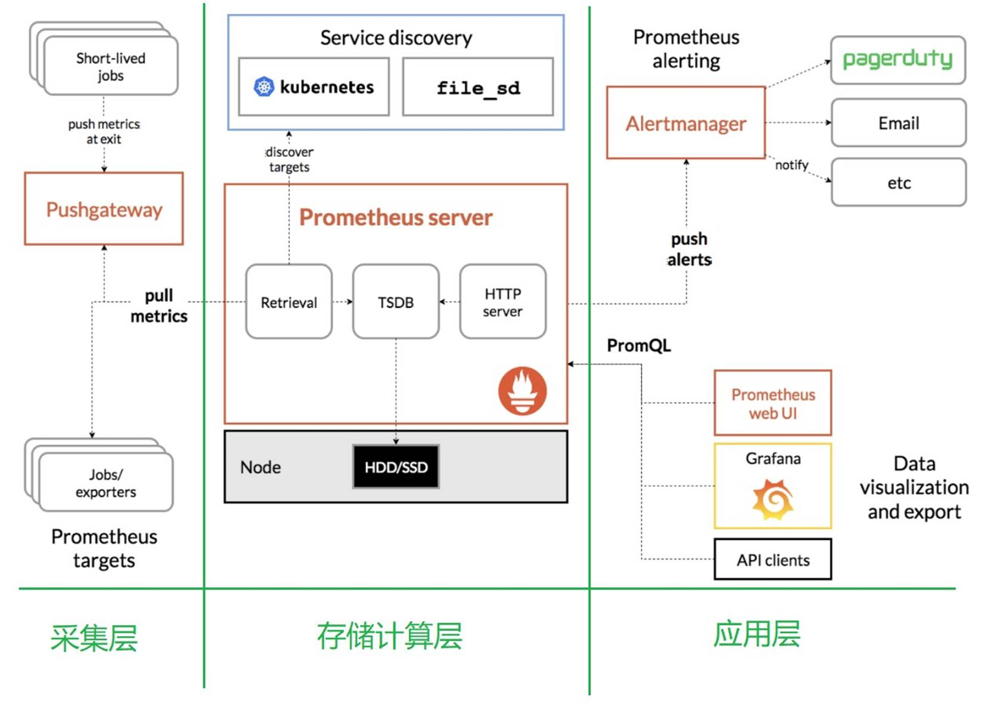

# Prometheus

# 一、简介

Prometheus 受启发于 Google 的Brogmon 监控系统（相似的 Kubernetes 是从 Google的 Brog 系统演变而来），从 2012 年开始由前 Google 工

程师在 Soundcloud 以开源软件的形式进行研发，并且于 2015 年对外发布早期版本。

# 二、特点

Prometheus 是一个开源的完整监控解决方案，其对传统监控系统的测试和告警模型进行了彻底的颠覆，形成了基于中央化的规则计算、统一分析和告警的新模型。 相比于传统监控系统，Prometheus 具有以下优点：

## 2.1、易于管理 

- ➢ Prometheus核心部分只有一个单独的二进制文件，不存在任何的第三方依赖(数据库，缓存等等)。唯一需要的就是本地磁盘，因此不会有潜在级联故障的风险。 
- ➢ Prometheus 基于 Pull 模型的架构方式，可以在任何地方（本地电脑，开发环境，测试环境）搭建我们的监控系统。 
- ➢ 对于一些复杂的情况，还可以使用Prometheus 服务发现(Service Discovery)的能力动态管理监控目标。

## 2.2、监控服务的内部运行状态 

Pometheus鼓励用户监控服务的内部状态，基于Prometheus丰富的Client库，用户可以轻松的在应用程序中添加对Prometheus的支持，从而让用户可以获取服务和应用内部真正的运行状态。 

## 2.3、强大的数据模型 

所有采集的监控数据均以指标(metric)的形式保存在内置的时间序列数据库当中(TSDB)。所有的样本除了基本的指标名称以外，还包含一组用于描述该样本特征的标签。
如下所示： 

```json
http_request_status{
    code='200',
    content_path='/api/path',
    environment='produment'
} =>
[value1@timestamp1,value2@timestamp2...]

http_request_status{ # 指标名称
    code='200', # 维度的标签
    content_path='/api/path2',
    environment='produment'
} =>
[value1@timestamp1,value2@timestamp2...] # 存储的样本值
```

每一条时间序列由指标名称(Metrics Name)以及一组标签(Labels)唯一标识。每条时间序列按照时间的先后顺序存储一系列的样本值。 

- ➢ http_request_status：指标名称(Metrics Name) 
- ➢ {code='200',content_path='/api/path',environment='produment'}：表示维度的标签，基于这些Labels我们可以方便地对监控数据进行聚合，过滤，裁剪。 
- ➢ [value1@timestamp1,value2@timestamp2...]：按照时间的先后顺序 存储的样本值。

## 2.4、强大的查询语言 PromQL 

Prometheus内置了一个强大的数据查询语言PromQL。 通过PromQL可以实现对监控数据的查询、聚合。同时PromQL也被应用于数据可视化(如Grafana)以及告警当中。 
通过PromQL可以轻松回答类似于以下问题： 

- ➢ 在过去一段时间中95%应用延迟时间的分布范围？ 
- ➢ 预测在4小时后，磁盘空间占用大致会是什么情况？ 
- ➢ CPU占用率前5位的服务有哪些？(过滤) 

## 2.5、高效 

对于监控系统而言，大量的监控任务必然导致有大量的数据产生。而Prometheus可以高效地处理这些数据，对于单一Prometheus Server实例而言它可以处理： 

- ➢ 数以百万的监控指标  
- ➢ 每秒处理数十万的数据点 

## 2.6、可扩展 

可以在每个数据中心、每个团队运行独立的Prometheus Servrer。Prometheus对于联邦集群的支持，可以让多个Prometheus实例产生一个逻辑集群，当单实例Prometheus Server处理的任务量过大时，通过使用功能分区(sharding)+联邦集群(federation)可以对其进行扩展。 

## 2.7、易于集成 

使用Prometheus可以快速搭建监控服务，并且可以非常方便地在应用程序中进行集成。目前支持：Java，JMX，Python，Go，Ruby，.Net，Node.js等等语言的客户端SDK，基于这些SDK可以快速让应用程序纳入到 Prometheus的监控当中，或者开发自己的监控数据收集程序。 同时这些客户端收集的监控数据，不仅仅支持 Prometheus，还能支持Graphite这些其他的监控工具。  同时Prometheus还支持与其他的监控系统进行集成：Graphite， Statsd， Collected，Scollector， muini， Nagios等。 Prometheus社区还提供了大量第三方实现的监控数据采集支持：JMX，CloudWatch，EC2，MySQL，PostgresSQL，Haskell，Bash，SNMP，Consul，Haproxy，Mesos，Bind，CouchDB，Django，Memcached，RabbitMQ，Redis，RethinkDB，Rsyslog等等。 

## 2.8、可视化 

- ➢ Prometheus Server中自带的Prometheus UI，可以方便地直接对数据进行查询，并且支持直接以图形化的形式展示数据。同时Prometheus 还提供了一个独立的基于Ruby On Rails的Dashboard解决方案 Promdash。 
- ➢ 最新的Grafana可视化工具也已经提供了完整的Prometheus支持，基于Grafana可以创建更加精美的监控图标。 
- ➢ 基于Prometheus提供的API还可以实现自己的监控可视化UI。 

## 2.9、开放性 

通常来说当我们需要监控一个应用程序时，一般需要该应用程序提供对相应监控系统协议的支持，因此应用程序会与所选择的监控系统进行绑定。为了减少这种绑定所带来的限制，对于决策者而言要么你就直接在应用中集成该监控系统的支持，要么就在外部创建单独的服务来适配不同的监控系统。 而对于Prometheus来说，使用Prometheus的client library的输出格式不止支持Prometheus的格式化数据，也可以输出支持其它监控系统的格式化数据，比如Graphite。 因此你甚至可以在不使用Prometheus的情况下，采用Prometheus的client library来让你的应用程序支持监控数据采集。 

# 三、Prometheus的架构 




## 3.1、Prometheus 生态圈组件 

- ➢ Prometheus Server：主服务器，负责收集和存储时间序列数据 
- ➢ client libraies：应用程序代码插桩，将监控指标嵌入到被监控应用程序中 
- ➢ Pushgateway：推送网关，为支持short-lived作业提供一个推送网关 
- ➢ exporter：专门为一些应用开发的数据摄取组件—exporter，例如：HAProxy、StatsD、Graphite等等。 
- ➢ Alertmanager：专门用于处理alert的组件

## 3.2 架构理解 

Prometheus 既然设计为一个维度存储模型，可以把它理解为一个 OLAP 系统。

### 3.2.1、存储计算层

- ➢ Prometheus Server，里面包含了存储引擎和计算引擎。
- ➢ Retrieval 组件为取数组件，它会主动从 PushGateway 或者 Exporter 拉取指标数据。
- ➢ Service discovery，可以动态发现要监控的目标。
- ➢ TSDB，数据核心存储与查询。
- ➢ HTTP server，对外提供 HTTP 服务。

### 3.2.2、采集层

采集层分为两类，一类是生命周期较短的作业，还有一类是生命周期较长的作业。

- ➢ 短作业：直接通过 API，在退出时间指标推送给PushGateway 。
- ➢ 长作业：Retrieval 组件直接从 Job 或者 Exporter 拉取数据。

无论哪种方式，Server端都是pull的

### 3.2.3、应用层

应用层主要分为两种，一种是AlertManager，另一种是数据可视化。

- ➢ AlertManager

  对接Pagerduty，是一套付费的监控报警系统。可实现短信报警、5 分钟无人 ack 打电话通知、仍然无人 ack，通知值班人员 Manager…Emial，发送邮件… …

- ➢ 数据可视化

  - Prometheus build-in WebUI
  - Grafana
  - 其他基于API 开发的客户端

