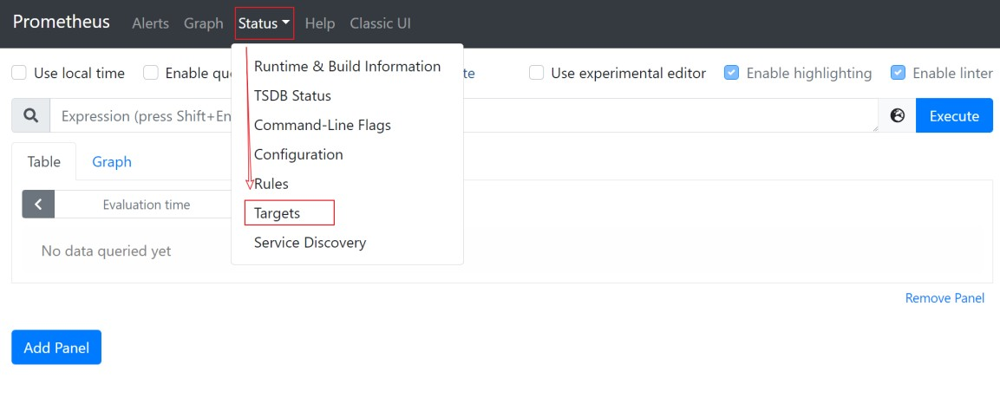
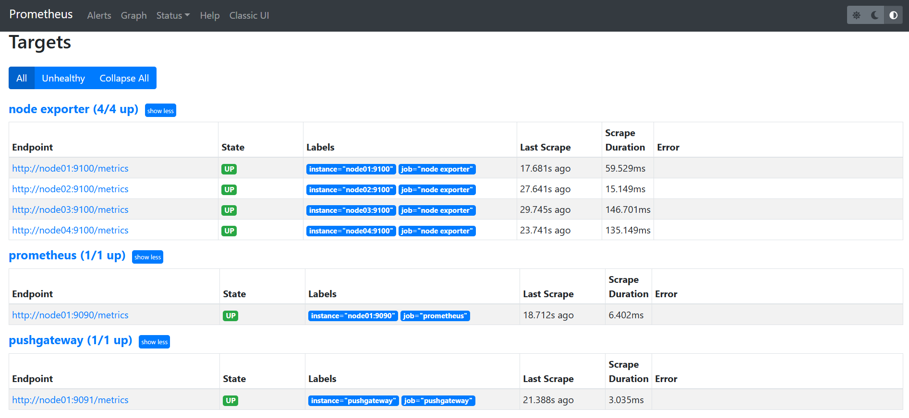

# Prometheus

# 一、简介

Prometheus 受启发于 Google 的Brogmon 监控系统（相似的 Kubernetes 是从 Google的 Brog 系统演变而来），从 2012 年开始由前 Google 工

程师在 Soundcloud 以开源软件的形式进行研发，并且于 2015 年对外发布早期版本。

# 二、特点

Prometheus 是一个开源的完整监控解决方案，其对传统监控系统的测试和告警模型进行了彻底的颠覆，形成了基于中央化的规则计算、统一分析和告警的新模型。 相比于传统监控系统，Prometheus 具有以下优点：

## 2.1、易于管理 

- ➢ Prometheus核心部分只有一个单独的二进制文件，不存在任何的第三方依赖(数据库，缓存等等)。唯一需要的就是本地磁盘，因此不会有潜在级联故障的风险。 
- ➢ Prometheus 基于 Pull 模型的架构方式，可以在任何地方（本地电脑，开发环境，测试环境）搭建我们的监控系统。 
- ➢ 对于一些复杂的情况，还可以使用Prometheus 服务发现(Service Discovery)的能力动态管理监控目标。

## 2.2、监控服务的内部运行状态 

Pometheus鼓励用户监控服务的内部状态，基于Prometheus丰富的Client库，用户可以轻松的在应用程序中添加对Prometheus的支持，从而让用户可以获取服务和应用内部真正的运行状态。 

## 2.3、强大的数据模型 

所有采集的监控数据均以指标(metric)的形式保存在内置的时间序列数据库当中(TSDB)。所有的样本除了基本的指标名称以外，还包含一组用于描述该样本特征的标签。
如下所示： 

```json
http_request_status{
    code='200',
    content_path='/api/path',
    environment='produment'
} =>
[value1@timestamp1,value2@timestamp2...]

http_request_status{ # 指标名称
    code='200', # 维度的标签
    content_path='/api/path2',
    environment='produment'
} =>
[value1@timestamp1,value2@timestamp2...] # 存储的样本值
```

每一条时间序列由指标名称(Metrics Name)以及一组标签(Labels)唯一标识。每条时间序列按照时间的先后顺序存储一系列的样本值。 

- ➢ http_request_status：指标名称(Metrics Name) 
- ➢ {code='200',content_path='/api/path',environment='produment'}：表示维度的标签，基于这些Labels我们可以方便地对监控数据进行聚合，过滤，裁剪。 
- ➢ [value1@timestamp1,value2@timestamp2...]：按照时间的先后顺序 存储的样本值。

## 2.4、强大的查询语言 PromQL 

Prometheus内置了一个强大的数据查询语言PromQL。 通过PromQL可以实现对监控数据的查询、聚合。同时PromQL也被应用于数据可视化(如Grafana)以及告警当中。 
通过PromQL可以轻松回答类似于以下问题： 

- ➢ 在过去一段时间中95%应用延迟时间的分布范围？ 
- ➢ 预测在4小时后，磁盘空间占用大致会是什么情况？ 
- ➢ CPU占用率前5位的服务有哪些？(过滤) 

## 2.5、高效 

对于监控系统而言，大量的监控任务必然导致有大量的数据产生。而Prometheus可以高效地处理这些数据，对于单一Prometheus Server实例而言它可以处理： 

- ➢ 数以百万的监控指标  
- ➢ 每秒处理数十万的数据点 

## 2.6、可扩展 

可以在每个数据中心、每个团队运行独立的Prometheus Servrer。Prometheus对于联邦集群的支持，可以让多个Prometheus实例产生一个逻辑集群，当单实例Prometheus Server处理的任务量过大时，通过使用功能分区(sharding)+联邦集群(federation)可以对其进行扩展。 

## 2.7、易于集成 

使用Prometheus可以快速搭建监控服务，并且可以非常方便地在应用程序中进行集成。目前支持：Java，JMX，Python，Go，Ruby，.Net，Node.js等等语言的客户端SDK，基于这些SDK可以快速让应用程序纳入到 Prometheus的监控当中，或者开发自己的监控数据收集程序。 同时这些客户端收集的监控数据，不仅仅支持 Prometheus，还能支持Graphite这些其他的监控工具。  同时Prometheus还支持与其他的监控系统进行集成：Graphite， Statsd， Collected，Scollector， muini， Nagios等。 Prometheus社区还提供了大量第三方实现的监控数据采集支持：JMX，CloudWatch，EC2，MySQL，PostgresSQL，Haskell，Bash，SNMP，Consul，Haproxy，Mesos，Bind，CouchDB，Django，Memcached，RabbitMQ，Redis，RethinkDB，Rsyslog等等。 

## 2.8、可视化 

- ➢ Prometheus Server中自带的Prometheus UI，可以方便地直接对数据进行查询，并且支持直接以图形化的形式展示数据。同时Prometheus 还提供了一个独立的基于Ruby On Rails的Dashboard解决方案 Promdash。 
- ➢ 最新的Grafana可视化工具也已经提供了完整的Prometheus支持，基于Grafana可以创建更加精美的监控图标。 
- ➢ 基于Prometheus提供的API还可以实现自己的监控可视化UI。 

## 2.9、开放性 

通常来说当我们需要监控一个应用程序时，一般需要该应用程序提供对相应监控系统协议的支持，因此应用程序会与所选择的监控系统进行绑定。为了减少这种绑定所带来的限制，对于决策者而言要么你就直接在应用中集成该监控系统的支持，要么就在外部创建单独的服务来适配不同的监控系统。 而对于Prometheus来说，使用Prometheus的client library的输出格式不止支持Prometheus的格式化数据，也可以输出支持其它监控系统的格式化数据，比如Graphite。 因此你甚至可以在不使用Prometheus的情况下，采用Prometheus的client library来让你的应用程序支持监控数据采集。 

# 三、Prometheus的架构 


## 3.1、Prometheus 生态圈组件 

- ➢ Prometheus Server：主服务器，负责收集和存储时间序列数据 
- ➢ client libraies：应用程序代码插桩，将监控指标嵌入到被监控应用程序中 
- ➢ Pushgateway：推送网关，为支持short-lived作业提供一个推送网关 
- ➢ exporter：专门为一些应用开发的数据摄取组件—exporter，例如：HAProxy、StatsD、Graphite等等。 
- ➢ Alertmanager：专门用于处理alert的组件

## 3.2 架构理解 

Prometheus 既然设计为一个维度存储模型，可以把它理解为一个 OLAP 系统。

### 3.2.1、存储计算层

- ➢ Prometheus Server，里面包含了存储引擎和计算引擎。
- ➢ Retrieval 组件为取数组件，它会主动从 PushGateway 或者 Exporter 拉取指标数据。
- ➢ Service discovery，可以动态发现要监控的目标。
- ➢ TSDB，数据核心存储与查询。
- ➢ HTTP server，对外提供 HTTP 服务。

### 3.2.2、采集层

采集层分为两类，一类是生命周期较短的作业，还有一类是生命周期较长的作业。

- ➢ 短作业：直接通过 API，在退出时间指标推送给PushGateway 。
- ➢ 长作业：Retrieval 组件直接从 Job 或者 Exporter 拉取数据。

无论哪种方式，Server端都是pull的

### 3.2.3、应用层

应用层主要分为两种，一种是AlertManager，另一种是数据可视化。

- ➢ AlertManager

  对接Pagerduty，是一套付费的监控报警系统。可实现短信报警、5 分钟无人 ack 打电话通知、仍然无人 ack，通知值班人员 Manager…Emial，发送邮件… …

- ➢ 数据可视化

  - Prometheus build-in WebUI
  - Grafana
  - 其他基于API 开发的客户端

# 四、安装

官网：https://prometheus.io/

下载地址：https://prometheus.io/download

安装包介绍：

- prometheus-*.tar.gz 主包
- pushgateway-*.tar.gz 数据采集
- alertmanager-*.tar.gz 告警 （选装）
- node_exporter-*.tar.gz  数据采集（选装）

Prometheus 基于 Golang 编写，编译后的软件包，不依赖于任何的第三方依赖。只需要下载对应平台的二进制包，解压并且添加基本的配置即可正常启动 Prometheus Server。

```shell
[root@node01 prometheus]# pwd
/opt/prometheus
[root@node01 prometheus]# ll
total 172860
-rw-rw-rw- 1 root root 25115445 Sep 17  2021 alertmanager-0.23.0.linux-amd64.tar.gz
-rw-rw-rw- 1 root root    71283 Sep 17  2021 flink-dashboard_rev3.json
-rw-rw-rw- 1 root root 60454974 Sep 17  2021 grafana-enterprise-8.1.2.linux-amd64.tar.gz
-rw-rw-rw- 1 root root  8898481 Sep 17  2021 node_exporter-1.2.2.linux-amd64.tar.gz
-rw-rw-rw- 1 root root   105600 Sep 17  2021 node-exporter-for-prometheus-dashboard-cn-v20201010_rev24.json
-rw-rw-rw- 1 root root 73156341 Sep 17  2021 prometheus-2.29.1.linux-amd64.tar.gz
-rw-rw-rw- 1 root root  9193207 Sep 17  2021 pushgateway-1.4.1.linux-amd64.tar.gz
```

## 4.1、prometheus

```shell
[root@node01 prometheus]# tar -zxvf prometheus-2.29.1.linux-amd64.tar.gz 
[root@node01 prometheus]# mv prometheus-2.29.1.linux-amd64 prometheus-2.29.1
```

修改配置

```yaml
# my global config
global:
  scrape_interval: 15s # Set the scrape interval to every 15 seconds. Default is every 1 minute.
  evaluation_interval: 15s # Evaluate rules every 15 seconds. The default is every 1 minute.
  # scrape_timeout is set to the global default (10s).

# Alertmanager configuration
alerting:
  alertmanagers:
    - static_configs:
        - targets:
          # - alertmanager:9093

# Load rules once and periodically evaluate them according to the global 'evaluation_interval'.
rule_files:
  # - "first_rules.yml"
  # - "second_rules.yml"

# A scrape configuration containing exactly one endpoint to scrape:
# Here it's Prometheus itself.
scrape_configs:
  # The job name is added as a label `job=<job_name>` to any timeseries scraped from this config.
  - job_name: "prometheus"

    # metrics_path defaults to '/metrics'
    # scheme defaults to 'http'.

    static_configs:
      - targets: ["node01:9090"]

  # 添加 PushGateway 监控配置
  - job_name: "pushgateway"
    static_configs:
    - targets: ["node01:9091"]
      labels:
        instance: pushgateway

  # 添加 Node Exporter 监控配置
  - job_name: "node exporter"
    static_configs:
    - targets: ["node01:9100", "node02:9100", "node03:9100", "node04:9100"]
```

配置说明： 

**1、global配置块**：控制Prometheus服务器的全局配置 

- ➢ scrape_interval：配置拉取数据的时间间隔，默认为1分钟。 
- ➢ evaluation_interval：规则验证（生成alert）的时间间隔，默认为1分钟。 

**2、rule_files配置块**：规则配置文件 

**3、scrape_configs配置块**：配置采集目标相关， prometheus监视的目标。Prometheus自身的运行信息可以通过HTTP访问，所以Prometheus可以监控自己的运行数据。 

- ➢ job_name：监控作业的名称 
- ➢ static_configs：表示静态目标配置，就是固定从某个target拉取数据 
- ➢ targets：指定监控的目标，其实就是从哪儿拉取数据。Prometheus 会从http://hadoop202:9090/metrics上拉取数据。 Prometheus 是可以在运行时自动加载配置的。启动时需要添加： -- web.enable - lifecycle 

启动：

```shell
[root@node01 prometheus-2.29.1]# nohup ./prometheus --config.file=prometheus.yml > /var/log/prometheus/prometheus.log 2>&1 & 
```

## 4.2、pushgateway

Prometheus在正常情况下是采用拉模式从产生metric的作业或者exporter（比如专门监控主机的NodeExporter）拉取监控数据。但是我们要监控的是Flink on YARN作业，想要让Prometheus自动发现作业的提交、结束以及自动拉取数据显然是比较困难的。PushGateway就是一个中转组件，通过配置Flink on YARN作业将metric推到PushGateway，Prometheus再从PushGateway拉取就可以了

```shell
[root@node01 prometheus]# tar -zxvf pushgateway-1.4.1.linux-amd64.tar.gz 
[root@node01 prometheus]# mv pushgateway-1.4.1.linux-amd64 pushgateway-1.4.1
```

启动

```shell
[root@node01 pushgateway-1.4.1]# nohup ./pushgateway --web.listen-address :9091 > /var/log/prometheus/pushgateway.log 2>&1 & 
```

## 4.3、alertmanager

```shell
[root@node01 prometheus]# tar -zxvf alertmanager-0.23.0.linux-amd64.tar.gz 
[root@node01 prometheus]# mv alertmanager-0.23.0.linux-amd64 alertmanager-0.23.0
```

启动

```shell
[root@node01 alertmanager-0.23.0]# nohup  ./alertmanager --config.file=alertmanager.yml > /var/log/prometheus/alertmanager.log 2>&1 & 
```

## 4.4、node_exporter

```简言之就是在每个node启动之后就通过了每个node的查询接口，promethus就能收集到了```

在 Prometheus 的架构设计中，Prometheus Server 主要负责数据的收集，存储并且对外提供数据查询支持，而实际的监控样本数据的收集则是由 Exporter 完成。

因此为了能够监控到某些东西，如主机的CPU 使用率，我们需要使用到 Exporter。Prometheus 周期性的从 Exporter 暴露的HTTP 服务地址（通常是/metrics）拉取监控样本数据。

Exporter 可以是一个相对开放的概念，其可以是一个独立运行的程序独立于监控目标以外，也可以是直接内置在监控目标中。只要能够向 Prometheus 提供标准格式的监控样本数据即可。

为了能够采集到主机的运行指标如CPU, 内存，磁盘等信息。我们可以使用Node Exporter。Node Exporter 同样采用 Golang 编写，并且不存在任何的第三方依赖，只需要下载，解压即可运行。可以从 https://prometheus.io/download/ 获取最新的 node exporter 版本的二进制包。

- 安装

  ```shell
  [root@node01 prometheus]# tar -zxvf node_exporter-1.2.2.linux-amd64.tar.gz 
  [root@node01 prometheus]# mv node_exporter-1.2.2.linux-amd64 node_exporter-1.2.2
  [root@node01 prometheus]# cd node_exporter-1.2.2
  [root@node01 node_exporter-1.2.2]# ll
  total 18080
  -rw-r--r-- 1 3434 3434    11357 Aug  6  2021 LICENSE
  -rwxr-xr-x 1 3434 3434 18494215 Aug  6  2021 node_exporter
  -rw-r--r-- 1 3434 3434      463 Aug  6  2021 NOTICE
  ```

- 启动

  启动并通过页面查看是否成功 

  执行 ./node_exporter 

  浏览器输入：http://node01:9100/metrics，可以看到当前node exporter获取到的当前主机的所有监控数据。 

- 分发

  分发 node_exporter-1.2.2 到 node02、node03、node04 上去

  ```shell
  [root@node01 prometheus]# for ip in node{02..04};do echo $ip;scp -r node_exporter-1.2.2 $ip:/opt/prometheus/;done
  ```

- 配置开机启动

  ```shell
  # 创建service 文件
  # 注意脚本里的 User， 是设备的账户名
  [root@node01 ~]# sudo vim /usr/lib/systemd/system/node_exporter.service
  [Unit]
  Description=node_export
  Documentation=https://github.com/prometheus/node_exporter
  After=network.target
  [Service]
  Type=simple
  User=root
  ExecStart= /opt/prometheus/node_exporter-1.2.2/node_exporter
  Restart=on-failure
  [Install]
  WantedBy=multi-user.target
  
  #  分发文件
  [root@node01 ~]# cd /usr/lib/systemd/system/
  [root@node01 system]# for ip in node{02..04};do echo $ip;scp node_exporter.service $ip:/usr/lib/systemd/system/;done
  
  #  设为开机自启动（所有机器都执行）
  [root@node01 ~]# for ip in node{01..04};do echo $ip;ssh $ip "systemctl enable node_exporter.service";done
  #  启动服务（所有机器都执行）
  [root@node01 ~]# for ip in node{01..04};do echo $ip;ssh $ip "systemctl start node_exporter.service";done
  ```

## 4.6、打开 **web** **页面查看**

➢ 浏览器输入：http://node01:9090/

➢ 点击 Status，选中 Targets：





➢ prometheus、pushgateway 和 node exporter 都是 up 状态，表示安装启动成功。

# 五、PromQL

Prometheus 通过指标名称（metrics name）以及对应的一组标签（labelset）唯一定义一条时间序列。指标名称反映了监控样本的基本标识，而 label 则在这个基本特征上为采集到的数据提供了多种特征维度。用户可以基于这些特征维度过滤，聚合，统计从而产生新的计算后的一条时间序列。

PromQL 是 Prometheus 内置的数据查询语言，其提供对时间序列数据丰富的查询，聚合以及逻辑运算能力的支持。并且被广泛应用在Prometheus的日常应用当中，包括对数据查询、可视化、告警处理当中。

PromQL 是Prometheus 所有应用场景的基础:

> 访问9090:/metrics 可以查看所有指标

## 5.1、基本用法

### 5.1.1、查询时间序列

当 Prometheus 通过 Exporter 采集到相应的监控指标样本数据后，我们就可以通过PromQL 对监控样本数据进行查询。

当我们直接使用监控指标名称查询时，可以查询该指标下的所有时间序列。如：

```
prometheus_http_requests_total                  
等同于： 
prometheus_http_requests_total{}     
```

该表达式会返回指标名称为 prometheus_http_requests_total 的所有时间序列：

```
prometheus_http_requests_total{
    code="200",
    handler="alerts",
    instance="localhost:9090",
    job="prometheus",
    method="get"
}= (20889@1518096812.326)

prometheus_http_requests_total{
    code="200",
    handler="graph",
    instance="localhost:9090",
    job="prometheus",
    method="get"
}= (21287@1518096812.326)
```

PromQL 还支持用户根据时间序列的标签匹配模式来对时间序列进行过滤，目前主要支持两种匹配模式：完全匹配和正则匹配。

➢ **PromQL 支持使用 = 和 != 两种完全匹配模式：**

⚫ 通过使用 label=value 可以选择那些标签满足表达式定义的时间序列；

⚫ 反之使用 label!=value 则可以根据标签匹配排除时间序列；

例如，如果我们只需要查询所有 prometheus_http_requests_total 时间序列中满足标签 instance 为 localhost:9090 的时间 序列，则可以使用如下表达式：

```
prometheus_http_requests_total{instance="localhost:9090"}       
```

反之使用 instance!=“localhost:9090” 则可以排除这些时间序列

```
prometheus_http_requests_total{instance!="localhost:9090"}
```

➢ **PromQL 还可以支持使用正则表达式作为匹配条件，多个表达式之间使用 | 进行分离：**

⚫ 使用 label=~regx 表示选择那些标签符合正则表达式定义的时间序列；

⚫ 反之使用 label!~regx 进行排除；

例如，如果想查询多个环节下的时间序列序列可以使用如下表达式：

```shell
prometheus_http_requests_total{environment=~"staging|testing|development",method!="GET
"}
排除用法
prometheus_http_requests_total{environment!~"staging|testing|development",method!="GET
"}
```

### 5.1.2、范围查询

直接通过类似于 PromQL 表达式 httprequeststotal 查询时间序列时，返回值中只会包含该时间序列中的最新的一个样本值，这样的返回结果我们称之为瞬时向量。而相应的这样的表达式称之为 瞬时向量表达式。

而如果我们想过去一段时间范围内的样本数据时，我们则需要使用区间向量表达式。区间向量表达式和瞬时向量表达式之间的差异在于在区间向量表达式中我们需要定义时间选择的范围，时间范围通过时间范围选择器 [] 进行定义。 例如，通过以下表达式可以选择

最近 5 分钟内的所有样本数据：

`prometheus_http_requests_total{}[5m]`

该表达式将会返回查询到的时间序列中最近 5 分钟的所有样本数据：

```shell
prometheus_http_requests_total{
    code="200",
    handler="alerts",
    instance="localhost:9090",
    job="prometheus",
    method="get"
}=[
    1@1518096812.326
    1@1518096817.326
    1@1518096822.326
    1@1518096827.326
    1@1518096832.326
    1@1518096837.325
]                                                                                   9.
prometheus_http_requests_total{
    code="200",
    handler="graph",
    instance="localhost:9090",
    job="prometheus",
    method="get"
}=[
    4@1518096812.326
    4@1518096817.326
    4@1518096822.326
    4@1518096827.326
    4@1518096832.326
    4@1518096837.325
]
```

通过区间向量表达式查询到的结果我们称为区间向量。 除了使用 m 表示分钟以外，PromQL 的时间范围选择器支持其它时间单位：

```shell
s - 秒
m - 分钟
h - 小时
d - 天
w - 周
y - 年
```

### 5.1.3、时间位移操作

在瞬时向量表达式或者区间向量表达式中，都是以当前时间为基准

```shell
prometheus_http_requests_total{} # 瞬时向量表达式，选择当前最新的数据 
prometheus_http_requests_total{}[5m] # 区间向量表达式，选择以当前时间为基准，5 分钟内的数据
```

而如果我们想查询，5 分钟前的瞬时样本数据，或昨天一天的区间内的样本数据呢? 这个时候我们就可以使用位移操作，位移操作的关键字为 **offset**。 可以使用 offset 时间位移操作

```shell
prometheus_http_requests_total{} offset 5m
prometheus_http_requests_total{}[1d] offset 1d
```

### 5.1.4、使用聚合操作

一般来说，如果描述样本特征的标签(label)在并非唯一的情况下，通过 PromQL 查询数据，会返回多条满足这些特征维度的时间序列。而 PromQL 提供的聚合操作可以用来对这些时间序列进行处理，形成一条新的时间序列：

```shell
# 查询系统所有 http 请求的总量
sum(prometheus_http_requests_total)
# 按照 mode 计算主机 CPU 的平均使用时间
avg(node_cpu_seconds_total) by (mode)
# 按照主机查询各个主机的 CPU 使用率
sum(sum(irate(node_cpu_seconds_total{mode!='idle'}[5m])) / sum(irate(node_cpu_seconds_total [5m]))) by (instance)
```

### 5.1.5、标量和字符串

除了使用瞬时向量表达式和区间向量表达式以外，PromQL 还直接支持用户使用标量(Scalar)和字符串(String)。

➢ 标量（Scalar）：一个浮点型的数字值

标量只有一个数字，没有时序。 例如：10

需要注意的是，当使用表达式 count(prometheus_http_requests_total)，返回的数据类型，依然是瞬时向量。用户可以通过内置函数scalar()将单个瞬时向量转换为标量。

➢ 字符串（String）：一个简单的字符串值

直接使用字符串，作为PromQL 表达式，则会直接返回字符串。

```shell
"this is a string"
'these are unescaped: \n \\ \t'
`these are not unescaped: \n ' " \t
```

### 5.1.6、合法的PromQL表达式

所有的 PromQL 表达式都**必须至少包含一个指标名称**(例如 http_request_total)，或者一个**不会匹配到空字符串**的标签过滤器(例如{code=”200”})。

```shell
因此以下两种方式，均为合法的表达式：
prometheus_http_requests_total # 合法
prometheus_http_requests_total{} # 合法
{method="get"} # 合法

而如下表达式，则不合法：
{job=~".*"} # 不合法

同时，除了使用  {label=value}  的形式以外，我们还可以使用内置的 name 标签来指定监控指标名称：
{  name  =~"prometheus_http_requests_total"} # 合法
{  name  =~"node_disk_bytes_read|node_disk_bytes_written"} # 合法
```

## 5.2 PromQL操作符

### 5.2.1、数学运算

PromQL 支持的所有数学运算符如下所示：

```shell
+ (加法)
- (减法)
* (乘法)
/ (除法)
% (求余)
^ (幂运算)
```

### 5.2.2、布尔运算

➢ Prometheus 支持以下布尔运算符如下：

```shell
== (相等)
!= (不相等)
>(大于)
< (小于)
>= (大于等于)
<= (小于等于)
```

➢ 使用bool 修饰符改变布尔运算符的行为

布尔运算符的默认行为是对时序数据进行过滤。而在其它的情况下我们可能需要的是真正的布尔结果。例如，只需要 知道当前模块的 HTTP 请求量是否>=1000，如果大于等于1000 则返回 1（true）否则返回 0（false）。这时可以使 用 bool 修饰符改变布尔运算的默认行为。 例如：

prometheus_http_requests_total > bool 1000

使用 bool 修改符后，布尔运算不会对时间序列进行过滤，而是直接依次瞬时向量中的各个样本数据与标量的比较结果 0 或者 1。从而形成一条新的时间序列。

```json
prometheus_http_requests_total{
    code="200",
    handler="query",
    instance="localhost:9090",
    job="prometheus",
    method="get"
}  1
prometheus_http_requests_total{
    code="200",
    handler="query_range",
    instance="localhost:9090",
    job="prometheus",
    method="get"
} 0
```

同时需要注意的是，如果是在两个标量之间使用布尔运算，则必须使用 bool 修饰符：2 == bool 2 # 结果为 1

### 5.2.3、使用集合运算符

使用瞬时向量表达式能够获取到一个包含多个时间序列的集合，我们称为瞬时向量。通过集合运算，可以在两个瞬时向量与瞬时向量之间进行相应的集合操作。

目前，Prometheus 支持以下集合运算符

```shell
and (并且)
or (或者)
unless (排除)
```

vector1 and vector2 会产生一个由 vector1 的元素组成的新的向量。该向量包含vector1 中完全匹配 vector2 中的元素组成。

vector1 or vector2 会产生一个新的向量，该向量包含 vector1 中所有的样本数据，以及 vector2 中没有与 vector1 匹配到的样本数据。

vector1 unless vector2 会产生一个新的向量，新向量中的元素由 vector1 中没有与vector2 匹配的元素组成

### 5.2.4、操作符优先级

对于复杂类型的表达式，需要了解运算操作的运行优先级。例如，查询主机的 CPU 使用率，可以使用表达式：

```shell
100 * (1 - avg (irate(node_cpu_seconds_total{mode='idle'}[5m])) by(job) ) 
```

其中irate 是PromQL中的内置函数，用于计算区间向量中时间序列每秒的即时增长率。在 PromQL 操作符中优先级由高到低依次为：

```shell
^
*, /, %
+, -
==, !=, <=, =, >
and, unless
or
```

### 5.2.5、PromQL聚合操作

Prometheus 还提供了下列内置的聚合操作符，这些操作符作用域瞬时向量。可以将瞬时表达式返回的样本数据进行 聚合，形成一个新的时间序列。

```shell
sum (求和)
min (最小值)
max (最大值)
avg (平均值)

stddev (标准差)
stdvar (标准差异)
count (计数)
count_values (对 value 进行计数)
bottomk (后 n 条时序)
topk (前n 条时序)
quantile (分布统计)
```

使用聚合操作的语法如下：

```shell
<aggr-op>([parameter,] <vector expression>) [without|by (<label list>)] 
```

其中只有 count_values , quantile , topk , bottomk 支持参数(parameter)。

without 用于从计算结果中移除列举的标签，而保留其它标签。by 则正好相反，结果向量中只保留列出的标签，其余标签则移除。通过 without 和 by 可以按照样本的问题对数据进行聚合。

例如：

```shell
sum(prometheus_http_requests_total) without (instance)                  等价于
sum(prometheus_http_requests_total) by (code,handler,job,method)       
```

如果只需要计算整个应用的 HTTP 请求总量，可以直接使用表达式：sum(prometheus_http_requests_total)

count_values 用于时间序列中每一个样本值出现的次数。count_values 会为每一个唯一的样本值输出一个时间序列，并且每一个时间序列包含一个额外的标签。 例如：count_values(“count”, prometheus_http_requests_total)

topk 和 bottomk 则用于对样本值进行排序，返回当前样本值前 n 位，或者后 n 位的时间序列。

获取 HTTP 请求数前 5 位的时序样本数据，可以使用表达式：topk(5, prometheus_http_requests_total)

quantile 用于计算当前样本数据值的分布情况 quantile(φ, express)其中 0 ≤ φ ≤ 1。

例如，当φ 为 0.5 时，即表示找到当前样本数据中的中位数：quantile(0.5, prometheus_http_requests_total)

# 六、Prometheus 和 Grafana 集成

grafana 是一款采用 Go 语言编写的开源应用，主要用于大规模指标数据的可视化展现，是网络架构和应用分析中最流行的时序数据展示工具，目前已经支持绝大部分常用的时序数据库。下载地址：https://grafana.com/grafana/download

安装启动

```shell
[root@node01 prometheus]# tar -zxvf grafana-enterprise-8.1.2.linux-amd64.tar.gz 
[root@node01 prometheus]# cd grafana-8.1.2/
[root@node01 grafana-8.1.2]# nohup ./bin/grafana-server web > /var/log/prometheus/grafana.log 2>&1 &
```

打开web：http://hadoop202:3000 , 默认用户名和密码：admin

# 七、启动脚本

所有组件启动脚本

```shell
#!/bin/bash

PROMETHEUS_PATH=/opt/prometheus/prometheus-2.29.1
PUSHGATEWAY_PATH=/opt/prometheus/pushgateway-1.4.1
ALERTMANAGER_PATH=/opt/prometheus/alertmanager-0.23.0
GRAFANA_PATH=/opt/prometheus/grafana-8.1.2
LOG_PATH=/var/log/prometheus
start(){
    nohup $PROMETHEUS_PATH/prometheus --config.file=$PROMETHEUS_PATH/prometheus.yml > $LOG_PATH/prometheus.log 2>&1 &
    echo "prometheus 启动成功，运行于 9090 端口"
    
    nohup $PUSHGATEWAY_PATH/pushgateway --web.listen-address :9091 > $LOG_PATH/pushgateway.log 2>&1 &
    echo "pushgateway 启动成功，运行于 9091 端口"
    
    nohup $ALERTMANAGER_PATH/alertmanager --config.file=$ALERTMANAGER_PATH/alertmanager.yml > $LOG_PATH/alertmanager.log 2>&1 &
    echo "alertmanager 启动成功，运行于 9100 端口"
    
    nohup $GRAFANA_PATH/bin/grafana-server web > $LOG_PATH/grafana.log 2>&1 &
    echo "grafana 启动成功，运行于 3000 端口"

}

stop(){
    curl -X POST http://node01:9090/-/quit
    # curl -XPOST http://node01:9090/-/reload
    ps -ef | grep pushgateway | grep -v grep |awk  '{print $2}' | xargs -n1 kill -9
    ps -ef | grep alertmanager.yml | grep -v grep |awk  '{print $2}' | xargs -n1 kill -9
    ps -ef | grep grafana-server | grep -v grep |awk  '{print $2}' | xargs -n1 kill -9
}

case $1 in
    "start")
        $1
        ;;
    "stop")
        $1
        ;;
esac
```


