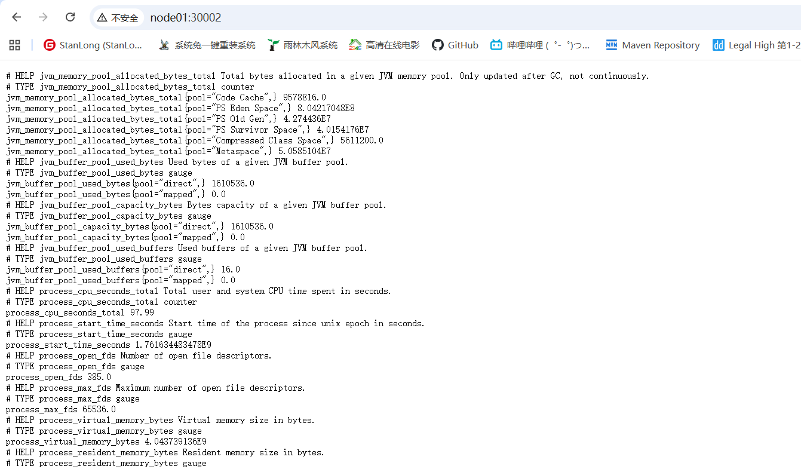
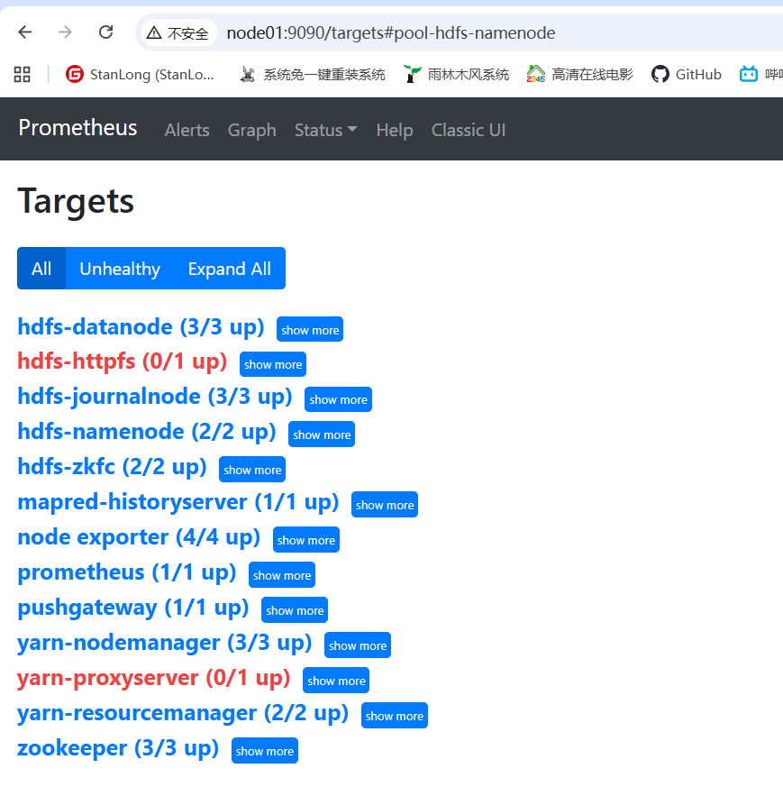

# Prometheus 监控 Hadoop

**一、规划路径**

```shell
[root@node01 monitoring]# pwd
/opt/hadoop-3.4.0/monitoring

# jar包下载地址
# https://repo1.maven.org/maven2/io/prometheus/jmx/jmx_prometheus_javaagent/
# 启动jmx_exporter的时候需要指定配置文件，配置文件可以为空，但不能没有。为每个组件创建一下配置文件，暂时设置为空就好
touch namenode.yaml
touch datanode.yaml
touch resourcemanager.yaml
touch nodemanager.yaml
touch journalnode.yaml
touch zkfc.yaml
touch hffps.yaml
touch proxyserver.yaml
touch historyserver.yaml

[root@node01 monitoring]# ll
total 460
-rw-rw-rw- 1 root root 469645 Oct 28 14:37 jmx_prometheus_javaagent-0.16.1.jar
drwxr-xr-x 2 root root    209 Oct 28 14:40 yaml
[root@node01 monitoring]# cd yaml/
[root@node01 yaml]# ll
total 0
-rw-r--r-- 1 root root 0 Oct 28 14:40 datanode.yaml
-rw-r--r-- 1 root root 0 Oct 28 14:40 hffps.yaml
-rw-r--r-- 1 root root 0 Oct 28 14:40 historyserver.yaml
-rw-r--r-- 1 root root 0 Oct 28 14:40 journalnode.yaml
-rw-r--r-- 1 root root 0 Oct 28 14:40 namenode.yaml
-rw-r--r-- 1 root root 0 Oct 28 14:40 nodemanager.yaml
-rw-r--r-- 1 root root 0 Oct 28 14:40 proxyserver.yaml
-rw-r--r-- 1 root root 0 Oct 28 14:40 resourcemanager.yaml
-rw-r--r-- 1 root root 0 Oct 28 14:40 zkfc.yaml
```

**二、修改hadoop-env.sh**

```shell
[root@node01 yaml]# vim /opt/hadoop-3.4.0/etc/hadoop/hadoop-env.sh 
...
# 追加如下配置

export HDFS_NAMENODE_OPTS="-javaagent:/opt/hadoop-3.4.0/monitoring/jmx_prometheus_javaagent-0.16.1.jar=30002:/opt/hadoop-3.4.0/monitoring/yaml/namenode.yaml $HDFS_NAMENODE_OPTS"
export HDFS_DATANODE_OPTS="-javaagent:/opt/hadoop-3.4.0/monitoring/jmx_prometheus_javaagent-0.16.1.jar=30003:/opt/hadoop-3.4.0/monitoring/yaml/datanode.yaml $HDFS_DATANODE_OPTS"
export YARN_RESOURCEMANAGER_OPTS="-javaagent:/opt/hadoop-3.4.0/monitoring/jmx_prometheus_javaagent-0.16.1.jar=30004:/opt/hadoop-3.4.0/monitoring/yaml/resourcemanager.yaml $YARN_RESOURCEMANAGER_OPTS"
export YARN_NODEMANAGER_OPTS="-javaagent:/opt/hadoop-3.4.0/monitoring/jmx_prometheus_javaagent-0.16.1.jar=30005:/opt/hadoop-3.4.0/monitoring/yaml/nodemanager.yaml $YARN_NODEMANAGER_OPTS"
export HDFS_JOURNALNODE_OPTS="-javaagent:/opt/hadoop-3.4.0/monitoring/jmx_prometheus_javaagent-0.16.1.jar=30006:/opt/hadoop-3.4.0/monitoring/yaml/journalnode.yaml $HDFS_JOURNALNODE_OPTS"
export HDFS_ZKFC_OPTS="-javaagent:/opt/hadoop-3.4.0/monitoring/jmx_prometheus_javaagent-0.16.1.jar=30007:/opt/hadoop-3.4.0/monitoring/yaml/zkfc.yaml $HDFS_ZKFC_OPTS"
export HDFS_HTTPFS_OPTS="-javaagent:/opt/hadoop-3.4.0/monitoring/jmx_prometheus_javaagent-0.16.1.jar=30008:/opt/hadoop-3.4.0/monitoring/yaml/httpfs.yaml $HDFS_HTTPFS_OPTS"
export YARN_PROXYSERVER_OPTS="-javaagent:/opt/hadoop-3.4.0/monitoring/jmx_prometheus_javaagent-0.16.1.jar=30009:/opt/hadoop-3.4.0/monitoring/yaml/proxyserver.yaml $YARN_PROXYSERVER_OPTS"
export MAPRED_HISTORYSERVER_OPTS="-javaagent:/opt/hadoop-3.4.0/monitoring/jmx_prometheus_javaagent-0.16.1.jar=30010:/opt/hadoop-3.4.0/monitoring/yaml/historyserver.yaml $MAPRED_HISTORYSERVER_OPTS"
```

**三、分发**

将  `/opt/hadoop-3.4.0/etc/hadoop/hadoop-env.sh`  和  `/opt/hadoop-3.4.0/monitoring` 分发到集群的其他节点上。

**四、重启集群**

重启集群，网页访问  http://node01:30002/



各节点jmx端口运行情况

```shell
[root@node01 ~]# for ip in node{01..04};do echo $ip;ssh $ip "netstat -nltp | grep 300";done
node01
tcp        0      0 0.0.0.0:30002           0.0.0.0:*               LISTEN      30579/java          
tcp        0      0 0.0.0.0:30006           0.0.0.0:*               LISTEN      30892/java          
tcp        0      0 0.0.0.0:30007           0.0.0.0:*               LISTEN      31119/java          
tcp6       0      0 :::3000                 :::*                    LISTEN      5285/./grafana-serv 
node02
tcp        0      0 0.0.0.0:30002           0.0.0.0:*               LISTEN      17893/java          
tcp        0      0 0.0.0.0:30003           0.0.0.0:*               LISTEN      17958/java          
tcp        0      0 0.0.0.0:30005           0.0.0.0:*               LISTEN      18337/java          
tcp        0      0 0.0.0.0:30006           0.0.0.0:*               LISTEN      18057/java          
tcp        0      0 0.0.0.0:30007           0.0.0.0:*               LISTEN      18168/java          
node03
tcp        0      0 0.0.0.0:30003           0.0.0.0:*               LISTEN      17789/java          
tcp        0      0 0.0.0.0:30004           0.0.0.0:*               LISTEN      18063/java          
tcp        0      0 0.0.0.0:30005           0.0.0.0:*               LISTEN      18142/java          
tcp        0      0 0.0.0.0:30006           0.0.0.0:*               LISTEN      17861/java          
tcp        0      0 0.0.0.0:30010           0.0.0.0:*               LISTEN      18244/java          
node04
tcp        0      0 0.0.0.0:30003           0.0.0.0:*               LISTEN      17707/java          
tcp        0      0 0.0.0.0:30004           0.0.0.0:*               LISTEN      17866/java          
tcp        0      0 0.0.0.0:30005           0.0.0.0:*               LISTEN      17936/java 
```

编写配置文件

Prometheus 配置
采取引用外部配置文件的模式，具有更好的结构性和易管理性，当组件节点发生变动，我们只需修改json文件，不需要重启prometheus。

```shell
  - job_name: 'hdfs-namenode'
    file_sd_configs:
    - files:
      - /opt/hadoop-3.4.0/monitoring/json/namenode.json
      refresh_interval: 2s
 
  - job_name: 'hdfs-datanode'
    file_sd_configs:
    - files:
      - /opt/hadoop-3.4.0/monitoring/json/datanode.json
      refresh_interval: 2s
 
  - job_name: 'yarn-resourcemanager'
    file_sd_configs:
    - files:
      - /opt/hadoop-3.4.0/monitoring/json/resourcemanager.json
      refresh_interval: 2s
 
  - job_name: 'yarn-nodemanager'
    file_sd_configs:
    - files:
      - /opt/hadoop-3.4.0/monitoring/json/nodemanager.json
      refresh_interval: 2s
 
  - job_name: 'hdfs-journalnode'
    file_sd_configs:
    - files:
      - /opt/hadoop-3.4.0/monitoring/json/journalnode.json
      refresh_interval: 2s
 
  - job_name: 'hdfs-zkfc'
    file_sd_configs:
    - files:
      - /opt/hadoop-3.4.0/monitoring/json/zkfc.json
      refresh_interval: 2s
 
  - job_name: 'hdfs-httpfs'
    file_sd_configs:
    - files:
      - /opt/hadoop-3.4.0/monitoring/json/httpfs.json
      refresh_interval: 2s
 
  - job_name: 'yarn-proxyserver'
    file_sd_configs:
    - files:
      - /opt/hadoop-3.4.0/monitoring/json/proxyserver.json
      refresh_interval: 2s
 
  - job_name: 'mapred-historyserver'
    file_sd_configs:
    - files:
      - /opt/hadoop-3.4.0/monitoring/json/historyserver.json
      refresh_interval: 2s
```

在/opt/hadoop-3.4.0/monitoring目录下新建一个json目录，并新建文件 组件名.json

```json
[root@node01 json]# ll
total 36
-rw-r--r-- 1 root root 70 Oct 28 15:59 datanode.json
-rw-r--r-- 1 root root 40 Oct 28 16:00 historyserver.json
-rw-r--r-- 1 root root 40 Oct 28 16:00 httpfs.json
-rw-r--r-- 1 root root 70 Oct 28 16:00 journalnode.json
-rw-r--r-- 1 root root 55 Oct 28 15:50 namenode.json
-rw-r--r-- 1 root root 70 Oct 28 16:00 nodemanager.json
-rw-r--r-- 1 root root 40 Oct 28 16:00 proxyserver.json
-rw-r--r-- 1 root root 55 Oct 28 16:04 resourcemanager.json
-rw-r--r-- 1 root root 55 Oct 28 16:00 zkfc.json
-----------------------------------------------------------------------------------------------------------------
# 各文件内容如下
cat >> namenode.json << EOF
[
 {
  "targets": ["node01:30002","node02:30002"]
 }
]
EOF

cat >> datanode.json << EOF 
[
 {
  "targets": ["node02:30003","node03:30003","node04:30003"]
 }
]
EOF

cat >> resourcemanager.json << EOF
[
 {
  "targets": ["node03:30004","node04:30004"]
 }
]
EOF

cat >> nodemanager.json << EOF
[
 {
  "targets": ["node02:30005","node03:30005","node04:30005"]
 }
]
EOF


cat >> journalnode.json << EOF
[
 {
  "targets": ["node01:30006","node02:30006","node03:30006"]
 }
]
EOF

cat >> zkfc.json << EOF
[
 {
  "targets": ["node01:30007","node02:30007"]
 }
]
EOF

cat >> httpfs.json << EOF
[
 {
  "targets": ["master:30008"]
 }
]
EOF

cat >> proxyserver.json << EOF
[
 {
  "targets": ["master:30009"]
 }
]
EOF

cat >> historyserver.json << EOF
[
 {
  "targets": ["node03:30010"]
 }
]
EOF
```

重启 prometheus，观察页面

