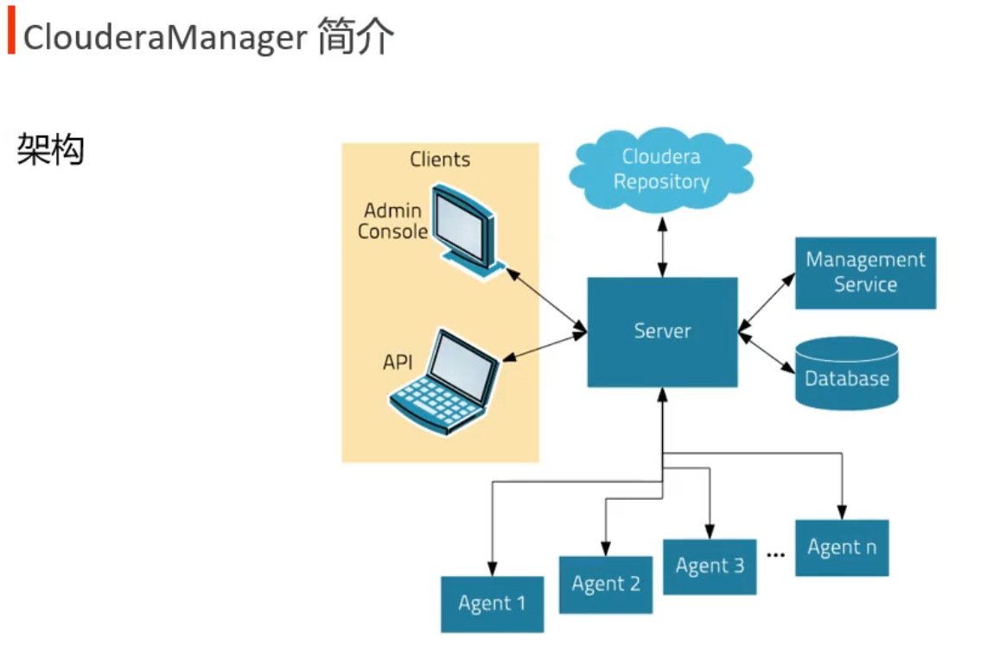
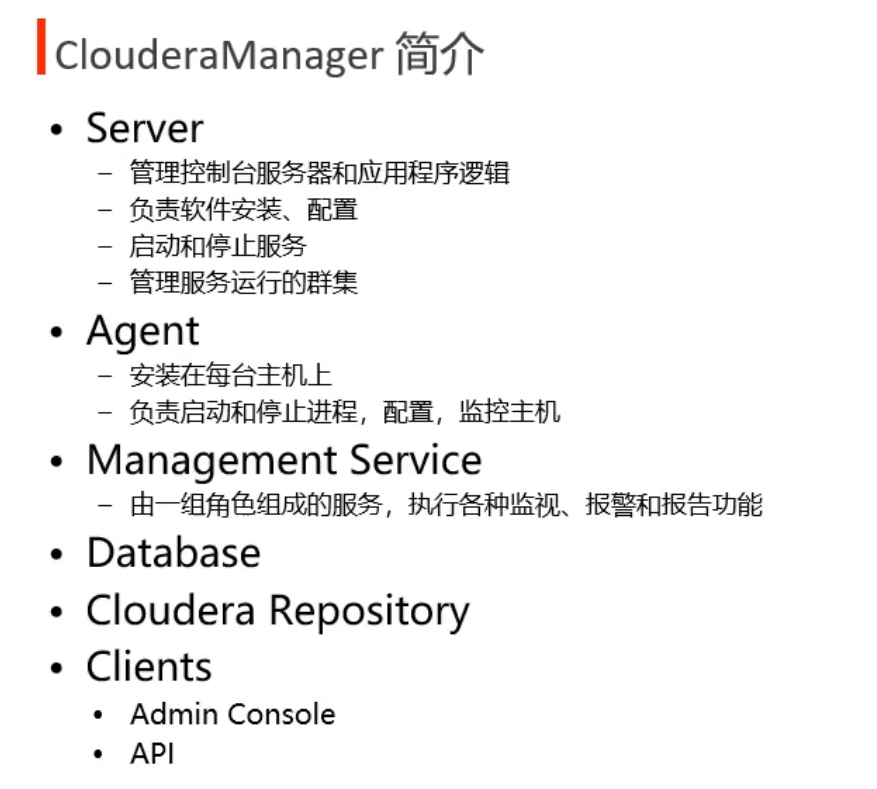
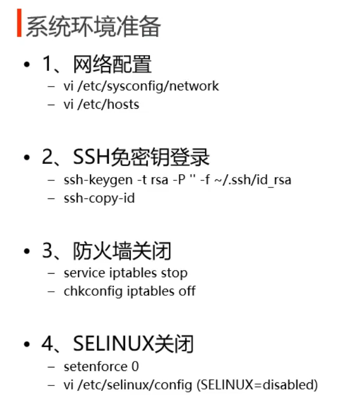
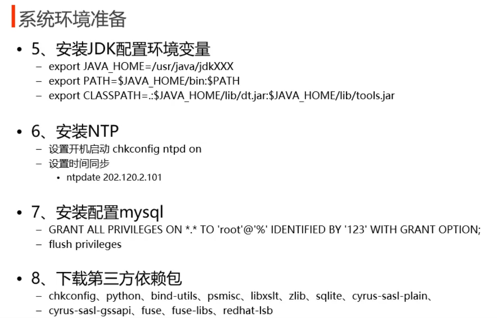
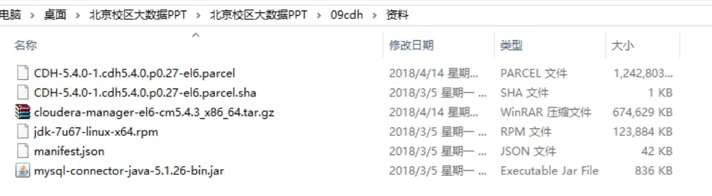
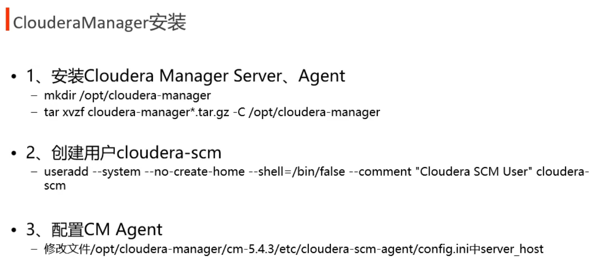
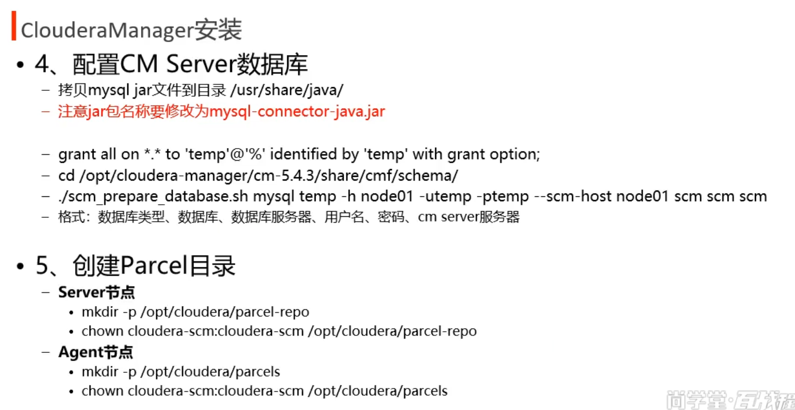
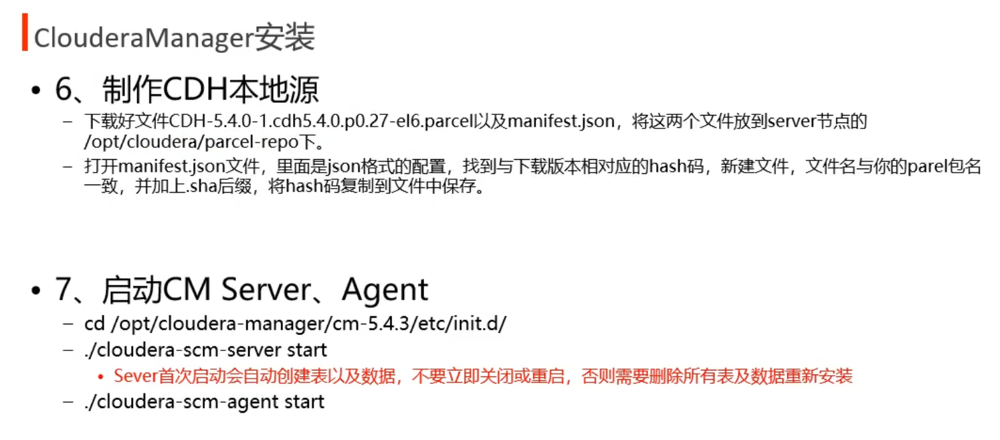
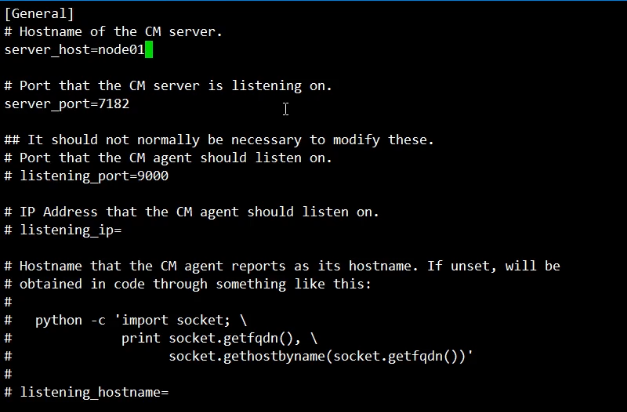
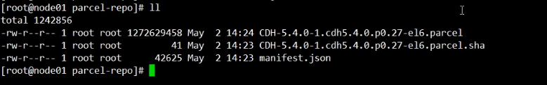

# CDH

## 一、CDH

CDH（Cloudera Distribution Including [Apache Hadoop](https://zhida.zhihu.com/search?content_id=236019655&content_type=Article&match_order=1&q=Apache+Hadoop&zhida_source=entity))是由Cloudera公司提供的一个集成了Apache Hadoop以及相关[生态系统](https://zhida.zhihu.com/search?content_id=236019655&content_type=Article&match_order=1&q=生态系统&zhida_source=entity)的发行版本。CDH是一个大数据平台，简化和加速了[大数据](https://zhida.zhihu.com/search?content_id=236019655&content_type=Article&match_order=2&q=大数据&zhida_source=entity)处理分析的部署和管理。CDH提供Hadoop的核心元素-可伸缩存储和[分布式计算](https://zhida.zhihu.com/search?content_id=236019655&content_type=Article&match_order=1&q=分布式计算&zhida_source=entity)-以及基于web的用户界面和重要的企业功能。CDH是Apache许可的开放源码，是唯一提供统一批处理、交互式SQL和交互式搜索以及基于角色的访问控制的Hadoop解决方案。










部署包准备:

其中 CDH-5.4.0-1.cdh5.4.0.p0.27-el6.parcel.sha 里的内容是根据 CDH-5.4.0-1.cdh5.4.0.p0.27-el6.parcel 到manifest.json中搜索匹配到 hash 值得到的



/opt/cloudera-manager 所有节点都要准备

 tar zxvf cloudera-manager*.tar.gc -C /opt/cloudera-manager 可以先在一台机器上准备好之后再分发到其他节点

创建用户需要在三台节点上都创建







在启动CM Server 、Agent 之前，每台机器上都执行

```shell
echo 0 > /proc/sys/vm/swappiness
```


修改文件 /opt/cloudera-manager/cm-5.4.3/etc/cloudera-scm-agent/config.ini 中 server_host 为主节点的ip



将部署包里的三个文件放到 server 节点的 /opt/cloudera/parcel-repo 下



以上工作完成之后将 /opt/clouder-manager 分发到其他节点上。

启动之后访问  node01:7180 访问